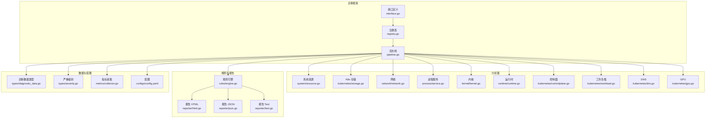
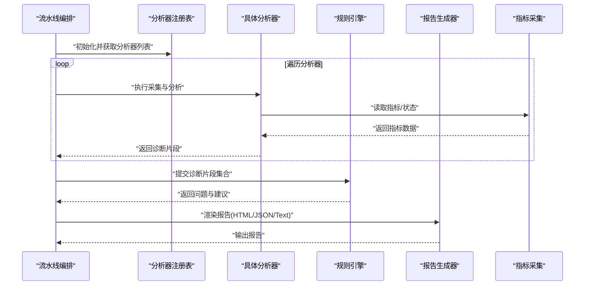
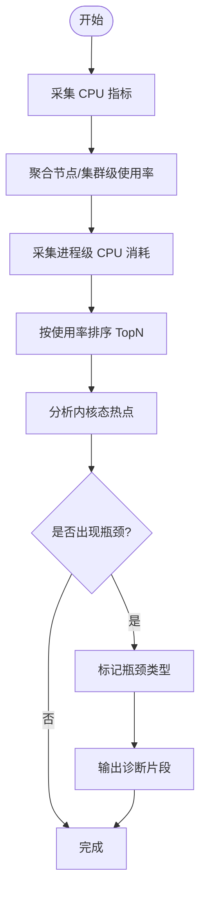
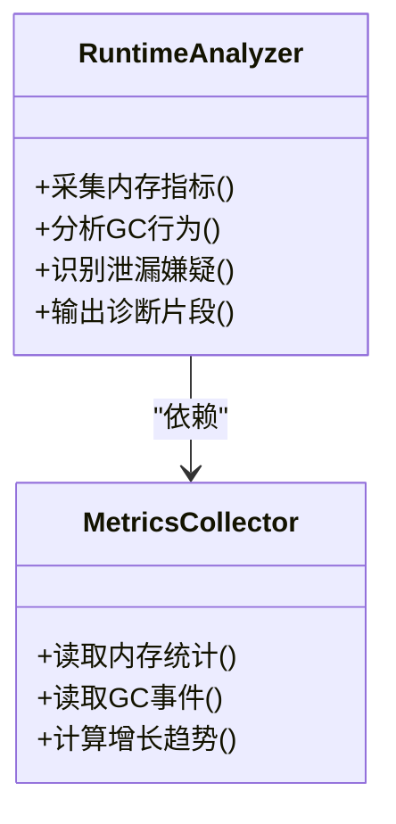
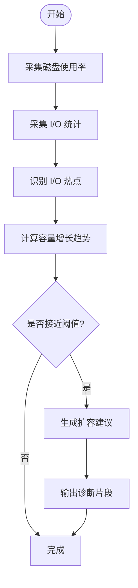
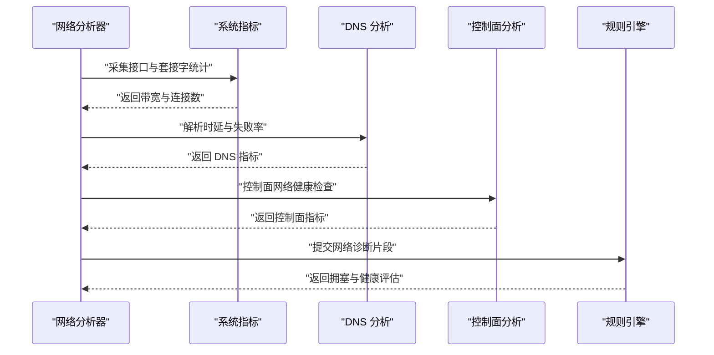
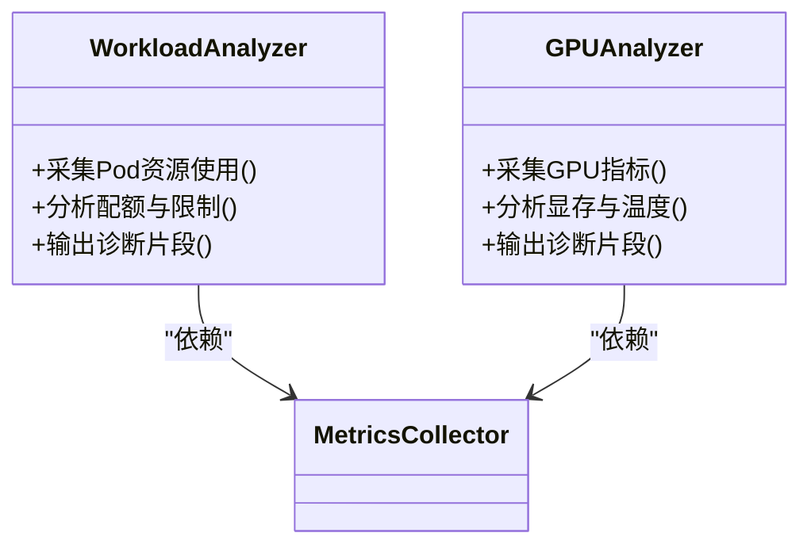
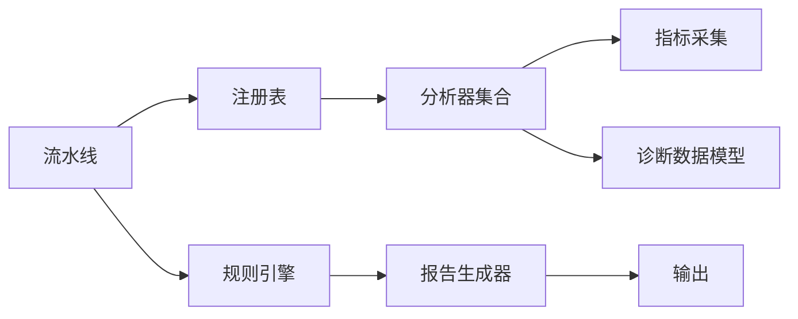

# 系统资源分析器

<cite>
**本文引用的文件**   
- [internal/diag/analyzer/system/resource.go](file://internal/diag/analyzer/system/resource.go)
- [internal/diag/analyzer/kubernetes/storage.go](file://internal/diag/analyzer/kubernetes/storage.go)
- [internal/diag/analyzer/network/network.go](file://internal/diag/analyzer/network/network.go)
- [internal/diag/analyzer/process/service.go](file://internal/diag/analyzer/process/service.go)
- [internal/diag/analyzer/kernel/kernel.go](file://internal/diag/analyzer/kernel/kernel.go)
- [internal/diag/analyzer/runtime/runtime.go](file://internal/diag/analyzer/runtime/runtime.go)
- [internal/diag/analyzer/kubernetes/controlplane.go](file://internal/diag/analyzer/kubernetes/controlplane.go)
- [internal/diag/analyzer/kubernetes/workload.go](file://internal/diag/analyzer/kubernetes/workload.go)
- [internal/diag/analyzer/kubernetes/dns.go](file://internal/diag/analyzer/kubernetes/dns.go)
- [internal/diag/analyzer/kubernetes/gpu.go](file://internal/diag/analyzer/kubernetes/gpu.go)
- [internal/diag/analyzer/registry.go](file://internal/diag/analyzer/registry.go)
- [internal/diag/analyzer/interface.go](file://internal/diag/analyzer/interface.go)
- [internal/diag/pipeline.go](file://internal/diag/pipeline.go)
- [internal/diag/types/diagnostic_data.go](file://internal/diag/types/diagnostic_data.go)
- [internal/diag/types/severity.go](file://internal/diag/types/severity.go)
- [internal/diag/reporter/html.go](file://internal/diag/reporter/html.go)
- [internal/diag/reporter/json.go](file://internal/diag/reporter/json.go)
- [internal/diag/reporter/text.go](file://internal/diag/reporter/text.go)
- [internal/diag/rules/engine.go](file://internal/diag/rules/engine.go)
- [internal/diag/rules/types.go](file://internal/diag/rules/types.go)
- [internal/diag/cost/analyzer.go](file://internal/diag/cost/analyzer.go)
- [internal/metrics/collector.go](file://internal/metrics/collector.go)
- [configs/config.yaml](file://configs/config.yaml)
</cite>

## 目录
1. [简介](#简介)
2. [项目结构](#项目结构)
3. [核心组件](#核心组件)
4. [架构总览](#架构总览)
5. [详细组件分析](#详细组件分析)
6. [依赖关系分析](#依赖关系分析)
7. [性能考量](#性能考量)
8. [故障排查指南](#故障排查指南)
9. [结论](#结论)
10. [附录](#附录)

## 简介
本文件为“系统资源分析器”的权威技术文档，聚焦以下能力：
- CPU 资源分析：使用率监控、进程级消耗分析与性能瓶颈识别
- 内存分析：泄漏检测、垃圾回收优化与内存压力监控
- 存储资源分析：磁盘空间监控、I/O 性能分析与容量规划
- 网络资源分析：带宽使用监控、连接数统计与拥塞检测
- 趋势与预测：资源使用趋势分析、容量预测与扩容建议
- 优化实践：资源优化指南与性能调优最佳实践

该分析器基于可插拔的诊断分析器（Analyzer）体系，结合规则引擎与报告输出，提供从数据采集、分析到可视化的完整闭环。

## 项目结构
与资源分析相关的关键目录与职责：
- internal/diag/analyzer：各维度分析器实现（系统、Kubernetes、网络、进程、内核、运行时等）
- internal/diag/types：诊断数据模型与严重级别定义
- internal/diag/rules：规则引擎与类型定义，用于阈值告警与问题判定
- internal/diag/reporter：多格式报告生成（HTML/JSON/Text）
- internal/diag/cost：成本分析辅助
- internal/metrics：指标采集封装
- configs：运行配置

图表来源
- [internal/diag/analyzer/interface.go](file://internal/diag/analyzer/interface.go)
- [internal/diag/analyzer/registry.go](file://internal/diag/analyzer/registry.go)
- [internal/diag/pipeline.go](file://internal/diag/pipeline.go)
- [internal/diag/analyzer/system/resource.go](file://internal/diag/analyzer/system/resource.go)
- [internal/diag/analyzer/kubernetes/storage.go](file://internal/diag/analyzer/kubernetes/storage.go)
- [internal/diag/analyzer/network/network.go](file://internal/diag/analyzer/network/network.go)
- [internal/diag/analyzer/process/service.go](file://internal/diag/analyzer/process/service.go)
- [internal/diag/analyzer/kernel/kernel.go](file://internal/diag/analyzer/kernel/kernel.go)
- [internal/diag/analyzer/runtime/runtime.go](file://internal/diag/analyzer/runtime/runtime.go)
- [internal/diag/analyzer/kubernetes/controlplane.go](file://internal/diag/analyzer/kubernetes/controlplane.go)
- [internal/diag/analyzer/kubernetes/workload.go](file://internal/diag/analyzer/kubernetes/workload.go)
- [internal/diag/analyzer/kubernetes/dns.go](file://internal/diag/analyzer/kubernetes/dns.go)
- [internal/diag/analyzer/kubernetes/gpu.go](file://internal/diag/analyzer/kubernetes/gpu.go)
- [internal/diag/rules/engine.go](file://internal/diag/rules/engine.go)
- [internal/diag/reporter/html.go](file://internal/diag/reporter/html.go)
- [internal/diag/reporter/json.go](file://internal/diag/reporter/json.go)
- [internal/diag/reporter/text.go](file://internal/diag/reporter/text.go)
- [internal/diag/types/diagnostic_data.go](file://internal/diag/types/diagnostic_data.go)
- [internal/diag/types/severity.go](file://internal/diag/types/severity.go)
- [internal/metrics/collector.go](file://internal/metrics/collector.go)
- [configs/config.yaml](file://configs/config.yaml)

章节来源
- [internal/diag/analyzer/interface.go](file://internal/diag/analyzer/interface.go)
- [internal/diag/analyzer/registry.go](file://internal/diag/analyzer/registry.go)
- [internal/diag/pipeline.go](file://internal/diag/pipeline.go)

## 核心组件
- 分析器接口与注册表：统一抽象各类资源分析器的采集与分析方法，并通过注册表集中管理实例生命周期与执行顺序。
- 流水线编排：按序调度各分析器，聚合结果并驱动规则引擎与报告生成。
- 规则引擎：基于阈值与模式匹配对诊断数据进行判定，产出问题与建议。
- 报告模块：将分析结果以 HTML/JSON/Text 等多格式输出，便于集成与展示。
- 指标采集：封装底层指标获取逻辑，供分析器复用。
- 数据模型：标准化诊断数据与严重级别，确保跨模块一致性。

章节来源
- [internal/diag/analyzer/interface.go](file://internal/diag/analyzer/interface.go)
- [internal/diag/analyzer/registry.go](file://internal/diag/analyzer/registry.go)
- [internal/diag/pipeline.go](file://internal/diag/pipeline.go)
- [internal/diag/rules/engine.go](file://internal/diag/rules/engine.go)
- [internal/diag/reporter/html.go](file://internal/diag/reporter/html.go)
- [internal/diag/reporter/json.go](file://internal/diag/reporter/json.go)
- [internal/diag/reporter/text.go](file://internal/diag/reporter/text.go)
- [internal/metrics/collector.go](file://internal/metrics/collector.go)
- [internal/diag/types/diagnostic_data.go](file://internal/diag/types/diagnostic_data.go)
- [internal/diag/types/severity.go](file://internal/diag/types/severity.go)

## 架构总览
系统资源分析器采用“采集-分析-规则-报告”的分层架构：
- 采集层：由多个专用分析器负责不同维度的资源数据采集与预处理
- 分析层：对原始数据进行聚合、归一化与初步判断
- 规则层：依据阈值与策略进行问题定位与严重性分级
- 报告层：生成结构化与可读性强的分析报告

图表来源
- [internal/diag/pipeline.go](file://internal/diag/pipeline.go)
- [internal/diag/analyzer/registry.go](file://internal/diag/analyzer/registry.go)
- [internal/diag/rules/engine.go](file://internal/diag/rules/engine.go)
- [internal/diag/reporter/html.go](file://internal/diag/reporter/html.go)
- [internal/diag/reporter/json.go](file://internal/diag/reporter/json.go)
- [internal/diag/reporter/text.go](file://internal/diag/reporter/text.go)
- [internal/metrics/collector.go](file://internal/metrics/collector.go)

## 详细组件分析

### CPU 资源分析
- 功能要点
  - 节点与集群级 CPU 使用率监控
  - 进程级 CPU 消耗分析（用户态/内核态、等待时间）
  - 性能瓶颈识别（CPU 饱和、上下文切换频繁、中断热点）
- 关键实现
  - 系统级 CPU 指标采集与聚合
  - 进程维度采样与排序，定位高占用进程
  - 内核态热点与系统调用耗时分析
- 输出与集成
  - 诊断片段包含 CPU 使用率、Top 进程、瓶颈标签
  - 规则引擎根据阈值触发告警与建议

图表来源
- [internal/diag/analyzer/system/resource.go](file://internal/diag/analyzer/system/resource.go)
- [internal/diag/analyzer/process/service.go](file://internal/diag/analyzer/process/service.go)
- [internal/diag/analyzer/kernel/kernel.go](file://internal/diag/analyzer/kernel/kernel.go)

章节来源
- [internal/diag/analyzer/system/resource.go](file://internal/diag/analyzer/system/resource.go)
- [internal/diag/analyzer/process/service.go](file://internal/diag/analyzer/process/service.go)
- [internal/diag/analyzer/kernel/kernel.go](file://internal/diag/analyzer/kernel/kernel.go)

### 内存分析
- 功能要点
  - 内存泄漏检测（增长趋势、未释放对象）
  - 垃圾回收优化（GC 频率、停顿时间、分配速率）
  - 内存压力监控（OOM 风险、碎片化、缓存命中率）
- 关键实现
  - 运行时内存指标采集（堆、栈、缓存、页缓存）
  - 进程级内存分布与增长曲线分析
  - GC 事件与停顿统计
- 输出与集成
  - 诊断片段包含内存使用量、GC 指标、泄漏嫌疑进程
  - 规则引擎评估内存压力等级并给出优化建议

图表来源
- [internal/diag/analyzer/runtime/runtime.go](file://internal/diag/analyzer/runtime/runtime.go)
- [internal/metrics/collector.go](file://internal/metrics/collector.go)

章节来源
- [internal/diag/analyzer/runtime/runtime.go](file://internal/diag/analyzer/runtime/runtime.go)
- [internal/metrics/collector.go](file://internal/metrics/collector.go)

### 存储资源分析
- 功能要点
  - 磁盘空间监控（分区使用率、inode 使用率）
  - I/O 性能分析（吞吐、延迟、队列深度）
  - 容量规划（增长趋势、扩容阈值）
- 关键实现
  - 文件系统与块设备指标采集
  - I/O 统计与热点路径识别
  - 存储类与卷使用情况汇总
- 输出与集成
  - 诊断片段包含磁盘使用率、I/O 热点、容量预警
  - 规则引擎评估存储健康度并给出扩容建议

图表来源
- [internal/diag/analyzer/kubernetes/storage.go](file://internal/diag/analyzer/kubernetes/storage.go)
- [internal/diag/analyzer/system/resource.go](file://internal/diag/analyzer/system/resource.go)

章节来源
- [internal/diag/analyzer/kubernetes/storage.go](file://internal/diag/analyzer/kubernetes/storage.go)
- [internal/diag/analyzer/system/resource.go](file://internal/diag/analyzer/system/resource.go)

### 网络资源分析
- 功能要点
  - 带宽使用监控（入/出流量、峰值）
  - 连接数统计（TCP/UDP、ESTABLISHED/TIME_WAIT）
  - 拥塞检测（丢包、重传、延迟抖动）
- 关键实现
  - 网络接口与套接字统计采集
  - DNS 解析时延与失败率分析
  - 控制面与数据面网络健康检查
- 输出与集成
  - 诊断片段包含带宽、连接数、拥塞指标
  - 规则引擎评估网络健康度并给出优化建议

图表来源
- [internal/diag/analyzer/network/network.go](file://internal/diag/analyzer/network/network.go)
- [internal/diag/analyzer/kubernetes/dns.go](file://internal/diag/analyzer/kubernetes/dns.go)
- [internal/diag/analyzer/kubernetes/controlplane.go](file://internal/diag/analyzer/kubernetes/controlplane.go)

章节来源
- [internal/diag/analyzer/network/network.go](file://internal/diag/analyzer/network/network.go)
- [internal/diag/analyzer/kubernetes/dns.go](file://internal/diag/analyzer/kubernetes/dns.go)
- [internal/diag/analyzer/kubernetes/controlplane.go](file://internal/diag/analyzer/kubernetes/controlplane.go)

### 工作负载与 GPU 分析
- 工作负载分析
  - Pod/Deployment 资源请求与限制对比
  - 资源超卖与争用识别
  - 扩缩容建议
- GPU 分析
  - GPU 利用率、显存占用、温度与功耗
  - 任务调度与队列积压
- 输出与集成
  - 诊断片段包含资源配额使用、GPU 健康度
  - 规则引擎给出扩缩容与调度优化建议

图表来源
- [internal/diag/analyzer/kubernetes/workload.go](file://internal/diag/analyzer/kubernetes/workload.go)
- [internal/diag/analyzer/kubernetes/gpu.go](file://internal/diag/analyzer/kubernetes/gpu.go)
- [internal/metrics/collector.go](file://internal/metrics/collector.go)

章节来源
- [internal/diag/analyzer/kubernetes/workload.go](file://internal/diag/analyzer/kubernetes/workload.go)
- [internal/diag/analyzer/kubernetes/gpu.go](file://internal/diag/analyzer/kubernetes/gpu.go)

### 趋势分析与容量预测
- 趋势分析
  - 基于历史指标的时间序列分析
  - 周期性波动识别与异常点检测
- 容量预测
  - 线性/指数拟合预测未来使用率
  - 阈值预警与扩容时间点建议
- 集成方式
  - 在流水线中串联历史数据与预测模型
  - 输出趋势图与扩容建议至报告

章节来源
- [internal/diag/pipeline.go](file://internal/diag/pipeline.go)
- [internal/diag/cost/analyzer.go](file://internal/diag/cost/analyzer.go)

### 成本分析与优化建议
- 成本分析
  - 资源使用与成本映射（CPU/内存/GPU/存储）
  - 闲置资源识别与回收建议
- 优化建议
  - 资源配额调整、调度策略优化
  - 容器镜像与启动参数优化

章节来源
- [internal/diag/cost/analyzer.go](file://internal/diag/cost/analyzer.go)

## 依赖关系分析
- 组件耦合
  - 流水线编排依赖注册表与管理分析器实例
  - 分析器依赖指标采集与系统/K8s API
  - 规则引擎依赖诊断数据模型与严重级别定义
  - 报告模块依赖规则引擎输出与模板
- 外部依赖
  - Kubernetes API（工作负载、存储、控制面）
  - 操作系统指标（CPU/内存/磁盘/网络）
  - 运行时指标（GC、堆栈、进程信息）

图表来源
- [internal/diag/pipeline.go](file://internal/diag/pipeline.go)
- [internal/diag/analyzer/registry.go](file://internal/diag/analyzer/registry.go)
- [internal/metrics/collector.go](file://internal/metrics/collector.go)
- [internal/diag/types/diagnostic_data.go](file://internal/diag/types/diagnostic_data.go)
- [internal/diag/rules/engine.go](file://internal/diag/rules/engine.go)
- [internal/diag/reporter/html.go](file://internal/diag/reporter/html.go)

章节来源
- [internal/diag/pipeline.go](file://internal/diag/pipeline.go)
- [internal/diag/analyzer/registry.go](file://internal/diag/analyzer/registry.go)
- [internal/metrics/collector.go](file://internal/metrics/collector.go)
- [internal/diag/types/diagnostic_data.go](file://internal/diag/types/diagnostic_data.go)
- [internal/diag/rules/engine.go](file://internal/diag/rules/engine.go)
- [internal/diag/reporter/html.go](file://internal/diag/reporter/html.go)

## 性能考量
- 采集频率与采样窗口：合理设置指标采集周期，避免过高频率导致系统开销
- 并行执行：分析器间无强依赖时可并行执行以提升吞吐
- 数据裁剪：仅采集必要字段，减少内存与序列化开销
- 规则阈值调优：避免误报与漏报，平衡灵敏度与稳定性
- 报告体积控制：分页或按需生成报告，避免大对象阻塞

[本节为通用指导，不直接分析具体文件]

## 故障排查指南
- 常见问题
  - 指标采集失败：检查权限、API 访问与系统命令可用性
  - 规则误报：调整阈值与匹配条件，验证数据源准确性
  - 报告生成失败：确认模板与输出路径权限
- 调试步骤
  - 启用详细日志，定位失败环节
  - 单独运行单个分析器，隔离问题范围
  - 校验诊断数据模型与严重级别定义

章节来源
- [internal/diag/rules/engine.go](file://internal/diag/rules/engine.go)
- [internal/diag/types/severity.go](file://internal/diag/types/severity.go)
- [internal/diag/reporter/html.go](file://internal/diag/reporter/html.go)

## 结论
系统资源分析器通过模块化分析器与规则引擎，实现对 CPU、内存、存储、网络的全面监控与诊断。结合趋势分析与成本优化建议，为容量规划与性能调优提供可靠依据。建议在生产环境中合理配置采集频率与规则阈值，持续迭代优化分析器与报告模板，以获得更精准的诊断结果与更好的用户体验。

[本节为总结性内容，不直接分析具体文件]

## 附录
- 配置项说明
  - 采集频率、超时、并发度
  - 规则阈值与告警级别
  - 报告输出格式与路径
- 最佳实践
  - 分阶段部署分析器，逐步扩大覆盖范围
  - 建立基线与阈值库，定期回顾与更新
  - 结合业务 SLA 制定差异化告警策略

章节来源
- [configs/config.yaml](file://configs/config.yaml)
- [internal/diag/rules/types.go](file://internal/diag/rules/types.go)
- [internal/diag/reporter/json.go](file://internal/diag/reporter/json.go)
- [internal/diag/reporter/text.go](file://internal/diag/reporter/text.go)