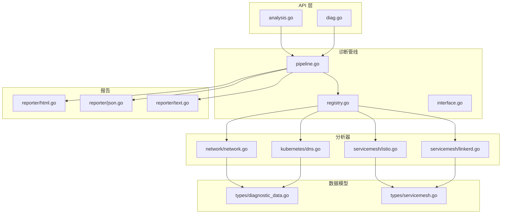
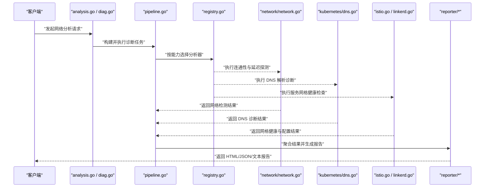
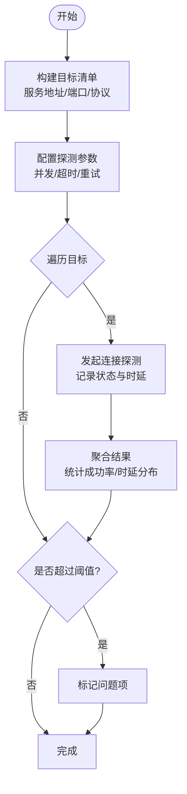
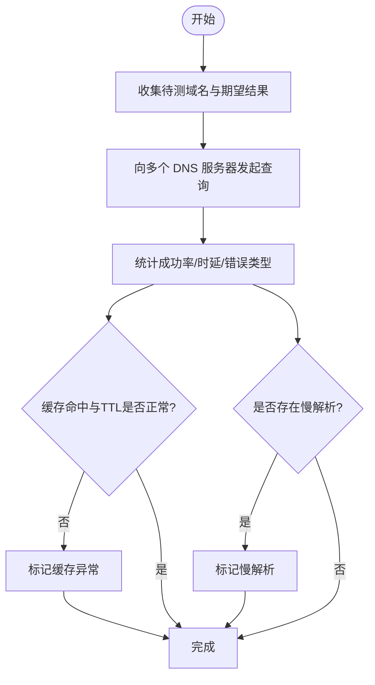
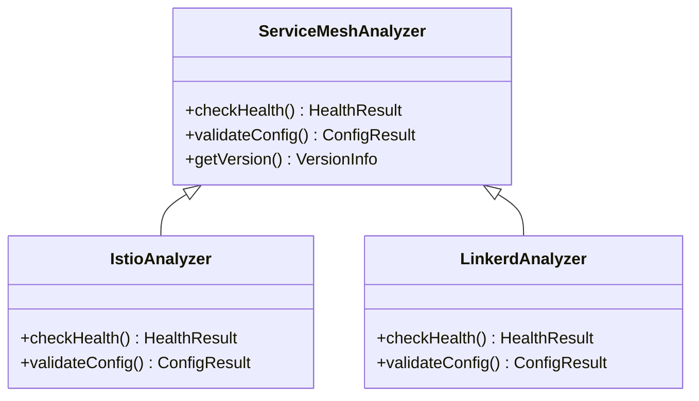
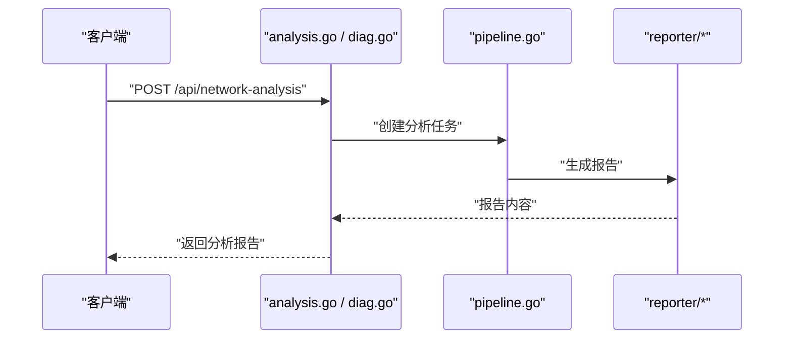
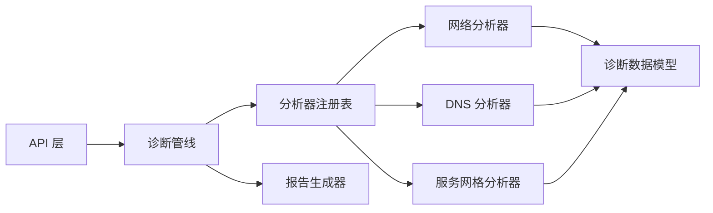

# 网络分析器

<cite>
**本文引用的文件**   
- [internal/networkanalysis/analyzer.go](file://internal/networkanalysis/analyzer.go)
- [internal/networkanalysis/analyzer_test.go](file://internal/networkanalysis/analyzer_test.go)
- [internal/diag/analyzer/registry.go](file://internal/diag/analyzer/registry.go)
- [internal/diag/analyzer/interface.go](file://internal/diag/analyzer/interface.go)
- [internal/diag/analyzer/network/network.go](file://internal/diag/analyzer/network/network.go)
- [internal/diag/analyzer/kubernetes/dns.go](file://internal/diag/analyzer/kubernetes/dns.go)
- [internal/diag/analyzer/servicemesh/istio.go](file://internal/diag/analyzer/servicemesh/istio.go)
- [internal/diag/analyzer/servicemesh/linkerd.go](file://internal/diag/analyzer/servicemesh/linkerd.go)
- [internal/diag/types/diagnostic_data.go](file://internal/diag/types/diagnostic_data.go)
- [internal/diag/types/servicemesh.go](file://internal/diag/types/servicemesh.go)
- [internal/api/analysis.go](file://internal/api/analysis.go)
- [internal/api/diag.go](file://internal/api/diag.go)
- [internal/diag/pipeline.go](file://internal/diag/pipeline.go)
- [internal/diag/reporter/html.go](file://internal/diag/reporter/html.go)
- [internal/diag/reporter/json.go](file://internal/diag/reporter/json.go)
- [internal/diag/reporter/text.go](file://internal/diag/reporter/text.go)
</cite>

## 目录
1. [简介](#简介)
2. [项目结构](#项目结构)
3. [核心组件](#核心组件)
4. [架构总览](#架构总览)
5. [详细组件分析](#详细组件分析)
6. [依赖关系分析](#依赖关系分析)
7. [性能考量](#性能考量)
8. [故障排查指南](#故障排查指南)
9. [结论](#结论)
10. [附录](#附录)

## 简介
本文件为“网络分析器”的权威技术文档，聚焦以下能力：
- 网络连接性测试：服务间通信检测、端口连通性验证、网络延迟测量
- DNS 解析诊断：域名解析失败排查、DNS 服务器响应时间分析、缓存问题检测
- 服务网格分析：Istio、Linkerd 健康检查与配置校验
- 网络拓扑发现、流量模式分析与安全策略验证
- 故障排查指南与性能调优建议

该模块通过统一的诊断管线与报告输出，将底层探测结果结构化并呈现给上层 API 与前端。

## 项目结构
网络分析相关代码主要分布在以下位置：
- internal/networkanalysis：网络分析主入口与编排
- internal/diag/analyzer：诊断分析器注册表与接口定义
- internal/diag/analyzer/network：网络层探测（连通性、延迟等）
- internal/diag/analyzer/kubernetes/dns：Kubernetes 环境下的 DNS 诊断
- internal/diag/analyzer/servicemesh：服务网格（Istio、Linkerd）分析
- internal/diag/types：诊断数据模型与网格类型定义
- internal/api：对外暴露的分析与诊断 API
- internal/diag/pipeline：诊断执行管线
- internal/diag/reporter：多格式报告生成（HTML/JSON/Text）

图表来源
- [internal/api/analysis.go](file://internal/api/analysis.go)
- [internal/api/diag.go](file://internal/api/diag.go)
- [internal/diag/pipeline.go](file://internal/diag/pipeline.go)
- [internal/diag/analyzer/registry.go](file://internal/diag/analyzer/registry.go)
- [internal/diag/analyzer/interface.go](file://internal/diag/analyzer/interface.go)
- [internal/diag/analyzer/network/network.go](file://internal/diag/analyzer/network/network.go)
- [internal/diag/analyzer/kubernetes/dns.go](file://internal/diag/analyzer/kubernetes/dns.go)
- [internal/diag/analyzer/servicemesh/istio.go](file://internal/diag/analyzer/servicemesh/istio.go)
- [internal/diag/analyzer/servicemesh/linkerd.go](file://internal/diag/analyzer/servicemesh/linkerd.go)
- [internal/diag/types/diagnostic_data.go](file://internal/diag/types/diagnostic_data.go)
- [internal/diag/types/servicemesh.go](file://internal/diag/types/servicemesh.go)
- [internal/diag/reporter/html.go](file://internal/diag/reporter/html.go)
- [internal/diag/reporter/json.go](file://internal/diag/reporter/json.go)
- [internal/diag/reporter/text.go](file://internal/diag/reporter/text.go)

章节来源
- [internal/networkanalysis/analyzer.go](file://internal/networkanalysis/analyzer.go)
- [internal/diag/analyzer/registry.go](file://internal/diag/analyzer/registry.go)
- [internal/diag/analyzer/interface.go](file://internal/diag/analyzer/interface.go)
- [internal/diag/analyzer/network/network.go](file://internal/diag/analyzer/network/network.go)
- [internal/diag/analyzer/kubernetes/dns.go](file://internal/diag/analyzer/kubernetes/dns.go)
- [internal/diag/analyzer/servicemesh/istio.go](file://internal/diag/analyzer/servicemesh/istio.go)
- [internal/diag/analyzer/servicemesh/linkerd.go](file://internal/diag/analyzer/servicemesh/linkerd.go)
- [internal/diag/types/diagnostic_data.go](file://internal/diag/types/diagnostic_data.go)
- [internal/diag/types/servicemesh.go](file://internal/diag/types/servicemesh.go)
- [internal/api/analysis.go](file://internal/api/analysis.go)
- [internal/api/diag.go](file://internal/api/diag.go)
- [internal/diag/pipeline.go](file://internal/diag/pipeline.go)
- [internal/diag/reporter/html.go](file://internal/diag/reporter/html.go)
- [internal/diag/reporter/json.go](file://internal/diag/reporter/json.go)
- [internal/diag/reporter/text.go](file://internal/diag/reporter/text.go)

## 核心组件
- 网络分析器入口：负责组装网络相关的诊断任务，协调各子分析器执行并汇总结果
- 诊断分析器注册表：集中管理各类分析器的生命周期与调用
- 网络分析器：实现端口连通性、延迟测量、基础拓扑发现
- DNS 分析器：在 Kubernetes 环境中进行解析链路诊断、响应时延统计与缓存异常检测
- 服务网格分析器：对 Istio/Linkerd 的健康状态与关键配置进行校验
- 数据模型：统一描述诊断结果、问题严重级别、网格资源状态
- 报告生成器：将诊断结果导出为 HTML/JSON/文本等多格式

章节来源
- [internal/networkanalysis/analyzer.go](file://internal/networkanalysis/analyzer.go)
- [internal/diag/analyzer/registry.go](file://internal/diag/analyzer/registry.go)
- [internal/diag/analyzer/interface.go](file://internal/diag/analyzer/interface.go)
- [internal/diag/analyzer/network/network.go](file://internal/diag/analyzer/network/network.go)
- [internal/diag/analyzer/kubernetes/dns.go](file://internal/diag/analyzer/kubernetes/dns.go)
- [internal/diag/analyzer/servicemesh/istio.go](file://internal/diag/analyzer/servicemesh/istio.go)
- [internal/diag/analyzer/servicemesh/linkerd.go](file://internal/diag/analyzer/servicemesh/linkerd.go)
- [internal/diag/types/diagnostic_data.go](file://internal/diag/types/diagnostic_data.go)
- [internal/diag/types/servicemesh.go](file://internal/diag/types/servicemesh.go)

## 架构总览
网络分析器采用“API -> 管线 -> 分析器 -> 报告”的分层架构。API 层接收请求并路由到诊断管线；管线根据配置调度具体分析器；分析器采集数据并产出结构化结果；报告层将结果渲染为多种格式供消费。

图表来源
- [internal/api/analysis.go](file://internal/api/analysis.go)
- [internal/api/diag.go](file://internal/api/diag.go)
- [internal/diag/pipeline.go](file://internal/diag/pipeline.go)
- [internal/diag/analyzer/registry.go](file://internal/diag/analyzer/registry.go)
- [internal/diag/analyzer/network/network.go](file://internal/diag/analyzer/network/network.go)
- [internal/diag/analyzer/kubernetes/dns.go](file://internal/diag/analyzer/kubernetes/dns.go)
- [internal/diag/analyzer/servicemesh/istio.go](file://internal/diag/analyzer/servicemesh/istio.go)
- [internal/diag/analyzer/servicemesh/linkerd.go](file://internal/diag/analyzer/servicemesh/linkerd.go)
- [internal/diag/reporter/html.go](file://internal/diag/reporter/html.go)
- [internal/diag/reporter/json.go](file://internal/diag/reporter/json.go)
- [internal/diag/reporter/text.go](file://internal/diag/reporter/text.go)

## 详细组件分析

### 网络连接性测试（服务间通信、端口连通性、延迟测量）
- 功能要点
  - 服务间通信检测：基于目标服务地址与端口发起连接探测，判定可达性与错误码
  - 端口连通性验证：批量探测常用端口或指定端口列表，记录开放/关闭/超时状态
  - 网络延迟测量：对关键节点进行往返时延采样，计算均值、分位数与抖动
- 处理流程
  - 输入目标清单与探测参数（并发度、超时、重试次数）
  - 并发执行探测任务，收集成功/失败与时延样本
  - 聚合结果并标记异常阈值（如丢包率、时延上限）
- 优化点
  - 合理设置并发与超时，避免对目标造成压力
  - 对高频目标使用指数退避与熔断保护
  - 对长尾延迟进行采样截断，减少噪声影响

图表来源
- [internal/diag/analyzer/network/network.go](file://internal/diag/analyzer/network/network.go)
- [internal/diag/types/diagnostic_data.go](file://internal/diag/types/diagnostic_data.go)

章节来源
- [internal/diag/analyzer/network/network.go](file://internal/diag/analyzer/network/network.go)
- [internal/diag/types/diagnostic_data.go](file://internal/diag/types/diagnostic_data.go)

### DNS 解析诊断（解析失败排查、响应时间分析、缓存问题检测）
- 功能要点
  - 解析失败排查：识别 NXDOMAIN、SERVFAIL、超时等错误类型，定位上游 DNS 或本地解析链问题
  - 响应时间分析：统计不同 DNS 服务器的查询耗时，识别慢解析与抖动
  - 缓存问题检测：对比多次解析结果与 TTL 行为，判断缓存命中与过期异常
- 处理流程
  - 收集目标域名与期望解析结果
  - 依次向系统默认与指定 DNS 服务器发起查询
  - 统计成功率、平均/分位时延、错误分布与缓存命中率
- 优化点
  - 针对慢解析启用并行查询与快速失败
  - 结合集群内 CoreDNS/NodeLocalDNS 配置进行根因推断

图表来源
- [internal/diag/analyzer/kubernetes/dns.go](file://internal/diag/analyzer/kubernetes/dns.go)
- [internal/diag/types/diagnostic_data.go](file://internal/diag/types/diagnostic_data.go)

章节来源
- [internal/diag/analyzer/kubernetes/dns.go](file://internal/diag/analyzer/kubernetes/dns.go)
- [internal/diag/types/diagnostic_data.go](file://internal/diag/types/diagnostic_data.go)

### 服务网格分析（Istio、Linkerd 健康检查与配置验证）
- 功能要点
  - 健康检查：探测控制面与数据面组件可用性，确认 Sidecar 注入与代理状态
  - 配置验证：校验关键资源（如 VirtualService、DestinationRule、ServiceEntry、MeshPolicy 等）存在性与一致性
- 处理流程
  - 检测网格组件部署与版本信息
  - 拉取关键配置资源并做规则校验
  - 输出健康评分与问题清单
- 优化点
  - 按需选择网格类型，避免不必要的资源访问
  - 对大名单配置进行分页与增量校验

图表来源
- [internal/diag/analyzer/servicemesh/istio.go](file://internal/diag/analyzer/servicemesh/istio.go)
- [internal/diag/analyzer/servicemesh/linkerd.go](file://internal/diag/analyzer/servicemesh/linkerd.go)
- [internal/diag/types/servicemesh.go](file://internal/diag/types/servicemesh.go)

章节来源
- [internal/diag/analyzer/servicemesh/istio.go](file://internal/diag/analyzer/servicemesh/istio.go)
- [internal/diag/analyzer/servicemesh/linkerd.go](file://internal/diag/analyzer/servicemesh/linkerd.go)
- [internal/diag/types/servicemesh.go](file://internal/diag/types/servicemesh.go)

### 网络拓扑发现、流量模式分析与安全策略验证
- 拓扑发现：基于服务发现与端点信息绘制服务间依赖图，标注关键路径与单点风险
- 流量模式：统计常见协议与端口的访问频率与时序特征，识别异常峰值与静默期
- 安全策略：校验网络策略、入站/出站规则与 mTLS 配置，提示不合规项

章节来源
- [internal/diag/analyzer/network/network.go](file://internal/diag/analyzer/network/network.go)
- [internal/diag/types/diagnostic_data.go](file://internal/diag/types/diagnostic_data.go)

### API 与管线集成
- API 层提供统一的分析入口，封装请求参数与权限校验
- 诊断管线负责任务编排、并发控制与结果聚合
- 报告生成器支持 HTML/JSON/文本三种格式，便于不同场景消费

图表来源
- [internal/api/analysis.go](file://internal/api/analysis.go)
- [internal/api/diag.go](file://internal/api/diag.go)
- [internal/diag/pipeline.go](file://internal/diag/pipeline.go)
- [internal/diag/reporter/html.go](file://internal/diag/reporter/html.go)
- [internal/diag/reporter/json.go](file://internal/diag/reporter/json.go)
- [internal/diag/reporter/text.go](file://internal/diag/reporter/text.go)

章节来源
- [internal/api/analysis.go](file://internal/api/analysis.go)
- [internal/api/diag.go](file://internal/api/diag.go)
- [internal/diag/pipeline.go](file://internal/diag/pipeline.go)
- [internal/diag/reporter/html.go](file://internal/diag/reporter/html.go)
- [internal/diag/reporter/json.go](file://internal/diag/reporter/json.go)
- [internal/diag/reporter/text.go](file://internal/diag/reporter/text.go)

## 依赖关系分析
- 耦合与内聚
  - 分析器通过统一接口解耦，注册表集中管理，降低耦合度
  - 数据模型集中定义，保证跨模块一致性
- 外部依赖
  - Kubernetes API（用于 DNS 与服务网格资源访问）
  - 网络栈（TCP/UDP 探测、DNS 查询）
- 潜在循环依赖
  - 通过接口与注册表避免直接循环引用
- 接口契约
  - 分析器需实现标准方法（健康检查、配置验证、数据采集）
  - 报告生成器需遵循统一数据结构

图表来源
- [internal/api/analysis.go](file://internal/api/analysis.go)
- [internal/api/diag.go](file://internal/api/diag.go)
- [internal/diag/pipeline.go](file://internal/diag/pipeline.go)
- [internal/diag/analyzer/registry.go](file://internal/diag/analyzer/registry.go)
- [internal/diag/analyzer/interface.go](file://internal/diag/analyzer/interface.go)
- [internal/diag/analyzer/network/network.go](file://internal/diag/analyzer/network/network.go)
- [internal/diag/analyzer/kubernetes/dns.go](file://internal/diag/analyzer/kubernetes/dns.go)
- [internal/diag/analyzer/servicemesh/istio.go](file://internal/diag/analyzer/servicemesh/istio.go)
- [internal/diag/analyzer/servicemesh/linkerd.go](file://internal/diag/analyzer/servicemesh/linkerd.go)
- [internal/diag/types/diagnostic_data.go](file://internal/diag/types/diagnostic_data.go)
- [internal/diag/types/servicemesh.go](file://internal/diag/types/servicemesh.go)
- [internal/diag/reporter/html.go](file://internal/diag/reporter/html.go)
- [internal/diag/reporter/json.go](file://internal/diag/reporter/json.go)
- [internal/diag/reporter/text.go](file://internal/diag/reporter/text.go)

章节来源
- [internal/diag/analyzer/registry.go](file://internal/diag/analyzer/registry.go)
- [internal/diag/analyzer/interface.go](file://internal/diag/analyzer/interface.go)
- [internal/diag/types/diagnostic_data.go](file://internal/diag/types/diagnostic_data.go)
- [internal/diag/types/servicemesh.go](file://internal/diag/types/servicemesh.go)

## 性能考量
- 并发与限流
  - 合理设置探测并发度，避免目标过载与自身资源耗尽
  - 对慢目标实施快速失败与熔断，提升整体吞吐
- 采样与统计
  - 对时延与丢包进行分位数统计，避免极端值影响结论
  - 对大规模目标进行分层抽样，平衡准确性与成本
- 缓存与复用
  - 复用连接与查询上下文，减少握手开销
  - 对稳定拓扑与配置进行增量更新，避免全量扫描
- 资源隔离
  - 将高负载任务放入独立 goroutine 池，避免阻塞主流程
  - 限制内存与 CPU 配额，保障系统稳定性

[本节为通用指导，无需特定文件来源]

## 故障排查指南
- 常见问题与定位
  - 解析失败：检查 DNS 服务器可达性、TTL 设置与缓存命中情况
  - 端口不可达：核对防火墙策略、服务监听端口与负载均衡配置
  - 高延迟：识别慢解析、拥塞链路或资源争用导致的抖动
  - 网格异常：确认控制面与 Sidecar 状态、mTLS 与路由规则一致性
- 排查步骤
  - 从 API 层获取任务 ID 与日志
  - 查看对应分析器的诊断结果与错误码
  - 结合报告中的问题清单逐项验证
- 工具与命令
  - 使用网络分析器生成的 JSON/文本报告进行自动化比对
  - 结合 kubectl 与网格 CLI 工具进行交叉验证

章节来源
- [internal/diag/analyzer/network/network.go](file://internal/diag/analyzer/network/network.go)
- [internal/diag/analyzer/kubernetes/dns.go](file://internal/diag/analyzer/kubernetes/dns.go)
- [internal/diag/analyzer/servicemesh/istio.go](file://internal/diag/analyzer/servicemesh/istio.go)
- [internal/diag/analyzer/servicemesh/linkerd.go](file://internal/diag/analyzer/servicemesh/linkerd.go)
- [internal/diag/reporter/json.go](file://internal/diag/reporter/json.go)
- [internal/diag/reporter/text.go](file://internal/diag/reporter/text.go)

## 结论
网络分析器以模块化与可扩展的设计，提供了覆盖连通性、DNS、服务网格与拓扑分析的完整能力。通过统一的管线与报告机制，用户可快速获取结构化诊断结果并进行自动化处理。建议在大规模环境中结合采样与限流策略，确保诊断过程高效且稳定。

[本节为总结性内容，无需特定文件来源]

## 附录
- 术语说明
  - 连通性：端到端可达性与错误码
  - 延迟：往返时延与抖动
  - 拓扑：服务间依赖关系图
  - 网格：服务网格控制面与数据面
- 参考文件
  - 内部测试用例可用于理解边界条件与异常路径

章节来源
- [internal/networkanalysis/analyzer_test.go](file://internal/networkanalysis/analyzer_test.go)