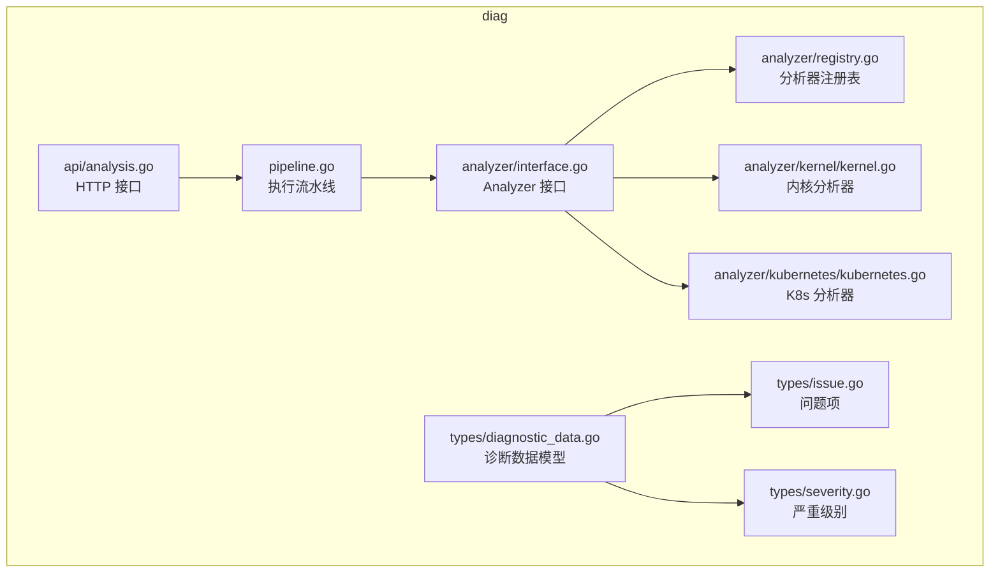
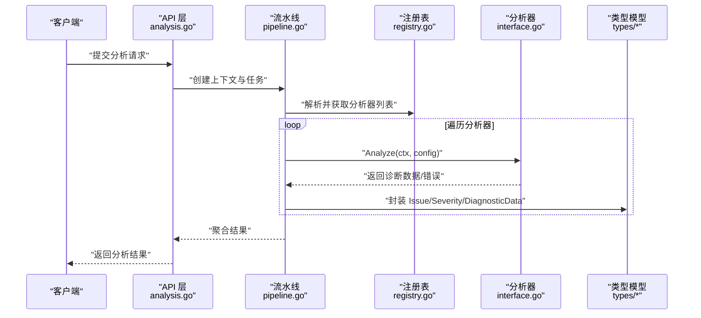
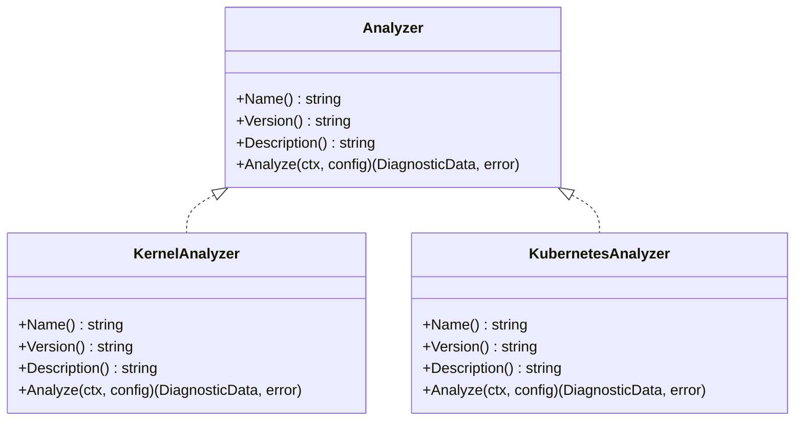
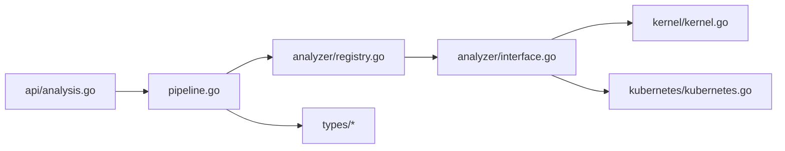

# 分析器接口设计

<cite>
**本文档引用的文件**   
- [internal/diag/analyzer/interface.go](file://internal/diag/analyzer/interface.go)
- [internal/diag/analyzer/registry.go](file://internal/diag/analyzer/registry.go)
- [internal/diag/analyzer/kernel/kernel.go](file://internal/diag/analyzer/kernel/kernel.go)
- [internal/diag/analyzer/kubernetes/kubernetes.go](file://internal/diag/analyzer/kubernetes/kubernetes.go)
- [internal/diag/types/diagnostic_data.go](file://internal/diag/types/diagnostic_data.go)
- [internal/diag/types/issue.go](file://internal/diag/types/issue.go)
- [internal/diag/types/severity.go](file://internal/diag/types/severity.go)
- [internal/diag/pipeline.go](file://internal/diag/pipeline.go)
- [internal/api/analysis.go](file://internal/api/analysis.go)
</cite>

## 目录
1. [简介](#简介)
2. [项目结构](#项目结构)
3. [核心组件](#核心组件)
4. [架构总览](#架构总览)
5. [详细组件分析](#详细组件分析)
6. [依赖关系分析](#依赖关系分析)
7. [性能考量](#性能考量)
8. [故障排查指南](#故障排查指南)
9. [结论](#结论)
10. [附录：自定义分析器实现示例](#附录自定义分析器实现示例)

## 简介
本文件面向 Klaw 平台的“分析器接口”设计与扩展，聚焦于 Analyzer 接口的核心方法定义、诊断上下文结构体、错误处理模式与结果数据结构，并给出插件开发的一致性规范。文档同时覆盖接口版本兼容性与扩展点设计原则，帮助开发者快速实现自定义分析器并与平台集成。

## 项目结构
与“分析器接口”相关的代码主要位于 internal/diag 子系统中，其中：
- analyzer 目录定义 Analyzer 接口、注册表以及若干内置分析器（如 kernel、kubernetes 等）
- types 目录定义诊断数据、问题项与严重级别等通用类型
- pipeline 负责编排执行流程
- api 层暴露分析相关 HTTP API

图表来源
- [internal/diag/analyzer/interface.go](file://internal/diag/analyzer/interface.go)
- [internal/diag/analyzer/registry.go](file://internal/diag/analyzer/registry.go)
- [internal/diag/analyzer/kernel/kernel.go](file://internal/diag/analyzer/kernel/kernel.go)
- [internal/diag/analyzer/kubernetes/kubernetes.go](file://internal/diag/analyzer/kubernetes/kubernetes.go)
- [internal/diag/types/diagnostic_data.go](file://internal/diag/types/diagnostic_data.go)
- [internal/diag/types/issue.go](file://internal/diag/types/issue.go)
- [internal/diag/types/severity.go](file://internal/diag/types/severity.go)
- [internal/diag/pipeline.go](file://internal/diag/pipeline.go)
- [internal/api/analysis.go](file://internal/api/analysis.go)

章节来源
- [internal/diag/analyzer/interface.go](file://internal/diag/analyzer/interface.go)
- [internal/diag/analyzer/registry.go](file://internal/diag/analyzer/registry.go)
- [internal/diag/types/diagnostic_data.go](file://internal/diag/types/diagnostic_data.go)
- [internal/diag/pipeline.go](file://internal/diag/pipeline.go)
- [internal/api/analysis.go](file://internal/api/analysis.go)

## 核心组件
- Analyzer 接口：定义统一的 Analyze() 方法与元信息能力，用于描述分析器名称、版本、适用目标及可配置项。
- 诊断上下文 DiagnosticContext：承载集群信息、命名空间过滤、配置选项、超时与取消信号等，贯穿分析生命周期。
- 结果与问题模型：Issue、Severity、DiagnosticData 等统一输出格式，确保不同分析器结果一致。
- 注册表 Registry：集中管理分析器的发现、实例化与调用。
- 流水线 Pipeline：按顺序或并行调度多个分析器，聚合结果并处理错误。
- API 层：对外暴露分析任务提交与结果查询接口。

章节来源
- [internal/diag/analyzer/interface.go](file://internal/diag/analyzer/interface.go)
- [internal/diag/types/diagnostic_data.go](file://internal/diag/types/diagnostic_data.go)
- [internal/diag/types/issue.go](file://internal/diag/types/issue.go)
- [internal/diag/types/severity.go](file://internal/diag/types/severity.go)
- [internal/diag/analyzer/registry.go](file://internal/diag/analyzer/registry.go)
- [internal/diag/pipeline.go](file://internal/diag/pipeline.go)
- [internal/api/analysis.go](file://internal/api/analysis.go)

## 架构总览
下图展示了从 API 请求到分析器执行的端到端流程，以及关键数据结构在调用链中的传递方式。

图表来源
- [internal/api/analysis.go](file://internal/api/analysis.go)
- [internal/diag/pipeline.go](file://internal/diag/pipeline.go)
- [internal/diag/analyzer/registry.go](file://internal/diag/analyzer/registry.go)
- [internal/diag/analyzer/interface.go](file://internal/diag/analyzer/interface.go)
- [internal/diag/types/diagnostic_data.go](file://internal/diag/types/diagnostic_data.go)
- [internal/diag/types/issue.go](file://internal/diag/types/issue.go)
- [internal/diag/types/severity.go](file://internal/diag/types/severity.go)

## 详细组件分析

### Analyzer 接口与 Analyze() 方法
- 职责：提供统一的分析入口，接收诊断上下文与配置，返回结构化诊断数据或错误。
- 参数规范：
  - 上下文：包含集群标识、命名空间过滤、超时与取消信号、日志与指标埋点钩子等。
  - 配置：分析器专属的配置键值对，支持默认值与校验。
- 返回值：
  - 成功：返回诊断数据集合（例如问题列表、指标快照、资源清单）。
  - 失败：返回错误对象，需区分可重试与不可重试场景。
- 元信息能力：通常提供 Name()、Version()、Description() 等方法，便于注册与展示。

章节来源
- [internal/diag/analyzer/interface.go](file://internal/diag/analyzer/interface.go)

#### 类图：Analyzer 接口与内置实现

图表来源
- [internal/diag/analyzer/interface.go](file://internal/diag/analyzer/interface.go)
- [internal/diag/analyzer/kernel/kernel.go](file://internal/diag/analyzer/kernel/kernel.go)
- [internal/diag/analyzer/kubernetes/kubernetes.go](file://internal/diag/analyzer/kubernetes/kubernetes.go)

章节来源
- [internal/diag/analyzer/interface.go](file://internal/diag/analyzer/interface.go)
- [internal/diag/analyzer/kernel/kernel.go](file://internal/diag/analyzer/kernel/kernel.go)
- [internal/diag/analyzer/kubernetes/kubernetes.go](file://internal/diag/analyzer/kubernetes/kubernetes.go)

### 诊断上下文 DiagnosticContext
- 字段含义：
  - 集群信息：集群 ID、名称、连接凭据或客户端句柄。
  - 命名空间过滤：允许指定一个或多个命名空间进行限定分析。
  - 配置选项：分析器级别的配置键值对，支持默认值与校验。
  - 控制信号：超时时间、取消通道，用于优雅退出与资源释放。
  - 辅助能力：日志记录器、指标上报钩子、缓存访问器等。
- 使用方式：
  - 由流水线或 API 层构造并注入到每个分析器的 Analyze() 调用中。
  - 分析器应尊重命名空间过滤与超时/取消信号，避免越权或长时间阻塞。

章节来源
- [internal/diag/types/diagnostic_data.go](file://internal/diag/types/diagnostic_data.go)
- [internal/diag/pipeline.go](file://internal/diag/pipeline.go)

### 结果与问题模型
- Issue：表示一条诊断问题，包含标题、描述、严重级别、定位信息、修复建议等。
- Severity：严重级别枚举，如信息、警告、错误、致命等，用于排序与告警策略。
- DiagnosticData：分析器输出的统一数据载体，可包含问题列表、指标快照、原始数据引用等。

章节来源
- [internal/diag/types/issue.go](file://internal/diag/types/issue.go)
- [internal/diag/types/severity.go](file://internal/diag/types/severity.go)
- [internal/diag/types/diagnostic_data.go](file://internal/diag/types/diagnostic_data.go)

### 注册表 Registry
- 职责：
  - 维护分析器注册表，支持按名称或标签查找。
  - 负责实例化分析器，并注入必要依赖（如客户端、配置）。
  - 提供分析器能力探测与兼容性检查。
- 扩展点：新增分析器需在初始化阶段完成注册。

章节来源
- [internal/diag/analyzer/registry.go](file://internal/diag/analyzer/registry.go)

### 流水线 Pipeline
- 职责：
  - 根据请求构建上下文与任务计划。
  - 串行或并行执行多个分析器，聚合结果。
  - 统一错误处理与重试策略，保证整体一致性。
- 执行流：
  - 解析请求 -> 构造上下文 -> 获取分析器列表 -> 逐个调用 Analyze() -> 合并结果 -> 返回。

章节来源
- [internal/diag/pipeline.go](file://internal/diag/pipeline.go)

### API 层 analysis.go
- 职责：
  - 暴露分析任务提交与结果查询的 HTTP 接口。
  - 将外部请求转换为内部上下文与配置，委托给流水线执行。
  - 统一响应格式与错误码。

章节来源
- [internal/api/analysis.go](file://internal/api/analysis.go)

## 依赖关系分析
- Analyzer 接口是核心抽象，各具体分析器实现该接口。
- 注册表集中管理分析器实例，解耦调用方与实现方。
- 流水线编排调用，依赖类型模型统一输出。
- API 层作为入口，依赖流水线与注册表。

图表来源
- [internal/api/analysis.go](file://internal/api/analysis.go)
- [internal/diag/pipeline.go](file://internal/diag/pipeline.go)
- [internal/diag/analyzer/registry.go](file://internal/diag/analyzer/registry.go)
- [internal/diag/analyzer/interface.go](file://internal/diag/analyzer/interface.go)
- [internal/diag/analyzer/kernel/kernel.go](file://internal/diag/analyzer/kernel/kernel.go)
- [internal/diag/analyzer/kubernetes/kubernetes.go](file://internal/diag/analyzer/kubernetes/kubernetes.go)
- [internal/diag/types/diagnostic_data.go](file://internal/diag/types/diagnostic_data.go)
- [internal/diag/types/issue.go](file://internal/diag/types/issue.go)
- [internal/diag/types/severity.go](file://internal/diag/types/severity.go)

章节来源
- [internal/diag/analyzer/registry.go](file://internal/diag/analyzer/registry.go)
- [internal/diag/pipeline.go](file://internal/diag/pipeline.go)
- [internal/api/analysis.go](file://internal/api/analysis.go)

## 性能考量
- 并发执行：流水线可对独立分析器进行并发调度，缩短总体耗时。
- 上下文超时：通过上下文控制与分析器内部分段超时，避免长尾阻塞。
- 资源限制：分析器应避免全量扫描，优先增量采集与分页拉取。
- 缓存复用：对昂贵查询结果进行短期缓存，减少重复开销。
- 结果裁剪：按需返回最小必要数据，降低序列化与传输成本。

[本节为通用指导，不直接分析具体文件]

## 故障排查指南
- 常见错误分类：
  - 上下文错误：超时、取消、权限不足。
  - 配置错误：缺失必填项、非法值、版本不兼容。
  - 运行时错误：网络异常、资源不可用、下游服务限流。
- 错误处理模式：
  - 区分可重试与不可重试错误，上层据此决定重试或降级。
  - 保留原始错误链与上下文信息，便于定位根因。
  - 对分析器级错误进行隔离，避免影响其他分析器执行。
- 调试建议：
  - 启用详细日志，记录输入上下文与关键步骤。
  - 使用测试用例覆盖边界条件与异常路径。
  - 借助注册表的“能力探测”验证环境依赖是否满足。

章节来源
- [internal/diag/pipeline.go](file://internal/diag/pipeline.go)
- [internal/diag/analyzer/registry.go](file://internal/diag/analyzer/registry.go)
- [internal/diag/types/issue.go](file://internal/diag/types/issue.go)

## 结论
Analyzer 接口以统一的 Analyze() 方法为核心，结合强类型的诊断上下文与结果模型，实现了高内聚、低耦合的分析器生态。通过注册表与流水线的编排，平台能够灵活扩展新的分析器并保持行为一致。遵循本文的接口约定与错误处理模式，可显著提升插件开发效率与系统稳定性。

[本节为总结性内容，不直接分析具体文件]

## 附录：自定义分析器实现示例
以下示例展示如何实现一个自定义分析器，使其接入 Klaw 平台：

- 步骤概览
  - 定义分析器结构体并实现 Analyzer 接口的方法。
  - 在 Analyze() 中读取诊断上下文与配置，执行数据采集与规则判断。
  - 将发现的问题封装为 Issue 列表，并返回 DiagnosticData。
  - 在应用启动时向注册表注册该分析器。

- 关键点
  - 严格遵循上下文超时与取消信号，及时中断耗时操作。
  - 尊重命名空间过滤，避免越权访问。
  - 对错误进行分类与包装，便于上层处理。
  - 提供清晰的 Name()/Version()/Description() 元信息。

- 参考路径
  - 接口定义：[internal/diag/analyzer/interface.go](file://internal/diag/analyzer/interface.go)
  - 类型模型：[internal/diag/types/diagnostic_data.go](file://internal/diag/types/diagnostic_data.go)、[internal/diag/types/issue.go](file://internal/diag/types/issue.go)、[internal/diag/types/severity.go](file://internal/diag/types/severity.go)
  - 注册表使用：[internal/diag/analyzer/registry.go](file://internal/diag/analyzer/registry.go)
  - 流水线调用：[internal/diag/pipeline.go](file://internal/diag/pipeline.go)
  - API 入口：[internal/api/analysis.go](file://internal/api/analysis.go)

章节来源
- [internal/diag/analyzer/interface.go](file://internal/diag/analyzer/interface.go)
- [internal/diag/types/diagnostic_data.go](file://internal/diag/types/diagnostic_data.go)
- [internal/diag/types/issue.go](file://internal/diag/types/issue.go)
- [internal/diag/types/severity.go](file://internal/diag/types/severity.go)
- [internal/diag/analyzer/registry.go](file://internal/diag/analyzer/registry.go)
- [internal/diag/pipeline.go](file://internal/diag/pipeline.go)
- [internal/api/analysis.go](file://internal/api/analysis.go)