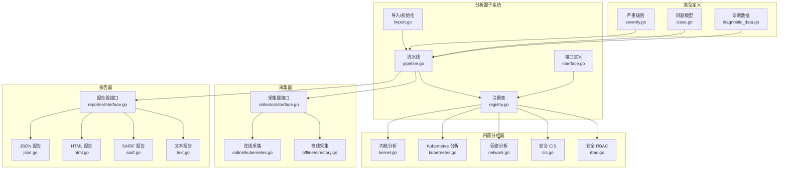
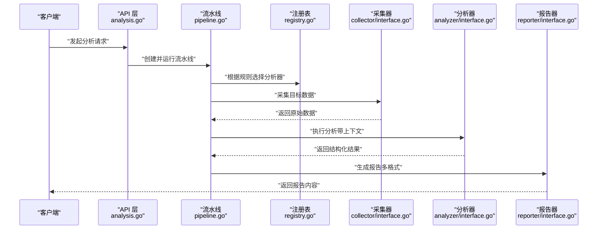
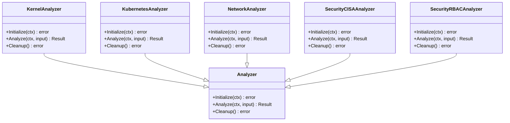
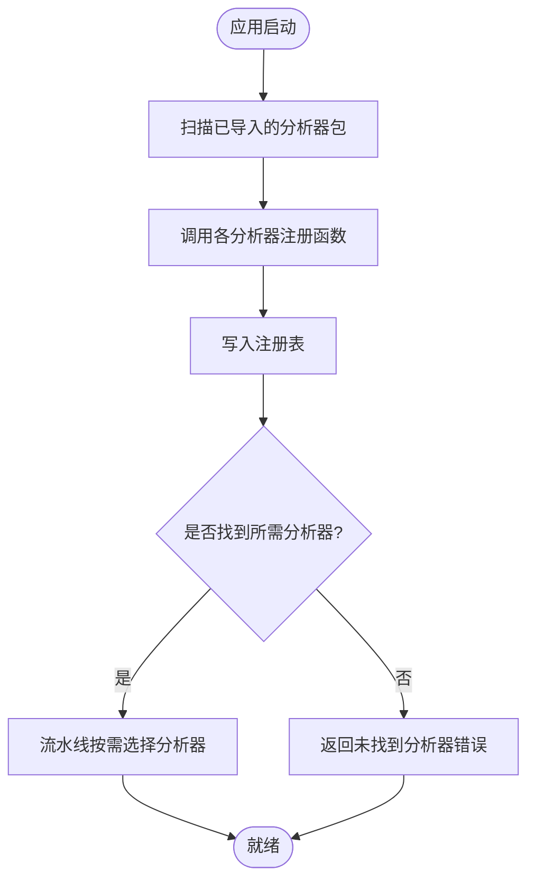
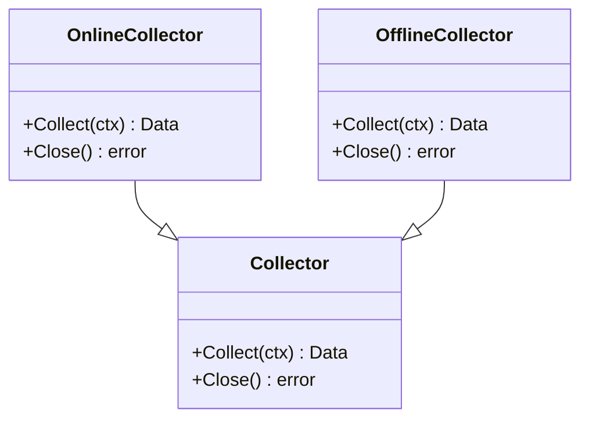
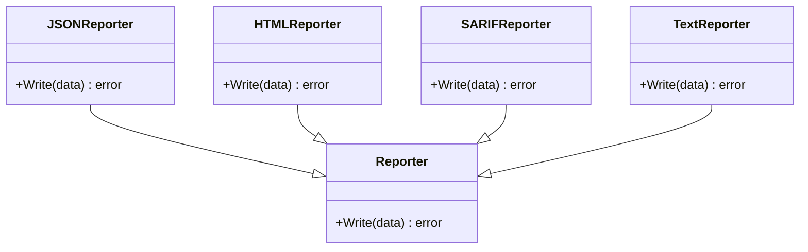
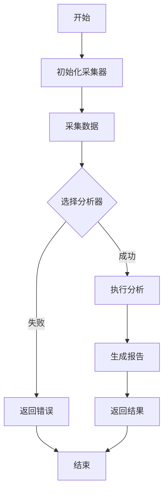
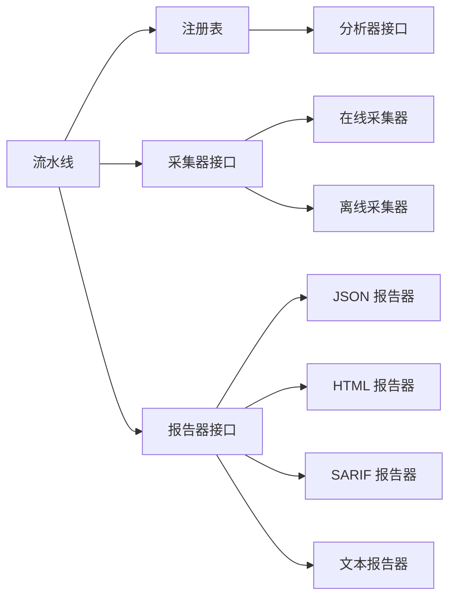

# 分析器插件系统

<cite>
**本文引用的文件**   
- [internal/diag/analyzer/interface.go](file://internal/diag/analyzer/interface.go)
- [internal/diag/analyzer/registry.go](file://internal/diag/analyzer/registry.go)
- [internal/diag/analyzer/kernel/kernel.go](file://internal/diag/analyzer/kernel/kernel.go)
- [internal/diag/analyzer/kubernetes/kubernetes.go](file://internal/diag/analyzer/kubernetes/kubernetes.go)
- [internal/diag/analyzer/network/network.go](file://internal/diag/analyzer/network/network.go)
- [internal/diag/analyzer/security/cis.go](file://internal/diag/analyzer/security/cis.go)
- [internal/diag/analyzer/security/rbac.go](file://internal/diag/analyzer/security/rbac.go)
- [internal/diag/pipeline.go](file://internal/diag/pipeline.go)
- [internal/diag/import.go](file://internal/diag/import.go)
- [internal/diag/types/diagnostic_data.go](file://internal/diag/types/diagnostic_data.go)
- [internal/diag/types/issue.go](file://internal/diag/types/issue.go)
- [internal/diag/types/severity.go](file://internal/diag/types/severity.go)
- [internal/diag/reporter/interface.go](file://internal/diag/reporter/interface.go)
- [internal/diag/reporter/json.go](file://internal/diag/reporter/json.go)
- [internal/diag/reporter/html.go](file://internal/diag/reporter/html.go)
- [internal/diag/reporter/sarif.go](file://internal/diag/reporter/sarif.go)
- [internal/diag/reporter/text.go](file://internal/diag/reporter/text.go)
- [internal/diag/collector/interface.go](file://internal/diag/collector/interface.go)
- [internal/diag/collector/online/kubernetes.go](file://internal/diag/collector/online/kubernetes.go)
- [internal/diag/collector/offline/directory.go](file://internal/diag/collector/offline/directory.go)
- [internal/api/analysis.go](file://internal/api/analysis.go)
</cite>

## 目录
1. [简介](#简介)
2. [项目结构](#项目结构)
3. [核心组件](#核心组件)
4. [架构总览](#架构总览)
5. [详细组件分析](#详细组件分析)
6. [依赖关系分析](#依赖关系分析)
7. [性能考虑](#性能考虑)
8. [故障排查指南](#故障排查指南)
9. [结论](#结论)
10. [附录](#附录)

## 简介
本文件面向 Klaw 平台的“分析器插件系统”，系统性阐述接口设计规范、生命周期管理、上下文传递与结果格式化；解释插件注册机制与动态加载原理，并覆盖内置分析器的实现模式（Kubernetes 资源分析、网络分析、安全分析）。同时提供插件开发最佳实践（错误处理、性能优化、测试策略）以及完整的自定义分析器开发与集成指南。

## 项目结构
分析器插件系统位于 internal/diag 目录下，围绕“采集-分析-报告”的流水线组织：
- 接口与类型定义：internal/diag/analyzer/interface.go、internal/diag/types/*
- 插件注册表：internal/diag/analyzer/registry.go
- 内置分析器：internal/diag/analyzer/{kernel,kubernetes,network,security,...}
- 数据收集器：internal/diag/collector/*
- 报告器：internal/diag/reporter/*
- 流水线编排：internal/diag/pipeline.go
- 导入与初始化：internal/diag/import.go
- API 暴露：internal/api/analysis.go

图表来源 
- [internal/diag/analyzer/interface.go](file://internal/diag/analyzer/interface.go)
- [internal/diag/analyzer/registry.go](file://internal/diag/analyzer/registry.go)
- [internal/diag/analyzer/kernel/kernel.go](file://internal/diag/analyzer/kernel/kernel.go)
- [internal/diag/analyzer/kubernetes/kubernetes.go](file://internal/diag/analyzer/kubernetes/kubernetes.go)
- [internal/diag/analyzer/network/network.go](file://internal/diag/analyzer/network/network.go)
- [internal/diag/analyzer/security/cis.go](file://internal/diag/analyzer/security/cis.go)
- [internal/diag/analyzer/security/rbac.go](file://internal/diag/analyzer/security/rbac.go)
- [internal/diag/collector/interface.go](file://internal/diag/collector/interface.go)
- [internal/diag/collector/online/kubernetes.go](file://internal/diag/collector/online/kubernetes.go)
- [internal/diag/collector/offline/directory.go](file://internal/diag/collector/offline/directory.go)
- [internal/diag/reporter/interface.go](file://internal/diag/reporter/interface.go)
- [internal/diag/reporter/json.go](file://internal/diag/reporter/json.go)
- [internal/diag/reporter/html.go](file://internal/diag/reporter/html.go)
- [internal/diag/reporter/sarif.go](file://internal/diag/reporter/sarif.go)
- [internal/diag/reporter/text.go](file://internal/diag/reporter/text.go)
- [internal/diag/types/diagnostic_data.go](file://internal/diag/types/diagnostic_data.go)
- [internal/diag/types/issue.go](file://internal/diag/types/issue.go)
- [internal/diag/types/severity.go](file://internal/diag/types/severity.go)
- [internal/diag/pipeline.go](file://internal/diag/pipeline.go)
- [internal/diag/import.go](file://internal/diag/import.go)

章节来源
- [internal/diag/analyzer/interface.go](file://internal/diag/analyzer/interface.go)
- [internal/diag/analyzer/registry.go](file://internal/diag/analyzer/registry.go)
- [internal/diag/pipeline.go](file://internal/diag/pipeline.go)
- [internal/diag/import.go](file://internal/diag/import.go)

## 核心组件
- 分析器接口与生命周期
  - 分析器通过统一接口暴露能力，包含初始化、执行、清理等生命周期方法；支持上下文传递以携带请求级信息（如超时、取消、租户隔离等）。
  - 结果采用结构化模型输出，便于多格式报告器消费。
- 插件注册与动态加载
  - 注册表集中维护可用分析器实例，支持按名称或类别检索；在应用启动时自动发现并注册内置分析器。
  - 通过导入包触发注册逻辑，实现“零配置”动态加载。
- 数据采集器
  - 抽象出在线与离线两种采集方式：在线从 Kubernetes 集群实时拉取数据，离线从本地目录读取快照数据。
- 报告器
  - 统一报告接口，支持 JSON、HTML、SARIF、文本等多种输出格式，便于下游系统集成与可视化。
- 类型定义
  - 诊断数据、问题模型、严重级别等核心类型贯穿采集、分析与报告全链路。

章节来源
- [internal/diag/analyzer/interface.go](file://internal/diag/analyzer/interface.go)
- [internal/diag/analyzer/registry.go](file://internal/diag/analyzer/registry.go)
- [internal/diag/collector/interface.go](file://internal/diag/collector/interface.go)
- [internal/diag/reporter/interface.go](file://internal/diag/reporter/interface.go)
- [internal/diag/types/diagnostic_data.go](file://internal/diag/types/diagnostic_data.go)
- [internal/diag/types/issue.go](file://internal/diag/types/issue.go)
- [internal/diag/types/severity.go](file://internal/diag/types/severity.go)

## 架构总览
分析器插件系统以“流水线”为核心编排采集、分析与报告三个阶段。API 层接收外部请求，调度流水线执行；注册表负责分析器发现与选择；采集器为分析器提供输入数据；报告器将分析结果序列化为多种格式。

图表来源 
- [internal/api/analysis.go](file://internal/api/analysis.go)
- [internal/diag/pipeline.go](file://internal/diag/pipeline.go)
- [internal/diag/analyzer/registry.go](file://internal/diag/analyzer/registry.go)
- [internal/diag/collector/interface.go](file://internal/diag/collector/interface.go)
- [internal/diag/analyzer/interface.go](file://internal/diag/analyzer/interface.go)
- [internal/diag/reporter/interface.go](file://internal/diag/reporter/interface.go)

## 详细组件分析

### 分析器接口与生命周期
- 设计要点
  - 统一的 Analyze 方法用于执行分析逻辑，接受上下文与输入数据，返回结构化结果。
  - 生命周期方法包括初始化（准备依赖）、执行（核心逻辑）、清理（释放资源），确保可插拔与资源安全。
  - 上下文传递支持取消、超时、追踪 ID、租户信息等，保证跨阶段一致性。
- 结果格式化
  - 分析结果以统一的数据模型表示，包含问题列表、严重级别、元数据等，供报告器消费。

图表来源 
- [internal/diag/analyzer/interface.go](file://internal/diag/analyzer/interface.go)
- [internal/diag/analyzer/kernel/kernel.go](file://internal/diag/analyzer/kernel/kernel.go)
- [internal/diag/analyzer/kubernetes/kubernetes.go](file://internal/diag/analyzer/kubernetes/kubernetes.go)
- [internal/diag/analyzer/network/network.go](file://internal/diag/analyzer/network/network.go)
- [internal/diag/analyzer/security/cis.go](file://internal/diag/analyzer/security/cis.go)
- [internal/diag/analyzer/security/rbac.go](file://internal/diag/analyzer/security/rbac.go)

章节来源
- [internal/diag/analyzer/interface.go](file://internal/diag/analyzer/interface.go)
- [internal/diag/analyzer/kernel/kernel.go](file://internal/diag/analyzer/kernel/kernel.go)
- [internal/diag/analyzer/kubernetes/kubernetes.go](file://internal/diag/analyzer/kubernetes/kubernetes.go)
- [internal/diag/analyzer/network/network.go](file://internal/diag/analyzer/network/network.go)
- [internal/diag/analyzer/security/cis.go](file://internal/diag/analyzer/security/cis.go)
- [internal/diag/analyzer/security/rbac.go](file://internal/diag/analyzer/security/rbac.go)

### 插件注册与动态加载
- 注册机制
  - 注册表维护分析器实例集合，提供按名称或类别查找的能力。
  - 内置分析器通过包导入触发注册函数，无需额外配置即可自动发现。
- 动态加载原理
  - 应用启动时扫描已导入的分析器包，调用其注册函数完成实例化与注册。
  - 支持扩展点：新增分析器只需实现接口并在导入处触发注册。

图表来源 
- [internal/diag/analyzer/registry.go](file://internal/diag/analyzer/registry.go)
- [internal/diag/import.go](file://internal/diag/import.go)

章节来源
- [internal/diag/analyzer/registry.go](file://internal/diag/analyzer/registry.go)
- [internal/diag/import.go](file://internal/diag/import.go)

### 数据采集器
- 在线采集器
  - 通过 Kubernetes 客户端获取集群资源状态，适合实时分析场景。
- 离线采集器
  - 从本地目录读取预存快照数据，适合离线审计与回溯分析。
- 接口契约
  - 统一采集接口，屏蔽数据来源差异，向上层提供一致的数据视图。

图表来源 
- [internal/diag/collector/interface.go](file://internal/diag/collector/interface.go)
- [internal/diag/collector/online/kubernetes.go](file://internal/diag/collector/online/kubernetes.go)
- [internal/diag/collector/offline/directory.go](file://internal/diag/collector/offline/directory.go)

章节来源
- [internal/diag/collector/interface.go](file://internal/diag/collector/interface.go)
- [internal/diag/collector/online/kubernetes.go](file://internal/diag/collector/online/kubernetes.go)
- [internal/diag/collector/offline/directory.go](file://internal/diag/collector/offline/directory.go)

### 报告器
- 统一接口
  - 所有报告器实现同一接口，支持序列化结构化结果为不同格式。
- 内置格式
  - JSON：机器可读，便于自动化处理。
  - HTML：人类可读，便于浏览器查看。
  - SARIF：静态分析标准格式，便于与 IDE/CI 集成。
  - 文本：简单文本输出，便于日志记录。

图表来源 
- [internal/diag/reporter/interface.go](file://internal/diag/reporter/interface.go)
- [internal/diag/reporter/json.go](file://internal/diag/reporter/json.go)
- [internal/diag/reporter/html.go](file://internal/diag/reporter/html.go)
- [internal/diag/reporter/sarif.go](file://internal/diag/reporter/sarif.go)
- [internal/diag/reporter/text.go](file://internal/diag/reporter/text.go)

章节来源
- [internal/diag/reporter/interface.go](file://internal/diag/reporter/interface.go)
- [internal/diag/reporter/json.go](file://internal/diag/reporter/json.go)
- [internal/diag/reporter/html.go](file://internal/diag/reporter/html.go)
- [internal/diag/reporter/sarif.go](file://internal/diag/reporter/sarif.go)
- [internal/diag/reporter/text.go](file://internal/diag/reporter/text.go)

### 流水线编排
- 职责
  - 协调采集、分析、报告三个阶段，管理上下文与错误传播。
  - 根据请求参数选择合适的数据采集器与分析器。
- 执行流程
  - 初始化采集器 -> 采集数据 -> 选择分析器 -> 执行分析 -> 生成报告 -> 返回结果。

图表来源 
- [internal/diag/pipeline.go](file://internal/diag/pipeline.go)

章节来源
- [internal/diag/pipeline.go](file://internal/diag/pipeline.go)

### 内置分析器实现模式
- Kubernetes 资源分析
  - 基于在线采集器获取集群资源状态，进行健康度、合规性、容量等维度分析。
- 网络分析
  - 针对网络连接、DNS、服务网格等进行连通性与性能分析。
- 安全分析
  - 基于 CIS 基准与 RBAC 策略进行安全合规检查，识别高风险配置。

章节来源
- [internal/diag/analyzer/kubernetes/kubernetes.go](file://internal/diag/analyzer/kubernetes/kubernetes.go)
- [internal/diag/analyzer/network/network.go](file://internal/diag/analyzer/network/network.go)
- [internal/diag/analyzer/security/cis.go](file://internal/diag/analyzer/security/cis.go)
- [internal/diag/analyzer/security/rbac.go](file://internal/diag/analyzer/security/rbac.go)

## 依赖关系分析
- 组件耦合
  - 流水线强依赖注册表、采集器接口与报告器接口，弱依赖具体实现。
  - 分析器仅依赖类型定义与采集器接口，保持高内聚低耦合。
- 外部依赖
  - 在线采集器依赖 Kubernetes 客户端；离线采集器依赖文件系统访问。
  - 报告器依赖序列化库与模板引擎（如适用）。

图表来源 
- [internal/diag/pipeline.go](file://internal/diag/pipeline.go)
- [internal/diag/analyzer/registry.go](file://internal/diag/analyzer/registry.go)
- [internal/diag/analyzer/interface.go](file://internal/diag/analyzer/interface.go)
- [internal/diag/collector/interface.go](file://internal/diag/collector/interface.go)
- [internal/diag/reporter/interface.go](file://internal/diag/reporter/interface.go)

章节来源
- [internal/diag/pipeline.go](file://internal/diag/pipeline.go)
- [internal/diag/analyzer/registry.go](file://internal/diag/analyzer/registry.go)
- [internal/diag/analyzer/interface.go](file://internal/diag/analyzer/interface.go)
- [internal/diag/collector/interface.go](file://internal/diag/collector/interface.go)
- [internal/diag/reporter/interface.go](file://internal/diag/reporter/interface.go)

## 性能考虑
- 并发与并行
  - 采集与分析阶段可并行执行，减少端到端延迟。
  - 使用上下文控制超时与取消，避免长时间阻塞。
- 内存与 I/O
  - 大对象采集应流式处理，避免一次性加载到内存。
  - 报告生成可采用增量写入，降低峰值内存占用。
- 缓存与复用
  - 对重复查询结果进行缓存，提高分析器响应速度。
  - 共享只读配置与连接池，减少资源分配开销。

[本节为通用指导，不直接分析具体文件]

## 故障排查指南
- 常见问题
  - 分析器未注册：检查导入路径与注册函数调用。
  - 采集失败：验证集群连接权限或离线数据目录存在性。
  - 报告生成异常：确认数据结构与报告器兼容性。
- 调试建议
  - 启用详细日志，定位失败阶段。
  - 使用最小数据集复现问题，逐步缩小范围。
  - 单元测试覆盖边界条件与错误路径。

章节来源
- [internal/diag/analyzer/registry.go](file://internal/diag/analyzer/registry.go)
- [internal/diag/collector/interface.go](file://internal/diag/collector/interface.go)
- [internal/diag/reporter/interface.go](file://internal/diag/reporter/interface.go)

## 结论
Klaw 分析器插件系统通过清晰的接口设计与模块化架构，实现了可扩展、可插拔的分析能力。统一的流水线编排与多格式报告支持，使平台能够灵活应对不同场景需求。遵循本文档的最佳实践，开发者可以快速构建高质量的分析器插件，并无缝集成到现有系统中。

[本节为总结性内容，不直接分析具体文件]

## 附录
- 自定义分析器开发步骤
  - 实现分析器接口，定义 Initialize、Analyze、Cleanup 方法。
  - 在包中注册分析器实例，确保导入时自动发现。
  - 编写单元测试，覆盖正常路径与错误路径。
  - 集成到流水线，验证端到端流程。
- 集成指南
  - 在 API 层添加新分析器的路由与参数校验。
  - 更新文档与示例，指导用户正确使用。
  - 监控与告警：为新分析器添加指标与错误统计。

[本节为补充说明，不直接分析具体文件]