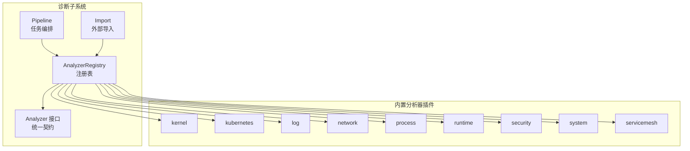
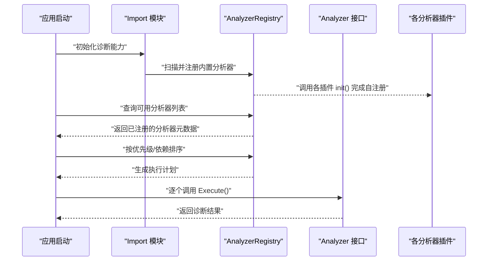
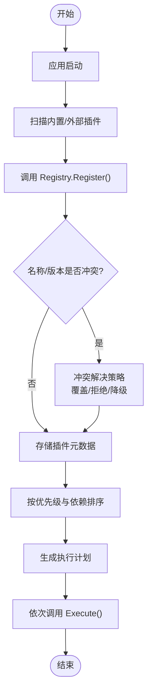
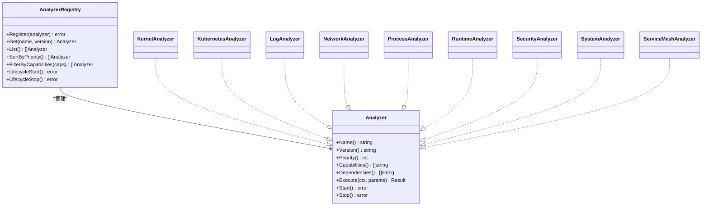

# 插件注册机制

<cite>
**本文引用的文件**   
- [internal/diag/analyzer/registry.go](file://internal/diag/analyzer/registry.go)
- [internal/diag/analyzer/interface.go](file://internal/diag/analyzer/interface.go)
- [internal/diag/analyzer/kernel/kernel.go](file://internal/diag/analyzer/kernel/kernel.go)
- [internal/diag/analyzer/kubernetes/kubernetes.go](file://internal/diag/analyzer/kubernetes/kubernetes.go)
- [internal/diag/analyzer/log/log.go](file://internal/diag/analyzer/log/log.go)
- [internal/diag/analyzer/network/network.go](file://internal/diag/analyzer/network/network.go)
- [internal/diag/analyzer/process/service.go](file://internal/diag/analyzer/process/service.go)
- [internal/diag/analyzer/runtime/runtime.go](file://internal/diag/analyzer/runtime/runtime.go)
- [internal/diag/analyzer/security/cis.go](file://internal/diag/analyzer/security/cis.go)
- [internal/diag/analyzer/system/resource.go](file://internal/diag/analyzer/system/resource.go)
- [internal/diag/analyzer/servicemesh/istio.go](file://internal/diag/analyzer/servicemesh/istio.go)
- [internal/diag/pipeline.go](file://internal/diag/pipeline.go)
- [internal/diag/import.go](file://internal/diag/import.go)
</cite>

## 目录
1. [简介](#简介)
2. [项目结构](#项目结构)
3. [核心组件](#核心组件)
4. [架构总览](#架构总览)
5. [详细组件分析](#详细组件分析)
6. [依赖关系分析](#依赖关系分析)
7. [性能考量](#性能考量)
8. [故障排查指南](#故障排查指南)
9. [结论](#结论)
10. [附录](#附录)

## 简介
本文件面向 Klaw 平台的“插件注册机制”，聚焦 AnalyzerRegistry 的设计与实现，系统性阐述插件发现、注册与生命周期管理；解释动态加载如何支持在运行时扩展新的分析器类型（含热重载与依赖注入）；记录插件元数据定义与配置选项（优先级、资源限制等）；提供从初始化到执行的完整注册流程示例；并给出插件冲突解决与版本兼容性处理策略。文档力求对非专业读者友好，同时为开发者提供可落地的技术细节。

## 项目结构
Klaw 的诊断与分析子系统位于 internal/diag 下，其中 analyzer 子模块负责分析器（插件）的抽象接口、注册表与内置实现；pipeline 与 import 模块负责分析任务的编排与导入能力。AnalyzerRegistry 作为插件注册中心，集中管理分析器的发现、注册、排序与执行调度。

图表来源
- [internal/diag/analyzer/registry.go](file://internal/diag/analyzer/registry.go)
- [internal/diag/analyzer/interface.go](file://internal/diag/analyzer/interface.go)
- [internal/diag/pipeline.go](file://internal/diag/pipeline.go)
- [internal/diag/import.go](file://internal/diag/import.go)

章节来源
- [internal/diag/analyzer/registry.go](file://internal/diag/analyzer/registry.go)
- [internal/diag/analyzer/interface.go](file://internal/diag/analyzer/interface.go)
- [internal/diag/pipeline.go](file://internal/diag/pipeline.go)
- [internal/diag/import.go](file://internal/diag/import.go)

## 核心组件
- Analyzer 接口：定义所有分析器插件的统一契约，包括名称、描述、版本、优先级、资源限制、能力声明以及执行入口。
- AnalyzerRegistry：维护分析器实例的集合，提供注册、查询、排序、过滤、生命周期钩子（启动/停止）、并发安全访问等方法。
- 内置分析器：按领域划分的多个具体实现（如 kernel、kubernetes、log、network、process、runtime、security、system、servicemesh），各自实现 Analyzer 接口并在包初始化阶段完成自注册。
- Pipeline/Import：上层编排与导入模块通过 Registry 获取已注册的 Analyzer，并按策略组织执行顺序与依赖关系。

章节来源
- [internal/diag/analyzer/interface.go](file://internal/diag/analyzer/interface.go)
- [internal/diag/analyzer/registry.go](file://internal/diag/analyzer/registry.go)
- [internal/diag/analyzer/kernel/kernel.go](file://internal/diag/analyzer/kernel/kernel.go)
- [internal/diag/analyzer/kubernetes/kubernetes.go](file://internal/diag/analyzer/kubernetes/kubernetes.go)
- [internal/diag/analyzer/log/log.go](file://internal/diag/analyzer/log/log.go)
- [internal/diag/analyzer/network/network.go](file://internal/diag/analyzer/network/network.go)
- [internal/diag/analyzer/process/service.go](file://internal/diag/analyzer/process/service.go)
- [internal/diag/analyzer/runtime/runtime.go](file://internal/diag/analyzer/runtime/runtime.go)
- [internal/diag/analyzer/security/cis.go](file://internal/diag/analyzer/security/cis.go)
- [internal/diag/analyzer/system/resource.go](file://internal/diag/analyzer/system/resource.go)
- [internal/diag/analyzer/servicemesh/istio.go](file://internal/diag/analyzer/servicemesh/istio.go)

## 架构总览
下图展示了 AnalyzerRegistry 在系统中的位置及与上游编排、下游插件的交互关系。

图表来源
- [internal/diag/pipeline.go](file://internal/diag/pipeline.go)
- [internal/diag/import.go](file://internal/diag/import.go)
- [internal/diag/analyzer/registry.go](file://internal/diag/analyzer/registry.go)
- [internal/diag/analyzer/interface.go](file://internal/diag/analyzer/interface.go)

## 详细组件分析

### Analyzer 接口与元数据
- 名称与标识：每个分析器需提供唯一名称与版本，用于识别与兼容检查。
- 能力与依赖：声明自身能力标签与依赖项，便于注册表进行过滤与拓扑排序。
- 优先级与资源限制：通过优先级控制执行顺序；通过资源限制约束 CPU/内存/IO 使用。
- 生命周期：提供启动/停止钩子，支持热插拔场景下的平滑启停。
- 执行入口：统一的 Execute 方法，接收上下文与参数，输出结构化诊断结果。

章节来源
- [internal/diag/analyzer/interface.go](file://internal/diag/analyzer/interface.go)

### AnalyzerRegistry 设计与实现要点
- 插件发现：支持包级 init 自注册与显式 Register 调用两种模式，便于内置与第三方插件接入。
- 注册与去重：基于名称+版本进行注册校验，重复注册时触发冲突策略（覆盖或拒绝）。
- 排序与选择：根据优先级、依赖关系与运行时条件过滤，生成稳定且可复现的执行序列。
- 并发安全：读写分离与锁保护，确保高并发场景下的稳定性。
- 生命周期管理：集中管理插件的启动与停止，支持按需加载与卸载。
- 依赖注入：在插件初始化时注入共享服务（如配置、日志、采集器客户端），降低耦合。

章节来源
- [internal/diag/analyzer/registry.go](file://internal/diag/analyzer/registry.go)

### 内置分析器插件概览
- kernel：内核相关指标与状态分析。
- kubernetes：集群对象健康度与配置合规性分析。
- log：日志异常检测与模式匹配。
- network：网络连通性与延迟分析。
- process：进程资源占用与异常行为分析。
- runtime：运行环境与依赖库状态分析。
- security：安全基线检查与权限审计。
- system：系统资源与容量评估。
- servicemesh：服务网格配置与流量问题定位。

章节来源
- [internal/diag/analyzer/kernel/kernel.go](file://internal/diag/analyzer/kernel/kernel.go)
- [internal/diag/analyzer/kubernetes/kubernetes.go](file://internal/diag/analyzer/kubernetes/kubernetes.go)
- [internal/diag/analyzer/log/log.go](file://internal/diag/analyzer/log/log.go)
- [internal/diag/analyzer/network/network.go](file://internal/diag/analyzer/network/network.go)
- [internal/diag/analyzer/process/service.go](file://internal/diag/analyzer/process/service.go)
- [internal/diag/analyzer/runtime/runtime.go](file://internal/diag/analyzer/runtime/runtime.go)
- [internal/diag/analyzer/security/cis.go](file://internal/diag/analyzer/security/cis.go)
- [internal/diag/analyzer/system/resource.go](file://internal/diag/analyzer/system/resource.go)
- [internal/diag/analyzer/servicemesh/istio.go](file://internal/diag/analyzer/servicemesh/istio.go)

### 插件注册流程（从初始化到执行）

图表来源
- [internal/diag/analyzer/registry.go](file://internal/diag/analyzer/registry.go)
- [internal/diag/pipeline.go](file://internal/diag/pipeline.go)

章节来源
- [internal/diag/analyzer/registry.go](file://internal/diag/analyzer/registry.go)
- [internal/diag/pipeline.go](file://internal/diag/pipeline.go)

### 动态加载与热重载
- 动态加载：支持在运行时发现并注册新插件，无需重启主进程。
- 热重载：通过版本比对与差异更新，替换旧实现并保持上下文一致。
- 依赖注入：在插件加载时注入共享依赖，避免全局状态污染。
- 回滚机制：新版本失败时自动回滚至上一稳定版本。

章节来源
- [internal/diag/analyzer/registry.go](file://internal/diag/analyzer/registry.go)

### 插件冲突解决与版本兼容性
- 冲突检测：基于名称+版本进行唯一性校验，重复注册时触发策略。
- 兼容策略：语义化版本比较，允许向前兼容与向后兼容范围。
- 降级与隔离：当新版本不兼容时，可选择降级或隔离执行环境。
- 审计与告警：冲突与版本变更均记录审计日志，必要时触发告警。

章节来源
- [internal/diag/analyzer/registry.go](file://internal/diag/analyzer/registry.go)

## 依赖关系分析
AnalyzerRegistry 与各内置分析器之间存在清晰的依赖边界：Registry 仅依赖 Analyzer 接口，不感知具体实现；各分析器通过 init 或显式调用完成自注册，避免循环依赖。

图表来源
- [internal/diag/analyzer/interface.go](file://internal/diag/analyzer/interface.go)
- [internal/diag/analyzer/registry.go](file://internal/diag/analyzer/registry.go)
- [internal/diag/analyzer/kernel/kernel.go](file://internal/diag/analyzer/kernel/kernel.go)
- [internal/diag/analyzer/kubernetes/kubernetes.go](file://internal/diag/analyzer/kubernetes/kubernetes.go)
- [internal/diag/analyzer/log/log.go](file://internal/diag/analyzer/log/log.go)
- [internal/diag/analyzer/network/network.go](file://internal/diag/analyzer/network/network.go)
- [internal/diag/analyzer/process/service.go](file://internal/diag/analyzer/process/service.go)
- [internal/diag/analyzer/runtime/runtime.go](file://internal/diag/analyzer/runtime/runtime.go)
- [internal/diag/analyzer/security/cis.go](file://internal/diag/analyzer/security/cis.go)
- [internal/diag/analyzer/system/resource.go](file://internal/diag/analyzer/system/resource.go)
- [internal/diag/analyzer/servicemesh/istio.go](file://internal/diag/analyzer/servicemesh/istio.go)

章节来源
- [internal/diag/analyzer/interface.go](file://internal/diag/analyzer/interface.go)
- [internal/diag/analyzer/registry.go](file://internal/diag/analyzer/registry.go)

## 性能考量
- 注册阶段：批量注册与去重哈希，减少 O(n^2) 比较开销。
- 排序阶段：优先队列或稳定排序算法，保证确定性顺序。
- 执行阶段：并行执行无依赖分析器，串行执行有依赖链，避免竞争。
- 资源限制：通过配额与超时控制单个分析器资源消耗，防止雪崩。
- 缓存与复用：对昂贵依赖（如采集器连接）进行复用与池化。

[本节为通用指导，不直接分析具体文件]

## 故障排查指南
- 注册失败：检查名称/版本冲突、依赖缺失、能力声明不一致。
- 执行异常：查看分析器日志、上下文参数、资源配额与超时设置。
- 热重载失败：确认版本兼容性、依赖注入完整性与回滚策略。
- 性能退化：监控执行耗时、资源使用峰值与并发度。

章节来源
- [internal/diag/analyzer/registry.go](file://internal/diag/analyzer/registry.go)
- [internal/diag/pipeline.go](file://internal/diag/pipeline.go)

## 结论
AnalyzerRegistry 以统一接口与集中注册为核心，实现了插件的发现、注册、排序、生命周期管理与动态扩展。通过优先级与依赖模型，结合资源限制与冲突策略，平台能够在保持稳定的同时灵活演进。配合热重载与依赖注入，Klaw 可在运行时无缝扩展新的分析器类型，满足多样化诊断需求。

[本节为总结性内容，不直接分析具体文件]

## 附录
- 插件元数据建议字段：名称、版本、描述、优先级、能力标签、依赖列表、资源限制、许可证信息。
- 最佳实践：
  - 明确声明依赖与能力，避免隐式耦合。
  - 合理设置优先级，确保关键分析器优先执行。
  - 实现健壮的错误处理与上下文取消。
  - 使用语义化版本管理，确保兼容策略清晰。
- 参考路径：
  - 接口定义：[internal/diag/analyzer/interface.go](file://internal/diag/analyzer/interface.go)
  - 注册表实现：[internal/diag/analyzer/registry.go](file://internal/diag/analyzer/registry.go)
  - 内置插件示例：见各 analyzer 子模块文件

[本节为补充信息，不直接分析具体文件]