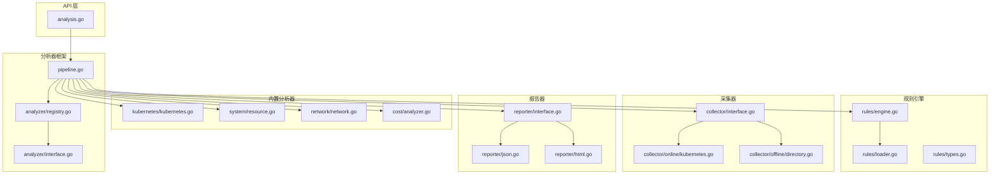
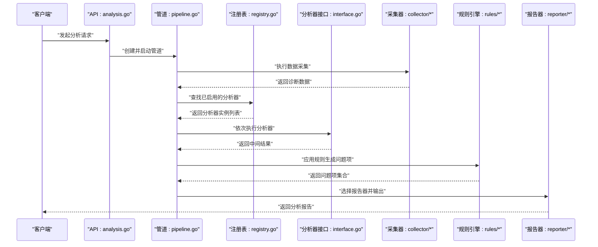
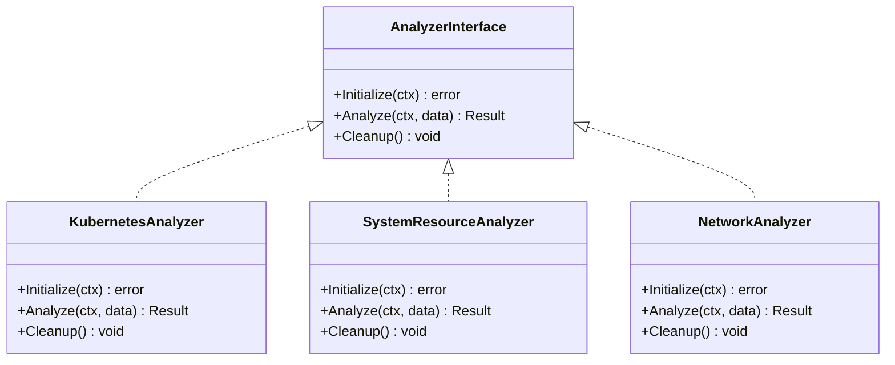
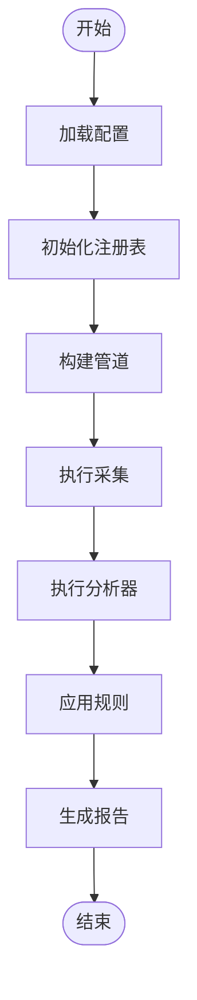
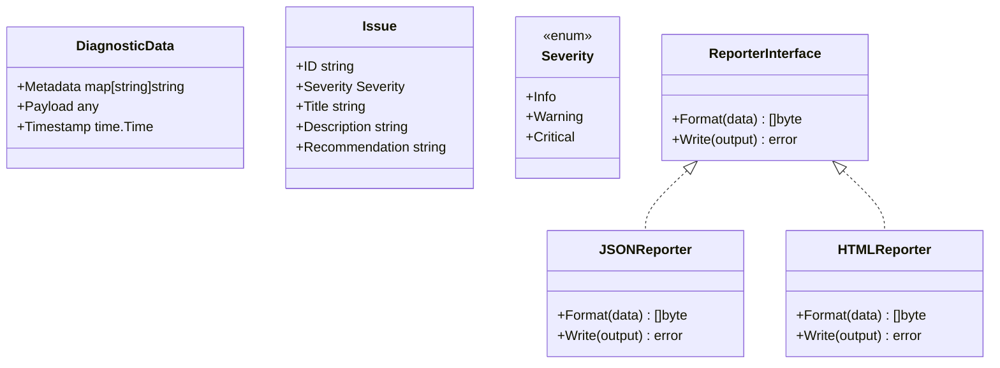
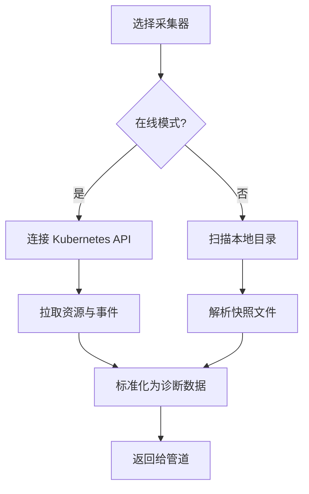
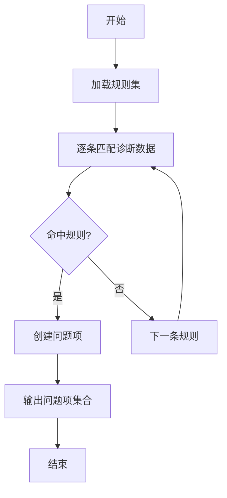
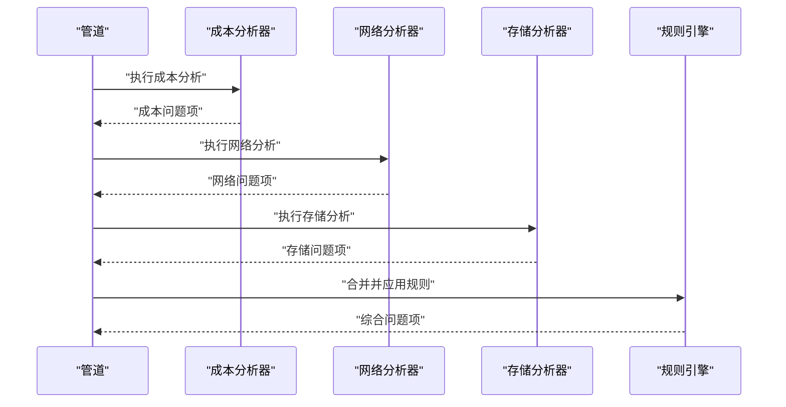
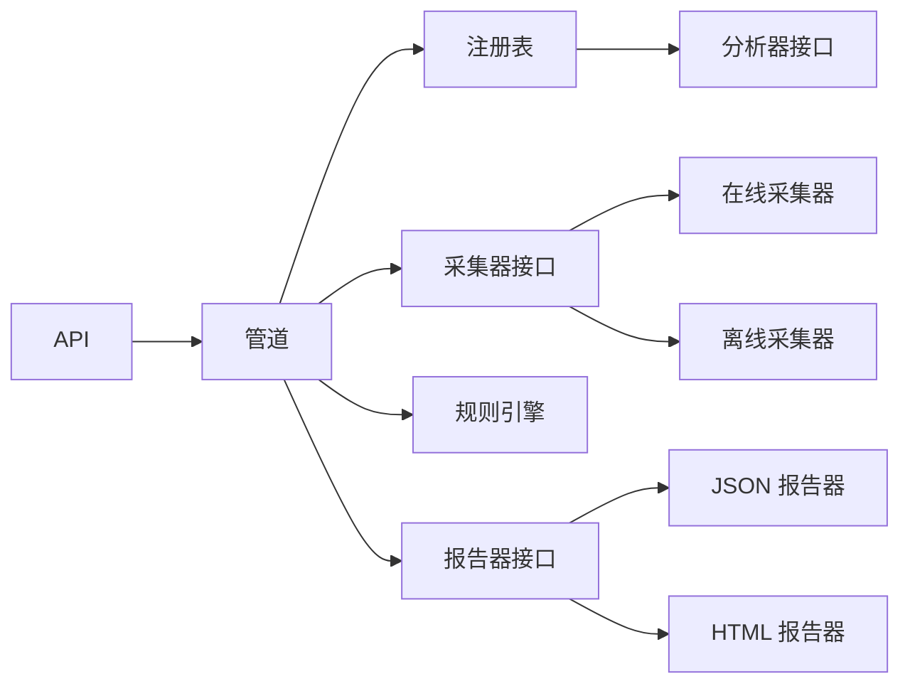

# 自定义分析器开发

<cite>
**本文引用的文件**   
- [internal/diag/analyzer/interface.go](file://internal/diag/analyzer/interface.go)
- [internal/diag/analyzer/registry.go](file://internal/diag/analyzer/registry.go)
- [internal/diag/pipeline.go](file://internal/diag/pipeline.go)
- [internal/diag/types/issue.go](file://internal/diag/types/issue.go)
- [internal/diag/types/severity.go](file://internal/diag/types/severity.go)
- [internal/diag/types/diagnostic_data.go](file://internal/diag/types/diagnostic_data.go)
- [internal/diag/analyzer/kubernetes/kubernetes.go](file://internal/diag/analyzer/kubernetes/kubernetes.go)
- [internal/diag/analyzer/system/resource.go](file://internal/diag/analyzer/system/resource.go)
- [internal/diag/analyzer/network/network.go](file://internal/diag/analyzer/network/network.go)
- [internal/diag/analyzer/servicemesh/servicemesh_test.go](file://internal/diag/analyzer/servicemesh/servicemesh_test.go)
- [internal/diag/reporter/interface.go](file://internal/diag/reporter/interface.go)
- [internal/diag/reporter/json.go](file://internal/diag/reporter/json.go)
- [internal/diag/reporter/html.go](file://internal/diag/reporter/html.go)
- [internal/diag/cost/analyzer.go](file://internal/diag/cost/analyzer.go)
- [internal/diag/rules/engine.go](file://internal/diag/rules/engine.go)
- [internal/diag/rules/loader.go](file://internal/diag/rules/loader.go)
- [internal/diag/rules/types.go](file://internal/diag/rules/types.go)
- [internal/diag/collector/interface.go](file://internal/diag/collector/interface.go)
- [internal/diag/collector/online/kubernetes.go](file://internal/diag/collector/online/kubernetes.go)
- [internal/diag/collector/offline/directory.go](file://internal/diag/collector/offline/directory.go)
- [internal/api/analysis.go](file://internal/api/analysis.go)
- [internal/config/config.go](file://internal/config/config.go)
</cite>

## 目录
1. [简介](#简介)
2. [项目结构](#项目结构)
3. [核心组件](#核心组件)
4. [架构总览](#架构总览)
5. [详细组件分析](#详细组件分析)
6. [依赖关系分析](#依赖关系分析)
7. [性能考量](#性能考量)
8. [故障排查指南](#故障排查指南)
9. [结论](#结论)
10. [附录](#附录)

## 简介
本指南面向希望在 Klaw 平台中开发“自定义分析器”的工程师，覆盖从接口实现、上下文处理、结果格式化到测试与部署的全流程。Klaw 的分析子系统采用插件化架构：通过统一的分析器接口定义、注册机制与管道编排，将数据采集、规则引擎、成本分析、报告输出等模块解耦，便于扩展新的分析能力（如资源检查、跨服务诊断、网络与存储分析等）。

## 项目结构
与自定义分析器相关的核心代码集中在 internal/diag 目录下，围绕“采集-分析-规则-报告”的流水线组织；API 层提供对外调用入口；配置模块负责加载运行参数。

图表来源
- [internal/api/analysis.go](file://internal/api/analysis.go)
- [internal/diag/analyzer/interface.go](file://internal/diag/analyzer/interface.go)
- [internal/diag/analyzer/registry.go](file://internal/diag/analyzer/registry.go)
- [internal/diag/pipeline.go](file://internal/diag/pipeline.go)
- [internal/diag/collector/interface.go](file://internal/diag/collector/interface.go)
- [internal/diag/collector/online/kubernetes.go](file://internal/diag/collector/online/kubernetes.go)
- [internal/diag/collector/offline/directory.go](file://internal/diag/collector/offline/directory.go)
- [internal/diag/rules/engine.go](file://internal/diag/rules/engine.go)
- [internal/diag/rules/loader.go](file://internal/diag/rules/loader.go)
- [internal/diag/rules/types.go](file://internal/diag/rules/types.go)
- [internal/diag/reporter/interface.go](file://internal/diag/reporter/interface.go)
- [internal/diag/reporter/json.go](file://internal/diag/reporter/json.go)
- [internal/diag/reporter/html.go](file://internal/diag/reporter/html.go)
- [internal/diag/analyzer/kubernetes/kubernetes.go](file://internal/diag/analyzer/kubernetes/kubernetes.go)
- [internal/diag/analyzer/system/resource.go](file://internal/diag/analyzer/system/resource.go)
- [internal/diag/analyzer/network/network.go](file://internal/diag/analyzer/network/network.go)
- [internal/diag/cost/analyzer.go](file://internal/diag/cost/analyzer.go)

章节来源
- [internal/api/analysis.go](file://internal/api/analysis.go)
- [internal/diag/pipeline.go](file://internal/diag/pipeline.go)
- [internal/config/config.go](file://internal/config/config.go)

## 核心组件
- 分析器接口与注册表
  - 分析器接口定义了统一的生命周期方法（初始化、执行、清理）以及上下文访问方式，确保不同分析器可被管道一致调度。
  - 注册表集中管理分析器的发现与实例化，支持按名称或类型启用/禁用。
- 管道编排
  - 管道串联采集器、分析器、规则引擎与报告器，负责错误传播、超时控制、并发度与重试策略。
- 数据类型
  - 诊断数据、问题项与严重级别构成分析结果的通用模型，保证多源数据与多报告格式的统一表达。
- 采集器
  - 在线采集器对接 Kubernetes API 获取运行时状态；离线采集器读取本地目录快照，适用于离线审计场景。
- 规则引擎
  - 基于规则文件的动态加载与匹配，将原始诊断数据转化为结构化问题项。
- 报告器
  - 支持 JSON、HTML 等多种输出格式，便于集成外部系统或生成可视化报告。

章节来源
- [internal/diag/analyzer/interface.go](file://internal/diag/analyzer/interface.go)
- [internal/diag/analyzer/registry.go](file://internal/diag/analyzer/registry.go)
- [internal/diag/pipeline.go](file://internal/diag/pipeline.go)
- [internal/diag/types/issue.go](file://internal/diag/types/issue.go)
- [internal/diag/types/severity.go](file://internal/diag/types/severity.go)
- [internal/diag/types/diagnostic_data.go](file://internal/diag/types/diagnostic_data.go)
- [internal/diag/collector/interface.go](file://internal/diag/collector/interface.go)
- [internal/diag/collector/online/kubernetes.go](file://internal/diag/collector/online/kubernetes.go)
- [internal/diag/collector/offline/directory.go](file://internal/diag/collector/offline/directory.go)
- [internal/diag/rules/engine.go](file://internal/diag/rules/engine.go)
- [internal/diag/rules/loader.go](file://internal/diag/rules/loader.go)
- [internal/diag/rules/types.go](file://internal/diag/rules/types.go)
- [internal/diag/reporter/interface.go](file://internal/diag/reporter/interface.go)
- [internal/diag/reporter/json.go](file://internal/diag/reporter/json.go)
- [internal/diag/reporter/html.go](file://internal/diag/reporter/html.go)

## 架构总览
下图展示了自定义分析器在 Klaw 中的位置与交互关系：API 层触发分析任务，管道协调采集与分析，规则引擎将数据转为问题项，最后由报告器输出。

图表来源
- [internal/api/analysis.go](file://internal/api/analysis.go)
- [internal/diag/pipeline.go](file://internal/diag/pipeline.go)
- [internal/diag/analyzer/registry.go](file://internal/diag/analyzer/registry.go)
- [internal/diag/analyzer/interface.go](file://internal/diag/analyzer/interface.go)
- [internal/diag/collector/interface.go](file://internal/diag/collector/interface.go)
- [internal/diag/rules/engine.go](file://internal/diag/rules/engine.go)
- [internal/diag/reporter/interface.go](file://internal/diag/reporter/interface.go)

## 详细组件分析

### 分析器接口与实现模式
- 接口职责
  - 定义分析器的生命周期方法：初始化环境、执行分析逻辑、释放资源。
  - 提供上下文访问：包含目标集群、命名空间、时间窗口、限流与取消信号等。
- 实现建议
  - 保持幂等性与可重试性；对 I/O 操作设置超时与退避。
  - 使用结构化日志记录关键路径与异常堆栈。
  - 将耗时计算拆分至子任务，避免阻塞管道。

图表来源
- [internal/diag/analyzer/interface.go](file://internal/diag/analyzer/interface.go)
- [internal/diag/analyzer/kubernetes/kubernetes.go](file://internal/diag/analyzer/kubernetes/kubernetes.go)
- [internal/diag/analyzer/system/resource.go](file://internal/diag/analyzer/system/resource.go)
- [internal/diag/analyzer/network/network.go](file://internal/diag/analyzer/network/network.go)

章节来源
- [internal/diag/analyzer/interface.go](file://internal/diag/analyzer/interface.go)
- [internal/diag/analyzer/kubernetes/kubernetes.go](file://internal/diag/analyzer/kubernetes/kubernetes.go)
- [internal/diag/analyzer/system/resource.go](file://internal/diag/analyzer/system/resource.go)
- [internal/diag/analyzer/network/network.go](file://internal/diag/analyzer/network/network.go)

### 注册表与管道编排
- 注册表
  - 维护分析器名称到实现的映射，支持按配置启用/禁用。
  - 提供实例化与缓存，减少重复创建开销。
- 管道
  - 串联采集、分析、规则与报告阶段，支持并发执行与错误聚合。
  - 提供超时、重试、熔断与指标收集钩子。

图表来源
- [internal/diag/analyzer/registry.go](file://internal/diag/analyzer/registry.go)
- [internal/diag/pipeline.go](file://internal/diag/pipeline.go)

章节来源
- [internal/diag/analyzer/registry.go](file://internal/diag/analyzer/registry.go)
- [internal/diag/pipeline.go](file://internal/diag/pipeline.go)

### 数据类型与结果格式化
- 诊断数据
  - 统一的数据载体，包含元数据、原始负载与附加信息。
- 问题项与严重级别
  - 将分析结果抽象为问题项，附带严重级别、描述与建议修复动作。
- 报告器
  - 将问题项序列化为 JSON、HTML 等格式，便于下游消费或展示。

图表来源
- [internal/diag/types/diagnostic_data.go](file://internal/diag/types/diagnostic_data.go)
- [internal/diag/types/issue.go](file://internal/diag/types/issue.go)
- [internal/diag/types/severity.go](file://internal/diag/types/severity.go)
- [internal/diag/reporter/interface.go](file://internal/diag/reporter/interface.go)
- [internal/diag/reporter/json.go](file://internal/diag/reporter/json.go)
- [internal/diag/reporter/html.go](file://internal/diag/reporter/html.go)

章节来源
- [internal/diag/types/diagnostic_data.go](file://internal/diag/types/diagnostic_data.go)
- [internal/diag/types/issue.go](file://internal/diag/types/issue.go)
- [internal/diag/types/severity.go](file://internal/diag/types/severity.go)
- [internal/diag/reporter/interface.go](file://internal/diag/reporter/interface.go)
- [internal/diag/reporter/json.go](file://internal/diag/reporter/json.go)
- [internal/diag/reporter/html.go](file://internal/diag/reporter/html.go)

### 采集器：在线与离线
- 在线采集器
  - 通过 Kubernetes API 实时拉取集群资源与事件，适合生产环境持续诊断。
- 离线采集器
  - 从本地目录读取快照文件，适合离线审计与回溯分析。

图表来源
- [internal/diag/collector/interface.go](file://internal/diag/collector/interface.go)
- [internal/diag/collector/online/kubernetes.go](file://internal/diag/collector/online/kubernetes.go)
- [internal/diag/collector/offline/directory.go](file://internal/diag/collector/offline/directory.go)

章节来源
- [internal/diag/collector/interface.go](file://internal/diag/collector/interface.go)
- [internal/diag/collector/online/kubernetes.go](file://internal/diag/collector/online/kubernetes.go)
- [internal/diag/collector/offline/directory.go](file://internal/diag/collector/offline/directory.go)

### 规则引擎：从数据到问题项
- 规则加载
  - 从配置文件或内嵌规则集加载规则，支持版本管理与热更新。
- 规则匹配
  - 将诊断数据与规则条件进行匹配，生成问题项并标注严重级别。

图表来源
- [internal/diag/rules/loader.go](file://internal/diag/rules/loader.go)
- [internal/diag/rules/engine.go](file://internal/diag/rules/engine.go)
- [internal/diag/rules/types.go](file://internal/diag/rules/types.go)

章节来源
- [internal/diag/rules/loader.go](file://internal/diag/rules/loader.go)
- [internal/diag/rules/engine.go](file://internal/diag/rules/engine.go)
- [internal/diag/rules/types.go](file://internal/diag/rules/types.go)

### 成本分析与跨服务分析示例
- 成本分析
  - 基于资源用量与定价模型估算集群成本，识别浪费与优化点。
- 跨服务分析
  - 结合多个分析器（如网络、存储、工作负载）的结果，进行关联分析与根因定位。

图表来源
- [internal/diag/cost/analyzer.go](file://internal/diag/cost/analyzer.go)
- [internal/diag/analyzer/network/network.go](file://internal/diag/analyzer/network/network.go)
- [internal/diag/rules/engine.go](file://internal/diag/rules/engine.go)

章节来源
- [internal/diag/cost/analyzer.go](file://internal/diag/cost/analyzer.go)
- [internal/diag/analyzer/network/network.go](file://internal/diag/analyzer/network/network.go)
- [internal/diag/rules/engine.go](file://internal/diag/rules/engine.go)

## 依赖关系分析
- 组件耦合
  - 管道对注册表与采集器接口低耦合，便于替换实现。
  - 分析器对规则引擎与报告器通过接口隔离，降低直接依赖。
- 外部依赖
  - Kubernetes API、文件系统 I/O、JSON/HTML 序列化库。
- 潜在循环依赖
  - 通过接口与分层设计避免循环引用；分析器不直接依赖报告器，仅通过管道传递数据。

图表来源
- [internal/api/analysis.go](file://internal/api/analysis.go)
- [internal/diag/pipeline.go](file://internal/diag/pipeline.go)
- [internal/diag/analyzer/registry.go](file://internal/diag/analyzer/registry.go)
- [internal/diag/analyzer/interface.go](file://internal/diag/analyzer/interface.go)
- [internal/diag/collector/interface.go](file://internal/diag/collector/interface.go)
- [internal/diag/collector/online/kubernetes.go](file://internal/diag/collector/online/kubernetes.go)
- [internal/diag/collector/offline/directory.go](file://internal/diag/collector/offline/directory.go)
- [internal/diag/rules/engine.go](file://internal/diag/rules/engine.go)
- [internal/diag/reporter/interface.go](file://internal/diag/reporter/interface.go)
- [internal/diag/reporter/json.go](file://internal/diag/reporter/json.go)
- [internal/diag/reporter/html.go](file://internal/diag/reporter/html.go)

章节来源
- [internal/api/analysis.go](file://internal/api/analysis.go)
- [internal/diag/pipeline.go](file://internal/diag/pipeline.go)
- [internal/diag/analyzer/registry.go](file://internal/diag/analyzer/registry.go)
- [internal/diag/analyzer/interface.go](file://internal/diag/analyzer/interface.go)
- [internal/diag/collector/interface.go](file://internal/diag/collector/interface.go)
- [internal/diag/rules/engine.go](file://internal/diag/rules/engine.go)
- [internal/diag/reporter/interface.go](file://internal/diag/reporter/interface.go)

## 性能考量
- 并发与限流
  - 在管道中对分析器与采集器设置并发上限，避免资源争用；对远端 API 调用实施令牌桶限流。
- 缓存与去重
  - 对频繁查询的资源结果进行短期缓存；对重复事件进行去重以减少冗余计算。
- 超时与熔断
  - 为每个阶段设置合理超时；对不稳定依赖启用熔断，快速失败并降级。
- 内存与 GC
  - 避免在大对象上持有长生命周期引用；及时释放 I/O 句柄与临时缓冲区。
- 指标与观测
  - 暴露关键指标（QPS、延迟、错误率、内存占用），配合告警与追踪链路。

[本节为通用指导，无需特定文件来源]

## 故障排查指南
- 常见问题
  - 分析器未生效：检查注册表是否启用对应分析器名称。
  - 采集失败：验证 Kubernetes 权限与网络连通性；离线模式确认目录可读。
  - 规则无命中：核对规则条件与诊断数据字段映射。
  - 报告为空：确认报告器选择与输出路径正确。
- 调试技巧
  - 开启详细日志，关注关键路径与异常堆栈。
  - 使用最小数据集复现问题，逐步缩小范围。
  - 在管道各阶段插入断点或打印中间结果。
- 单元测试与集成测试
  - 单元测试：对分析器与规则引擎进行纯函数式测试，模拟输入与期望输出。
  - 集成测试：搭建最小环境（Mock API、本地目录快照），端到端验证管道行为。
  - 参考现有测试用例结构与断言方式，确保覆盖率与稳定性。

章节来源
- [internal/diag/analyzer/servicemesh/servicemesh_test.go](file://internal/diag/analyzer/servicemesh/servicemesh_test.go)

## 结论
通过统一的分析器接口、注册表与管道编排，Klaw 提供了可扩展、可观测且易于测试的自定义分析器开发框架。遵循本文的最佳实践与示例流程，可以快速实现从简单资源检查到复杂跨服务分析的各类分析能力，并以多种报告格式输出，满足多样化运维与治理需求。

## 附录
- 开发步骤清单
  - 定义分析器实现，遵循接口规范。
  - 在注册表中登记分析器，并在配置中启用。
  - 编写单元测试与集成测试，覆盖正常与异常路径。
  - 配置规则与报告器，验证端到端流程。
  - 打包与部署：将分析器二进制或模块纳入镜像，随主程序发布。
- 最佳实践
  - 错误处理：区分可恢复与不可恢复错误，记录上下文信息。
  - 日志记录：结构化日志，包含请求 ID、阶段与耗时。
  - 性能优化：缓存热点数据，限制并发与超时，避免阻塞。
  - 安全合规：最小权限原则，敏感信息脱敏。

[本节为通用指导，无需特定文件来源]