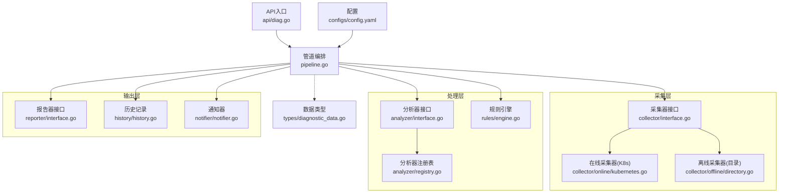
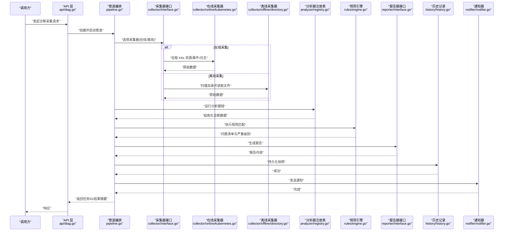
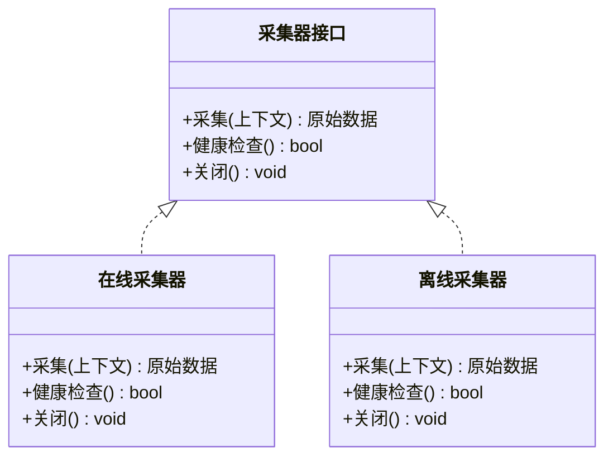
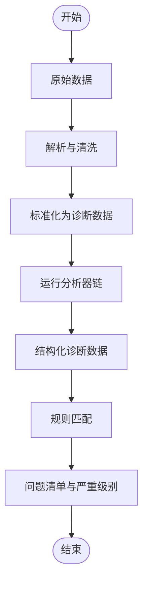
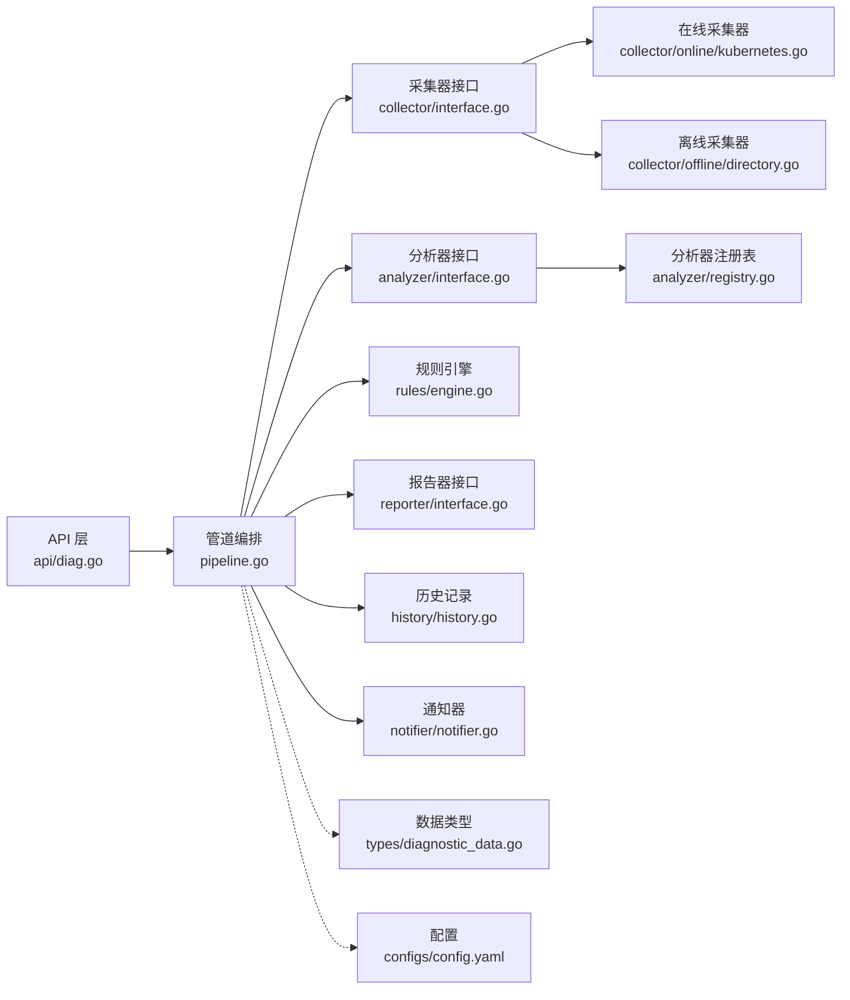

# 数据采集管道

<cite>
**本文档引用的文件**   
- [internal/diag/pipeline.go](file://internal/diag/pipeline.go)
- [internal/diag/collector/interface.go](file://internal/diag/collector/interface.go)
- [internal/diag/collector/online/kubernetes.go](file://internal/diag/collector/online/kubernetes.go)
- [internal/diag/collector/offline/directory.go](file://internal/diag/collector/offline/directory.go)
- [internal/diag/types/diagnostic_data.go](file://internal/diag/types/diagnostic_data.go)
- [internal/diag/analyzer/interface.go](file://internal/diag/analyzer/interface.go)
- [internal/diag/analyzer/registry.go](file://internal/diag/analyzer/registry.go)
- [internal/diag/reporter/interface.go](file://internal/diag/reporter/interface.go)
- [internal/diag/rules/engine.go](file://internal/diag/rules/engine.go)
- [internal/diag/history/history.go](file://internal/diag/history/history.go)
- [internal/diag/notifier/notifier.go](file://internal/diag/notifier/notifier.go)
- [internal/api/diag.go](file://internal/api/diag.go)
- [configs/config.yaml](file://configs/config.yaml)
</cite>

## 目录
1. [简介](#简介)
2. [项目结构](#项目结构)
3. [核心组件](#核心组件)
4. [架构总览](#架构总览)
5. [详细组件分析](#详细组件分析)
6. [依赖关系分析](#依赖关系分析)
7. [性能考虑](#性能考虑)
8. [故障排查指南](#故障排查指南)
9. [结论](#结论)
10. [附录](#附录)

## 简介
本文件面向 Klaw 平台的诊断引擎数据采集管道，系统性阐述数据流处理架构、采集器插件化机制与数据转换流程。重点覆盖在线采集器（Kubernetes API）与离线采集器（文件系统）的实现模式，并记录管道的状态管理、错误处理与重试策略。同时给出批量处理、缓存与资源限制等性能优化建议，以及自定义采集器的开发指南（接口实现、配置管理与测试方法）。

## 项目结构
数据采集管道位于 internal/diag 目录，围绕“采集-分析-规则-报告-通知”的流水线组织：
- collector：定义采集器抽象接口与在线/离线实现
- analyzer：分析器接口与注册表，用于对采集数据进行结构化分析
- rules：规则引擎，基于采集与分析结果进行问题判定
- reporter：多格式报告输出
- history：历史快照与对比
- notifier：告警与通知
- types：统一的数据模型与类型定义
- pipeline：管道编排、调度与生命周期管理

图表来源
- [internal/diag/pipeline.go](file://internal/diag/pipeline.go)
- [internal/diag/collector/interface.go](file://internal/diag/collector/interface.go)
- [internal/diag/collector/online/kubernetes.go](file://internal/diag/collector/online/kubernetes.go)
- [internal/diag/collector/offline/directory.go](file://internal/diag/collector/offline/directory.go)
- [internal/diag/analyzer/interface.go](file://internal/diag/analyzer/interface.go)
- [internal/diag/analyzer/registry.go](file://internal/diag/analyzer/registry.go)
- [internal/diag/rules/engine.go](file://internal/diag/rules/engine.go)
- [internal/diag/reporter/interface.go](file://internal/diag/reporter/interface.go)
- [internal/diag/history/history.go](file://internal/diag/history/history.go)
- [internal/diag/notifier/notifier.go](file://internal/diag/notifier/notifier.go)
- [internal/diag/types/diagnostic_data.go](file://internal/diag/types/diagnostic_data.go)
- [internal/api/diag.go](file://internal/api/diag.go)
- [configs/config.yaml](file://configs/config.yaml)

章节来源
- [internal/diag/pipeline.go](file://internal/diag/pipeline.go)
- [internal/diag/collector/interface.go](file://internal/diag/collector/interface.go)
- [internal/diag/collector/online/kubernetes.go](file://internal/diag/collector/online/kubernetes.go)
- [internal/diag/collector/offline/directory.go](file://internal/diag/collector/offline/directory.go)
- [internal/diag/analyzer/interface.go](file://internal/diag/analyzer/interface.go)
- [internal/diag/analyzer/registry.go](file://internal/diag/analyzer/registry.go)
- [internal/diag/rules/engine.go](file://internal/diag/rules/engine.go)
- [internal/diag/reporter/interface.go](file://internal/diag/reporter/interface.go)
- [internal/diag/history/history.go](file://internal/diag/history/history.go)
- [internal/diag/notifier/notifier.go](file://internal/diag/notifier/notifier.go)
- [internal/diag/types/diagnostic_data.go](file://internal/diag/types/diagnostic_data.go)
- [internal/api/diag.go](file://internal/api/diag.go)
- [configs/config.yaml](file://configs/config.yaml)

## 核心组件
- 采集器抽象接口：定义统一的采集契约，屏蔽在线/离线差异，支持按命名空间、标签或路径过滤。
- 在线采集器（Kubernetes API）：通过 K8s 客户端获取集群对象、事件、日志等实时数据。
- 离线采集器（文件系统）：从本地或挂载目录读取已落盘的诊断数据，支持增量扫描与校验。
- 分析器与注册表：将原始数据转换为结构化诊断信息，并通过注册表动态加载。
- 规则引擎：基于采集与分析结果执行诊断规则，生成问题清单与严重级别。
- 报告器：将诊断结果导出为多种格式（文本、JSON、HTML、SARIF 等）。
- 历史记录：保存每次采集快照，便于趋势分析与回溯。
- 通知器：将关键发现推送至外部系统（如 IM 平台）。
- 管道编排：负责调度采集、分析、规则、报告、通知等阶段，管理生命周期与错误恢复。

章节来源
- [internal/diag/collector/interface.go](file://internal/diag/collector/interface.go)
- [internal/diag/collector/online/kubernetes.go](file://internal/diag/collector/online/kubernetes.go)
- [internal/diag/collector/offline/directory.go](file://internal/diag/collector/offline/directory.go)
- [internal/diag/analyzer/interface.go](file://internal/diag/analyzer/interface.go)
- [internal/diag/analyzer/registry.go](file://internal/diag/analyzer/registry.go)
- [internal/diag/rules/engine.go](file://internal/diag/rules/engine.go)
- [internal/diag/reporter/interface.go](file://internal/diag/reporter/interface.go)
- [internal/diag/history/history.go](file://internal/diag/history/history.go)
- [internal/diag/notifier/notifier.go](file://internal/diag/notifier/notifier.go)
- [internal/diag/pipeline.go](file://internal/diag/pipeline.go)

## 架构总览
数据采集管道采用“分层+插件化”的架构：
- 采集层：通过统一接口接入不同数据源（在线 K8s、离线目录），支持并行与限流。
- 处理层：分析器将原始数据标准化；规则引擎对问题进行识别与分级。
- 输出层：报告器与通知器对外暴露结果；历史记录提供可追溯性。
- 控制面：API 层触发任务，配置中心驱动行为，管道编排协调各阶段。

图表来源
- [internal/api/diag.go](file://internal/api/diag.go)
- [internal/diag/pipeline.go](file://internal/diag/pipeline.go)
- [internal/diag/collector/interface.go](file://internal/diag/collector/interface.go)
- [internal/diag/collector/online/kubernetes.go](file://internal/diag/collector/online/kubernetes.go)
- [internal/diag/collector/offline/directory.go](file://internal/diag/collector/offline/directory.go)
- [internal/diag/analyzer/registry.go](file://internal/diag/analyzer/registry.go)
- [internal/diag/rules/engine.go](file://internal/diag/rules/engine.go)
- [internal/diag/reporter/interface.go](file://internal/diag/reporter/interface.go)
- [internal/diag/history/history.go](file://internal/diag/history/history.go)
- [internal/diag/notifier/notifier.go](file://internal/diag/notifier/notifier.go)

## 详细组件分析

### 采集器抽象接口设计
- 目标：统一在线与离线数据源的访问方式，提供一致的采集语义（范围过滤、分页/批处理、错误上报）。
- 关键点：
  - 采集上下文：包含命名空间、标签、时间窗口、速率限制等参数。
  - 数据契约：原始数据以统一结构传递，便于后续分析器消费。
  - 错误与重试：接口约定错误分类（网络、权限、超时、解析失败），支持指数退避与最大重试次数。
  - 取消与超时：支持上下文取消与整体超时，避免长尾阻塞。

图表来源
- [internal/diag/collector/interface.go](file://internal/diag/collector/interface.go)
- [internal/diag/collector/online/kubernetes.go](file://internal/diag/collector/online/kubernetes.go)
- [internal/diag/collector/offline/directory.go](file://internal/diag/collector/offline/directory.go)

章节来源
- [internal/diag/collector/interface.go](file://internal/diag/collector/interface.go)
- [internal/diag/collector/online/kubernetes.go](file://internal/diag/collector/online/kubernetes.go)
- [internal/diag/collector/offline/directory.go](file://internal/diag/collector/offline/directory.go)

### 在线采集器（Kubernetes API）实现模式
- 数据源：K8s API Server（节点、Pod、Deployment、Service、Event、Log 等）。
- 模式：
  - 列表式拉取：按命名空间/标签过滤，分页获取，避免一次性大对象。
  - 事件订阅：可选监听事件流，增量更新。
  - 日志聚合：按 Pod/容器维度收集最近 N 条日志，支持滚动与截断。
- 错误处理：
  - 区分认证失败、权限不足、配额限制、网络抖动。
  - 针对瞬时错误启用指数退避重试，超过阈值降级为部分采集。
- 性能：
  - 并发拉取受全局限流与 K8s 客户端 QPS 限制保护。
  - 使用缓存减少重复查询（如节点拓扑、命名空间列表）。

章节来源
- [internal/diag/collector/online/kubernetes.go](file://internal/diag/collector/online/kubernetes.go)

### 离线采集器（文件系统）实现模式
- 数据源：本地或挂载目录中的诊断文件（YAML/JSON/CSV/日志归档）。
- 模式：
  - 增量扫描：基于文件元数据（mtime/inode）判断变更，仅处理新增/修改。
  - 校验与去重：校验文件完整性，按哈希去重，避免重复处理。
  - 分批读取：按块或行读取，降低内存峰值。
- 错误处理：
  - 文件损坏、权限不足、路径不存在等错误分类与重试策略。
  - 跳过坏文件并记录审计日志，保证整体进度不受影响。

章节来源
- [internal/diag/collector/offline/directory.go](file://internal/diag/collector/offline/directory.go)

### 数据转换流程（分析器与规则）
- 分析器：将原始数据转换为结构化诊断数据（指标、事件、配置片段、异常堆栈等）。
- 规则引擎：基于分析结果匹配规则，生成问题条目与严重级别。
- 数据模型：统一的数据类型定义确保上下游一致性。

图表来源
- [internal/diag/analyzer/interface.go](file://internal/diag/analyzer/interface.go)
- [internal/diag/analyzer/registry.go](file://internal/diag/analyzer/registry.go)
- [internal/diag/rules/engine.go](file://internal/diag/rules/engine.go)
- [internal/diag/types/diagnostic_data.go](file://internal/diag/types/diagnostic_data.go)

章节来源
- [internal/diag/analyzer/interface.go](file://internal/diag/analyzer/interface.go)
- [internal/diag/analyzer/registry.go](file://internal/diag/analyzer/registry.go)
- [internal/diag/rules/engine.go](file://internal/diag/rules/engine.go)
- [internal/diag/types/diagnostic_data.go](file://internal/diag/types/diagnostic_data.go)

### 管道状态管理、错误处理与重试机制
- 状态管理：
  - 任务生命周期：初始化、运行中、完成、失败、取消。
  - 进度追踪：每个阶段的完成度与耗时统计。
- 错误处理：
  - 分类：可重试（网络、临时 I/O）、不可重试（权限、格式错误）。
  - 降级：部分失败时继续其他阶段，并记录失败详情。
- 重试机制：
  - 指数退避与最大重试次数。
  - 熔断：连续失败达到阈值后暂停采集，等待恢复。

章节来源
- [internal/diag/pipeline.go](file://internal/diag/pipeline.go)

### 报告与通知
- 报告器：支持文本、JSON、HTML、SARIF 等多格式输出，便于集成到不同工具链。
- 通知器：对接 IM/邮件/ webhook，支持模板与过滤条件。
- 历史记录：保存每次快照，支持对比与趋势分析。

章节来源
- [internal/diag/reporter/interface.go](file://internal/diag/reporter/interface.go)
- [internal/diag/notifier/notifier.go](file://internal/diag/notifier/notifier.go)
- [internal/diag/history/history.go](file://internal/diag/history/history.go)

## 依赖关系分析
- 松耦合：采集器、分析器、规则、报告器均通过接口解耦，便于替换与扩展。
- 注册表：分析器与报告器通过注册表动态加载，避免硬编码依赖。
- 配置驱动：通过配置文件控制采集范围、限流、重试与输出格式。

图表来源
- [internal/api/diag.go](file://internal/api/diag.go)
- [internal/diag/pipeline.go](file://internal/diag/pipeline.go)
- [internal/diag/collector/interface.go](file://internal/diag/collector/interface.go)
- [internal/diag/collector/online/kubernetes.go](file://internal/diag/collector/online/kubernetes.go)
- [internal/diag/collector/offline/directory.go](file://internal/diag/collector/offline/directory.go)
- [internal/diag/analyzer/interface.go](file://internal/diag/analyzer/interface.go)
- [internal/diag/analyzer/registry.go](file://internal/diag/analyzer/registry.go)
- [internal/diag/rules/engine.go](file://internal/diag/rules/engine.go)
- [internal/diag/reporter/interface.go](file://internal/diag/reporter/interface.go)
- [internal/diag/history/history.go](file://internal/diag/history/history.go)
- [internal/diag/notifier/notifier.go](file://internal/diag/notifier/notifier.go)
- [internal/diag/types/diagnostic_data.go](file://internal/diag/types/diagnostic_data.go)
- [configs/config.yaml](file://configs/config.yaml)

章节来源
- [internal/api/diag.go](file://internal/api/diag.go)
- [internal/diag/pipeline.go](file://internal/diag/pipeline.go)
- [configs/config.yaml](file://configs/config.yaml)

## 性能考虑
- 批量处理：
  - 采集端按批次拉取（分页/分片），减少单次负载。
  - 分析端批量转换，降低对象分配与 GC 压力。
- 缓存机制：
  - 只读数据（命名空间、节点拓扑）短期缓存，设置 TTL。
  - 热点对象（常见 Label/Annotation）局部缓存。
- 资源限制：
  - 全局并发上限与每采集器并发限制。
  - K8s 客户端 QPS 与 Burst 限制，避免触发服务端限流。
  - I/O 限流与内存水位监控，超限自动降级。
- 异步与背压：
  - 使用队列缓冲阶段间数据，防止上游过快导致下游拥塞。
  - 超时与取消传播，及时释放资源。

[本节为通用指导，不直接分析具体文件]

## 故障排查指南
- 常见问题定位：
  - 采集失败：检查权限、网络连通、K8s 配额与限流。
  - 解析错误：确认文件格式与字段映射，查看审计日志。
  - 规则误报：核对规则阈值与上下文过滤条件。
- 调试手段：
  - 开启详细日志与采样指标。
  - 使用最小数据集复现问题。
  - 逐步禁用阶段（采集/分析/规则/报告）隔离问题域。
- 恢复策略：
  - 重启失败阶段而非全量重跑。
  - 清理损坏文件或重置缓存。

章节来源
- [internal/diag/pipeline.go](file://internal/diag/pipeline.go)
- [internal/diag/notifier/notifier.go](file://internal/diag/notifier/notifier.go)

## 结论
Klaw 数据采集管道通过统一的采集器接口与插件化架构，实现了在线与离线数据源的无缝接入。结合分析器、规则引擎与多格式报告器，形成完整的诊断闭环。通过批量、缓存与资源限制等优化策略，保障在高负载下的稳定与高效。遵循本文的开发指南，可快速扩展自定义采集器并融入现有管道。

[本节为总结性内容，不直接分析具体文件]

## 附录

### 自定义采集器开发指南
- 接口实现：
  - 实现采集器接口的采集、健康检查与关闭方法。
  - 在采集过程中遵守上下文取消与超时。
- 配置管理：
  - 通过配置文件指定数据源路径/端点、过滤条件与限流参数。
  - 支持热更新与动态重载（如需）。
- 错误与重试：
  - 明确错误分类，实现指数退避与熔断。
  - 记录详细的错误上下文以便定位。
- 测试方法：
  - 单元测试：模拟数据源与网络错误，验证边界条件。
  - 集成测试：使用真实或 Mock 的 K8s/文件系统环境。
  - 性能测试：压测批量与并发场景，观察内存与 CPU。

章节来源
- [internal/diag/collector/interface.go](file://internal/diag/collector/interface.go)
- [configs/config.yaml](file://configs/config.yaml)