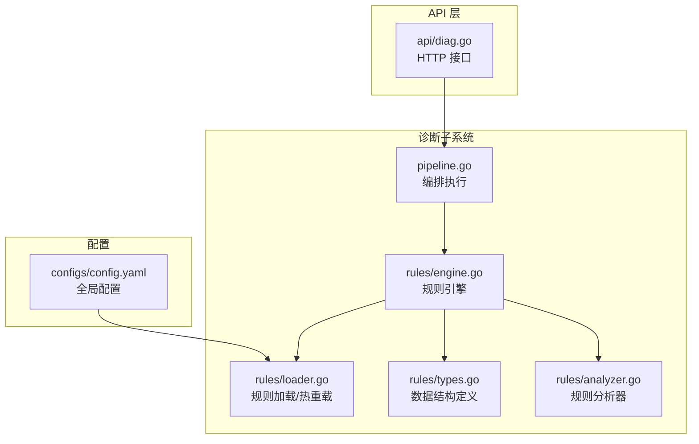
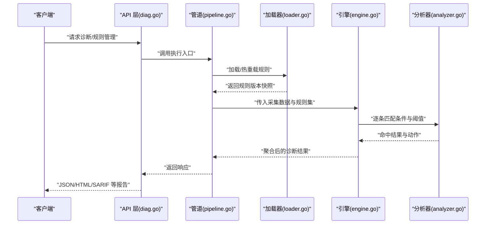
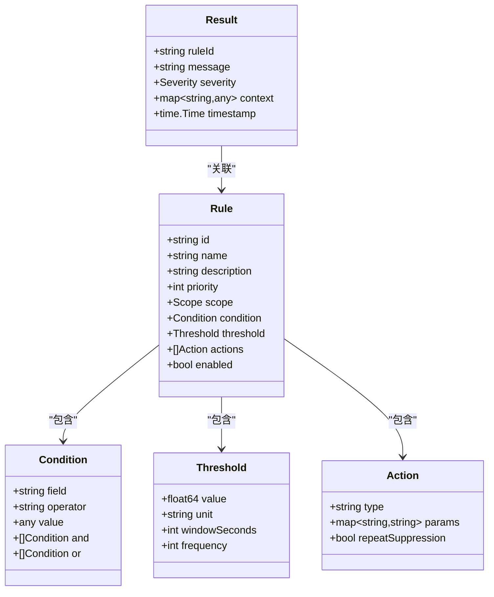
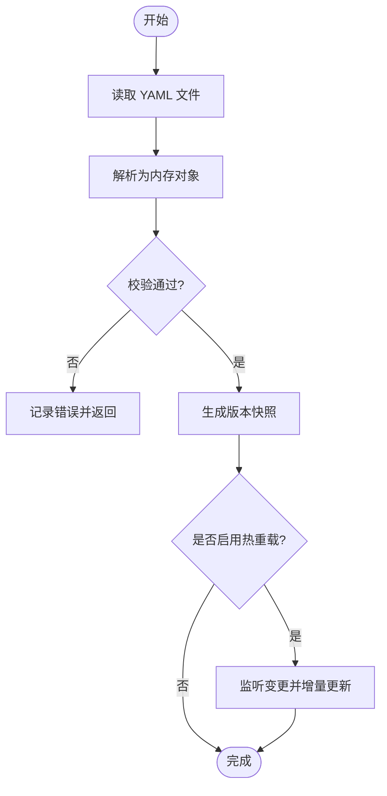
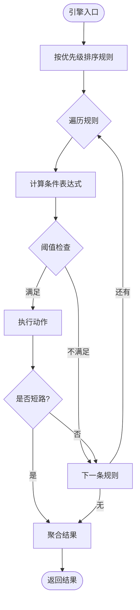
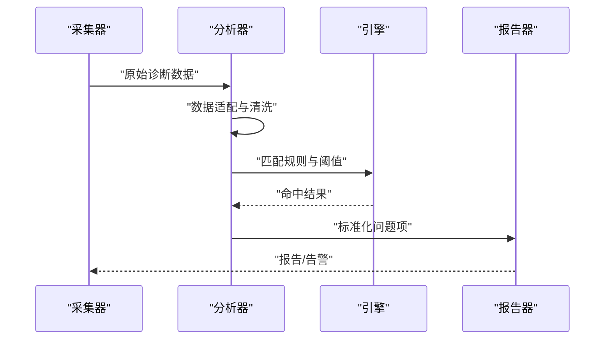
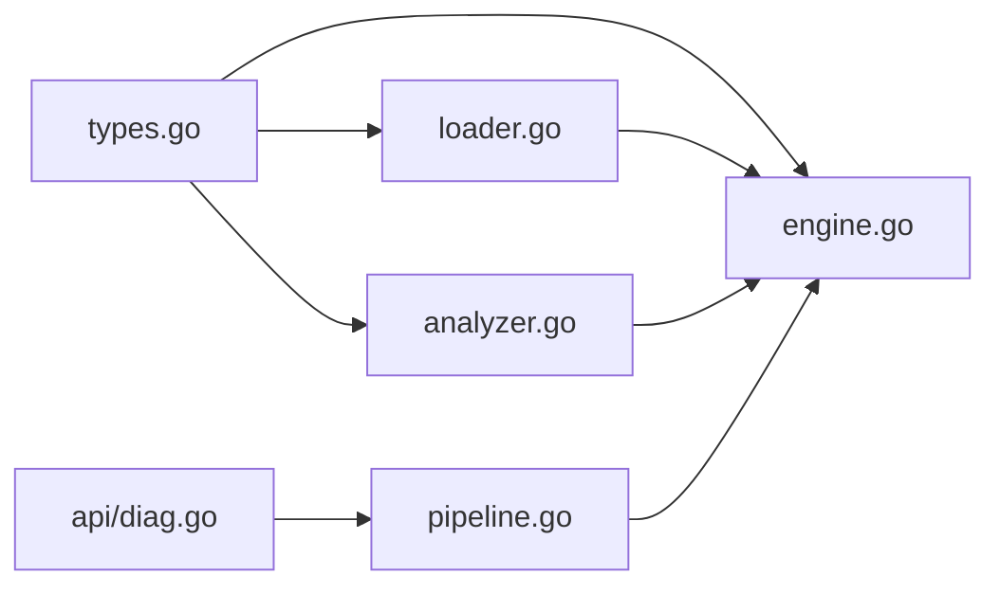

# 规则引擎

<cite>
**本文档引用的文件**   
- [internal/diag/rules/engine.go](file://internal/diag/rules/engine.go)
- [internal/diag/rules/loader.go](file://internal/diag/rules/loader.go)
- [internal/diag/rules/types.go](file://internal/diag/rules/types.go)
- [internal/diag/rules/analyzer.go](file://internal/diag/rules/analyzer.go)
- [internal/diag/pipeline.go](file://internal/diag/pipeline.go)
- [internal/api/diag.go](file://internal/api/diag.go)
- [configs/config.yaml](file://configs/config.yaml)
</cite>

## 目录
1. [简介](#简介)
2. [项目结构](#项目结构)
3. [核心组件](#核心组件)
4. [架构总览](#架构总览)
5. [详细组件分析](#详细组件分析)
6. [依赖关系分析](#依赖关系分析)
7. [性能考量](#性能考量)
8. [故障排查指南](#故障排查指南)
9. [结论](#结论)
10. [附录](#附录)

## 简介
本文件为 Klaw 平台诊断规则引擎的权威文档，聚焦于规则定义格式、YAML 配置结构、条件表达式与阈值设置、动作配置、匹配算法（优先级排序、短路逻辑、性能优化）、加载机制（热重载与版本管理），以及规则验证、调试与测试工具的使用。同时提供面向复杂业务场景的规则编写指南与最佳实践，帮助使用者高效构建可维护、可扩展的诊断规则集。

## 项目结构
规则引擎位于 internal/diag/rules 目录下，围绕“类型定义—加载器—引擎—分析器”分层组织；与上层管道 pipeline 和 API 层集成，对外暴露规则管理与执行接口。

图表来源
- [internal/diag/pipeline.go](file://internal/diag/pipeline.go)
- [internal/diag/rules/engine.go](file://internal/diag/rules/engine.go)
- [internal/diag/rules/loader.go](file://internal/diag/rules/loader.go)
- [internal/diag/rules/types.go](file://internal/diag/rules/types.go)
- [internal/diag/rules/analyzer.go](file://internal/diag/rules/analyzer.go)
- [internal/api/diag.go](file://internal/api/diag.go)
- [configs/config.yaml](file://configs/config.yaml)

章节来源
- [internal/diag/pipeline.go](file://internal/diag/pipeline.go)
- [internal/diag/rules/engine.go](file://internal/diag/rules/engine.go)
- [internal/diag/rules/loader.go](file://internal/diag/rules/loader.go)
- [internal/diag/rules/types.go](file://internal/diag/rules/types.go)
- [internal/diag/rules/analyzer.go](file://internal/diag/rules/analyzer.go)
- [internal/api/diag.go](file://internal/api/diag.go)
- [configs/config.yaml](file://configs/config.yaml)

## 核心组件
- 类型定义（types.go）：集中定义规则模型、条件表达式、阈值、动作、结果等核心数据结构，确保 YAML 到内存对象的稳定映射。
- 加载器（loader.go）：负责从 YAML 文件读取规则、校验语法与语义、生成版本快照、支持热重载与增量更新。
- 引擎（engine.go）：实现规则匹配算法，包括优先级排序、短路逻辑、批量评估与结果聚合。
- 分析器（analyzer.go）：将采集到的诊断数据与规则进行匹配，产出问题项与告警信息。
- 管道（pipeline.go）：编排数据采集、规则匹配、报告生成等阶段，驱动引擎运行。
- API（api/diag.go）：对外暴露规则查询、触发诊断、获取结果等 HTTP 接口。

章节来源
- [internal/diag/rules/types.go](file://internal/diag/rules/types.go)
- [internal/diag/rules/loader.go](file://internal/diag/rules/loader.go)
- [internal/diag/rules/engine.go](file://internal/diag/rules/engine.go)
- [internal/diag/rules/analyzer.go](file://internal/diag/rules/analyzer.go)
- [internal/diag/pipeline.go](file://internal/diag/pipeline.go)
- [internal/api/diag.go](file://internal/api/diag.go)

## 架构总览
规则引擎采用“配置驱动 + 事件/数据驱动”的模式：YAML 定义规则，采集数据进入管道后由引擎按优先级匹配并输出诊断结果。

图表来源
- [internal/api/diag.go](file://internal/api/diag.go)
- [internal/diag/pipeline.go](file://internal/diag/pipeline.go)
- [internal/diag/rules/loader.go](file://internal/diag/rules/loader.go)
- [internal/diag/rules/engine.go](file://internal/diag/rules/engine.go)
- [internal/diag/rules/analyzer.go](file://internal/diag/rules/analyzer.go)

## 详细组件分析

### 类型定义（types.go）
- 规则模型：包含标识、名称、描述、优先级、作用域、条件表达式、阈值、动作列表等字段。
- 条件表达式：支持基于键值路径、操作符（等于、大于、小于、包含、正则等）的组合。
- 阈值设置：数值型阈值、时间窗口、频率限制等。
- 动作配置：通知、记录、自动修复、抑制重复告警等。
- 结果模型：问题项、严重级别、上下文数据、关联规则 ID、时间戳等。

图表来源
- [internal/diag/rules/types.go](file://internal/diag/rules/types.go)

章节来源
- [internal/diag/rules/types.go](file://internal/diag/rules/types.go)

### 加载器（loader.go）
- 读取 YAML：解析规则文件，校验必填字段与类型约束。
- 版本管理：生成规则版本快照，支持回滚与对比。
- 热重载：监听配置文件变更，增量更新规则集，避免重启服务。
- 错误处理：对语法错误、语义冲突给出明确提示。

图表来源
- [internal/diag/rules/loader.go](file://internal/diag/rules/loader.go)

章节来源
- [internal/diag/rules/loader.go](file://internal/diag/rules/loader.go)

### 引擎（engine.go）
- 优先级排序：根据规则优先级从高到低匹配，确保关键规则优先生效。
- 短路逻辑：当命中高优规则或满足特定条件时，提前终止后续匹配，提升性能。
- 批量评估：对多条规则并行或流水线式评估，减少 CPU 抖动。
- 结果聚合：合并相同问题的多次命中，去重与抑制重复告警。

图表来源
- [internal/diag/rules/engine.go](file://internal/diag/rules/engine.go)

章节来源
- [internal/diag/rules/engine.go](file://internal/diag/rules/engine.go)

### 分析器（analyzer.go）
- 数据适配：将采集到的原始数据转换为规则引擎可用的结构化形式。
- 匹配执行：调用引擎进行条件与阈值匹配，生成问题项。
- 上下文注入：附加资源标识、命名空间、时间戳等上下文信息。
- 输出标准化：统一问题项格式，便于下游报告与告警消费。

图表来源
- [internal/diag/rules/analyzer.go](file://internal/diag/rules/analyzer.go)
- [internal/diag/rules/engine.go](file://internal/diag/rules/engine.go)

章节来源
- [internal/diag/rules/analyzer.go](file://internal/diag/rules/analyzer.go)

### 管道（pipeline.go）
- 阶段编排：数据采集 → 规则匹配 → 报告生成 → 通知发送。
- 错误恢复：单阶段失败不影响整体流程，支持重试与降级。
- 指标上报：统计匹配耗时、命中率、告警数量等指标。

章节来源
- [internal/diag/pipeline.go](file://internal/diag/pipeline.go)

### API（api/diag.go）
- 规则管理：上传、更新、删除、查询规则。
- 诊断执行：触发一次诊断任务，返回结果。
- 结果查询：按时间范围、规则 ID、严重级别过滤。

章节来源
- [internal/api/diag.go](file://internal/api/diag.go)

## 依赖关系分析
- 低耦合：类型定义独立，加载器与引擎解耦，分析器仅依赖引擎接口。
- 外部依赖：YAML 解析库、文件系统监听（用于热重载）、日志与指标库。
- 循环依赖：通过接口隔离避免循环引用。

图表来源
- [internal/diag/rules/types.go](file://internal/diag/rules/types.go)
- [internal/diag/rules/loader.go](file://internal/diag/rules/loader.go)
- [internal/diag/rules/engine.go](file://internal/diag/rules/engine.go)
- [internal/diag/rules/analyzer.go](file://internal/diag/rules/analyzer.go)
- [internal/diag/pipeline.go](file://internal/diag/pipeline.go)
- [internal/api/diag.go](file://internal/api/diag.go)

章节来源
- [internal/diag/rules/types.go](file://internal/diag/rules/types.go)
- [internal/diag/rules/loader.go](file://internal/diag/rules/loader.go)
- [internal/diag/rules/engine.go](file://internal/diag/rules/engine.go)
- [internal/diag/rules/analyzer.go](file://internal/diag/rules/analyzer.go)
- [internal/diag/pipeline.go](file://internal/diag/pipeline.go)
- [internal/api/diag.go](file://internal/api/diag.go)

## 性能考量
- 规则排序与短路：高优规则前置，命中即短路，降低平均匹配成本。
- 批量评估：对同批次数据复用中间结果，减少重复计算。
- 阈值窗口化：使用滑动窗口与计数缓存，避免全量扫描。
- 热重载增量更新：仅替换变更规则，避免重建索引。
- 指标监控：跟踪匹配耗时、命中率、告警峰值，指导规则精简。

[本节为通用性能建议，不直接分析具体文件]

## 故障排查指南
- 规则加载失败：检查 YAML 语法、必填字段、类型约束；查看加载器错误日志。
- 匹配未命中：确认条件表达式字段路径、操作符与阈值单位；打印中间数据。
- 重复告警：启用动作中的抑制重复选项，调整时间窗口。
- 性能退化：分析热点规则，拆分复杂表达式，增加索引或缓存。
- 热重载异常：确认文件监听权限与路径正确性，检查版本快照一致性。

章节来源
- [internal/diag/rules/loader.go](file://internal/diag/rules/loader.go)
- [internal/diag/rules/engine.go](file://internal/diag/rules/engine.go)
- [internal/diag/rules/analyzer.go](file://internal/diag/rules/analyzer.go)

## 结论
Klaw 规则引擎以清晰的类型定义、稳健的加载机制与高效的匹配算法为核心，结合管道编排与 API 暴露，形成完整的诊断闭环。通过优先级排序、短路逻辑与阈值窗口化等手段，在保证准确性的同时兼顾性能。遵循本文档的最佳实践，可快速构建高质量、可维护的诊断规则集。

[本节为总结性内容，不直接分析具体文件]

## 附录

### YAML 配置结构与示例说明
- 顶层字段：规则集合、全局开关、默认阈值、动作模板等。
- 规则条目：id、name、description、priority、scope、enabled、condition、threshold、actions。
- 条件表达式：field、operator、value、and/or 组合。
- 阈值设置：value、unit、windowSeconds、frequency。
- 动作配置：type、params、repeatSuppression。

章节来源
- [configs/config.yaml](file://configs/config.yaml)
- [internal/diag/rules/types.go](file://internal/diag/rules/types.go)

### 规则验证、调试与测试工具
- 验证：使用加载器的校验流程，检查语法与语义；输出详细错误定位。
- 调试：开启调试日志，打印条件求值过程与阈值比较结果。
- 测试：构造典型与边界用例，覆盖命中与未命中分支；回归测试优先级与短路行为。

章节来源
- [internal/diag/rules/loader.go](file://internal/diag/rules/loader.go)
- [internal/diag/rules/engine.go](file://internal/diag/rules/engine.go)

### 复杂业务场景编写指南与最佳实践
- 多条件组合：使用 and/or 表达复合条件，保持可读性与可维护性。
- 阈值分档：不同严重级别对应不同阈值，避免误报。
- 作用域隔离：按命名空间、集群、资源类型划分规则作用域。
- 动作编排：通知与自动修复分离，抑制重复告警，保留审计轨迹。
- 版本管理：每次变更生成新版本，支持回滚与对比。

[本节为通用实践建议，不直接分析具体文件]