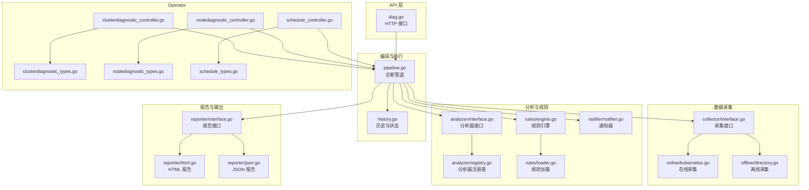
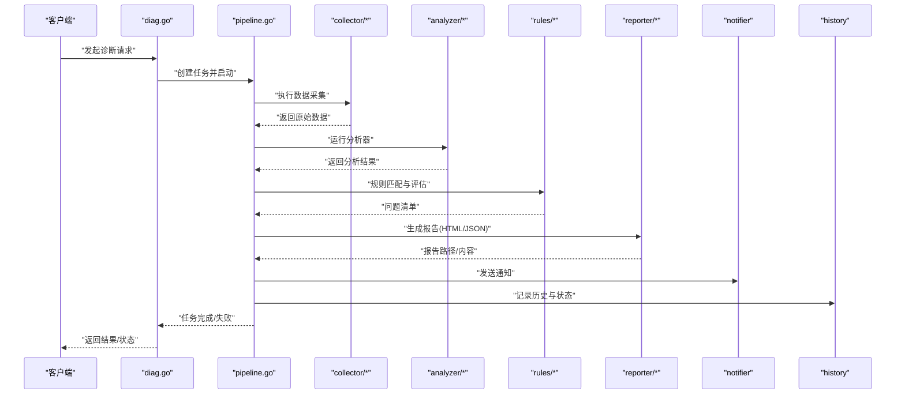
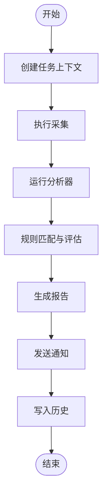
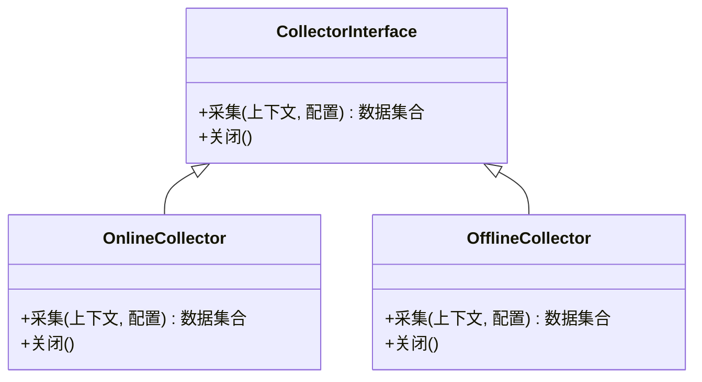
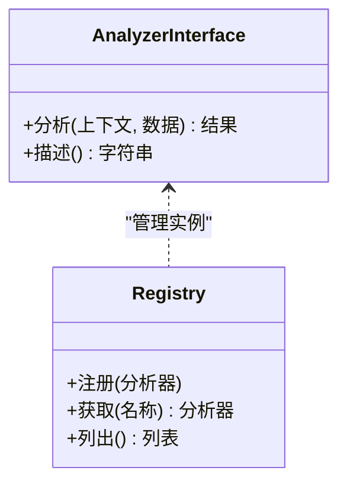
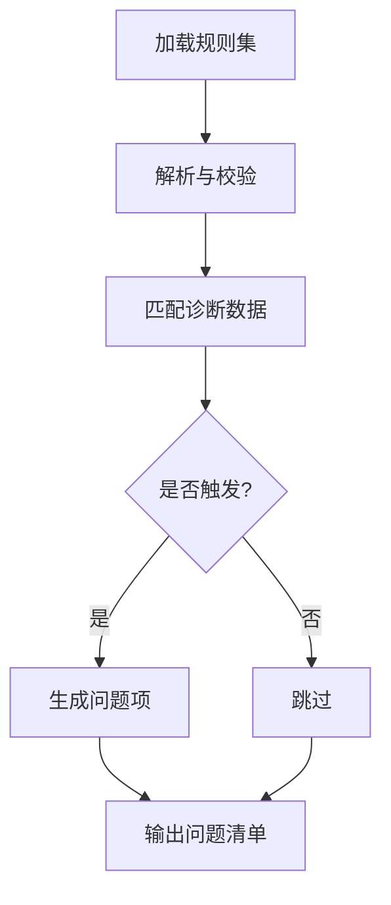
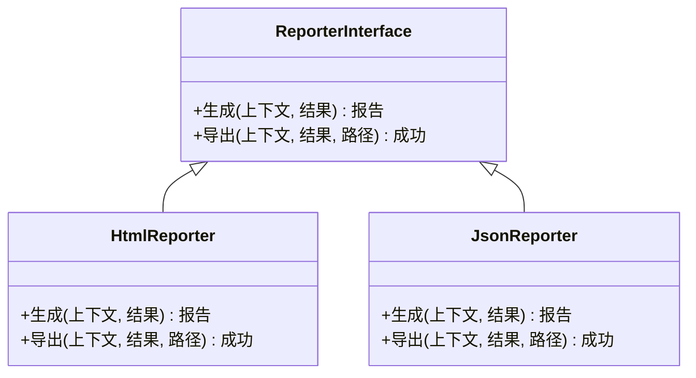
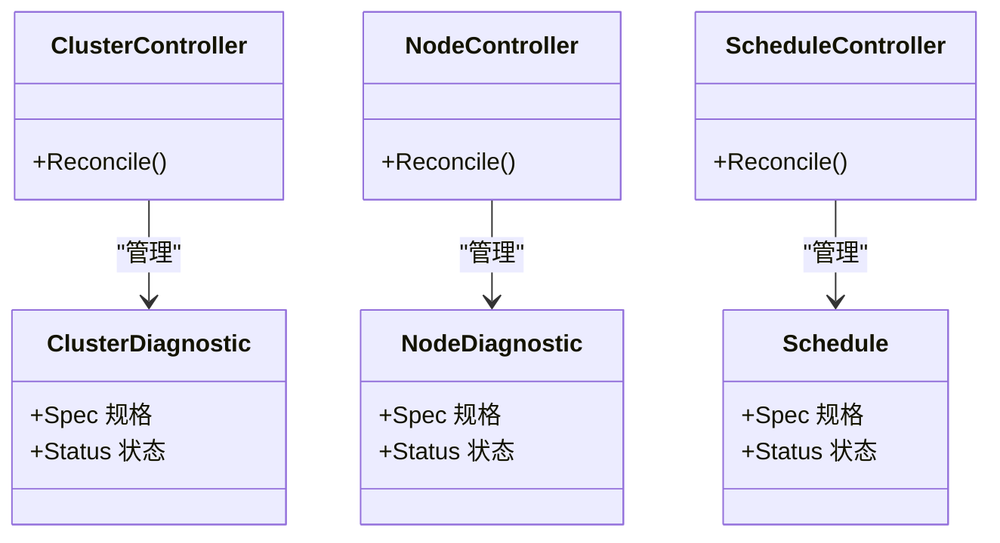
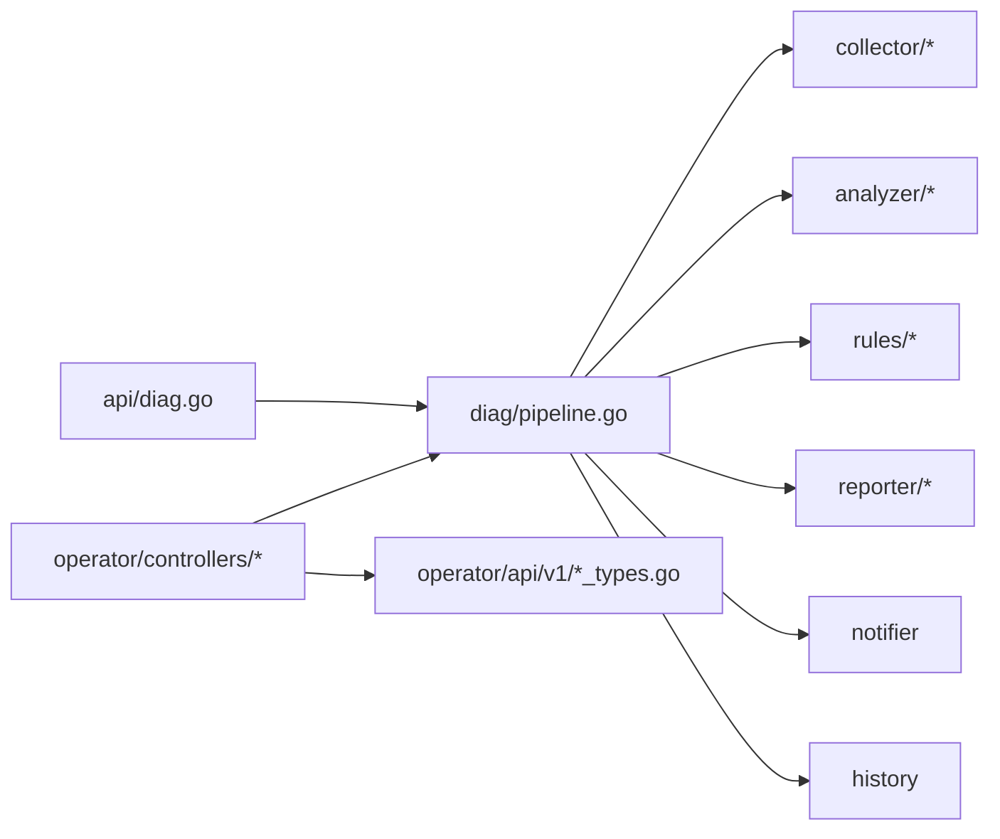

# 诊断工作流

<cite>
**本文引用的文件**   
- [internal/api/diag.go](file://internal/api/diag.go)
- [internal/diag/pipeline.go](file://internal/diag/pipeline.go)
- [internal/diag/import.go](file://internal/diag/import.go)
- [internal/diag/types/diagnostic_data.go](file://internal/diag/types/diagnostic_data.go)
- [internal/diag/types/issue.go](file://internal/diag/types/issue.go)
- [internal/diag/analyzer/interface.go](file://internal/diag/analyzer/interface.go)
- [internal/diag/analyzer/registry.go](file://internal/diag/analyzer/registry.go)
- [internal/diag/rules/engine.go](file://internal/diag/rules/engine.go)
- [internal/diag/rules/loader.go](file://internal/diag/rules/loader.go)
- [internal/diag/reporter/interface.go](file://internal/diag/reporter/interface.go)
- [internal/diag/reporter/html.go](file://internal/diag/reporter/html.go)
- [internal/diag/reporter/json.go](file://internal/diag/reporter/json.go)
- [internal/diag/notifier/notifier.go](file://internal/diag/notifier/notifier.go)
- [internal/diag/history/history.go](file://internal/diag/history/history.go)
- [internal/diag/collector/interface.go](file://internal/diag/collector/interface.go)
- [internal/diag/collector/online/kubernetes.go](file://internal/diag/collector/online/kubernetes.go)
- [internal/diag/collector/offline/directory.go](file://internal/diag/collector/offline/directory.go)
- [internal/diag/cost/analyzer.go](file://internal/diag/cost/analyzer.go)
- [internal/diag/rca/engine.go](file://internal/diag/rca/engine.go)
- [internal/diag/autofix/engine.go](file://internal/diag/autofix/engine.go)
- [internal/diag/tui/diagnosis.go](file://internal/diag/tui/diagnosis.go)
- [internal/diag/tui/model.go](file://internal/diag/tui/model.go)
- [operator/controllers/clusterdiagnostic_controller.go](file://operator/controllers/clusterdiagnostic_controller.go)
- [operator/controllers/nodediagnostic_controller.go](file://operator/controllers/nodediagnostic_controller.go)
- [operator/controllers/schedule_controller.go](file://operator/controllers/schedule_controller.go)
- [operator/api/v1/clusterdiagnostic_types.go](file://operator/api/v1/clusterdiagnostic_types.go)
- [operator/api/v1/nodediagnostic_types.go](file://operator/api/v1/nodediagnostic_types.go)
- [operator/api/v1/schedule_types.go](file://operator/api/v1/schedule_types.go)
</cite>

## 目录
1. [简介](#简介)
2. [项目结构](#项目结构)
3. [核心组件](#核心组件)
4. [架构总览](#架构总览)
5. [详细组件分析](#详细组件分析)
6. [依赖关系分析](#依赖关系分析)
7. [性能与并发控制](#性能与并发控制)
8. [故障恢复与重试策略](#故障恢复与重试策略)
9. [监控与日志分析](#监控与日志分析)
10. [结论](#结论)
11. [附录：数据导入导出规范](#附录数据导入导出规范)

## 简介
本文件面向 Klaw 平台的“诊断工作流”，系统化阐述从任务创建、调度执行到结果处理的全生命周期。内容覆盖状态管理、任务调度、并发控制、资源管理、数据导入导出（多格式与批量）、错误恢复与重试策略，以及监控与日志分析方法，帮助读者快速理解并高效使用诊断能力。

## 项目结构
Klaw 的诊断能力由 API 层、编排管道、采集器、分析器、规则引擎、报告器、通知器、历史记录等模块组成，并通过 Operator 控制器暴露 Kubernetes 原生资源进行声明式编排。

图表来源
- [internal/api/diag.go](file://internal/api/diag.go)
- [internal/diag/pipeline.go](file://internal/diag/pipeline.go)
- [internal/diag/collector/interface.go](file://internal/diag/collector/interface.go)
- [internal/diag/collector/online/kubernetes.go](file://internal/diag/collector/online/kubernetes.go)
- [internal/diag/collector/offline/directory.go](file://internal/diag/collector/offline/directory.go)
- [internal/diag/analyzer/interface.go](file://internal/diag/analyzer/interface.go)
- [internal/diag/analyzer/registry.go](file://internal/diag/analyzer/registry.go)
- [internal/diag/rules/engine.go](file://internal/diag/rules/engine.go)
- [internal/diag/rules/loader.go](file://internal/diag/rules/loader.go)
- [internal/diag/reporter/interface.go](file://internal/diag/reporter/interface.go)
- [internal/diag/reporter/html.go](file://internal/diag/reporter/html.go)
- [internal/diag/reporter/json.go](file://internal/diag/reporter/json.go)
- [internal/diag/notifier/notifier.go](file://internal/diag/notifier/notifier.go)
- [internal/diag/history/history.go](file://internal/diag/history/history.go)
- [operator/controllers/clusterdiagnostic_controller.go](file://operator/controllers/clusterdiagnostic_controller.go)
- [operator/controllers/nodediagnostic_controller.go](file://operator/controllers/nodediagnostic_controller.go)
- [operator/controllers/schedule_controller.go](file://operator/controllers/schedule_controller.go)
- [operator/api/v1/clusterdiagnostic_types.go](file://operator/api/v1/clusterdiagnostic_types.go)
- [operator/api/v1/nodediagnostic_types.go](file://operator/api/v1/nodediagnostic_types.go)
- [operator/api/v1/schedule_types.go](file://operator/api/v1/schedule_types.go)

章节来源
- [internal/api/diag.go](file://internal/api/diag.go)
- [internal/diag/pipeline.go](file://internal/diag/pipeline.go)
- [operator/controllers/clusterdiagnostic_controller.go](file://operator/controllers/clusterdiagnostic_controller.go)
- [operator/controllers/nodediagnostic_controller.go](file://operator/controllers/nodediagnostic_controller.go)
- [operator/controllers/schedule_controller.go](file://operator/controllers/schedule_controller.go)

## 核心组件
- 诊断管道 pipeline：串联采集、分析、规则匹配、报告生成与通知，负责任务生命周期与状态流转。
- 采集器 collector：统一抽象在线/离线采集方式，支持 Kubernetes 集群与本地目录数据源。
- 分析器 analyzer：按领域（网络、存储、GPU、系统、运行时等）实现具体分析逻辑，通过注册表集中管理。
- 规则引擎 rules：加载规则集并对诊断数据进行匹配评估，产出问题项。
- 报告器 reporter：将诊断结果输出为 HTML/JSON/SARIF/文本等多种格式。
- 通知器 notifier：在关键阶段或异常时发送告警通知。
- 历史记录 history：持久化任务历史、状态与结果摘要，便于追踪与审计。
- Operator 控制器：以 CRD 形式声明式创建 ClusterDiagnostic、NodeDiagnostic、Schedule 等资源，驱动后端执行。

章节来源
- [internal/diag/pipeline.go](file://internal/diag/pipeline.go)
- [internal/diag/collector/interface.go](file://internal/diag/collector/interface.go)
- [internal/diag/analyzer/interface.go](file://internal/diag/analyzer/interface.go)
- [internal/diag/analyzer/registry.go](file://internal/diag/analyzer/registry.go)
- [internal/diag/rules/engine.go](file://internal/diag/rules/engine.go)
- [internal/diag/rules/loader.go](file://internal/diag/rules/loader.go)
- [internal/diag/reporter/interface.go](file://internal/diag/reporter/interface.go)
- [internal/diag/reporter/html.go](file://internal/diag/reporter/html.go)
- [internal/diag/reporter/json.go](file://internal/diag/reporter/json.go)
- [internal/diag/notifier/notifier.go](file://internal/diag/notifier/notifier.go)
- [internal/diag/history/history.go](file://internal/diag/history/history.go)
- [operator/controllers/clusterdiagnostic_controller.go](file://operator/controllers/clusterdiagnostic_controller.go)
- [operator/controllers/nodediagnostic_controller.go](file://operator/controllers/nodediagnostic_controller.go)
- [operator/controllers/schedule_controller.go](file://operator/controllers/schedule_controller.go)

## 架构总览
下图展示一次典型诊断请求的端到端流程：API 接收请求后进入管道，依次完成数据采集、分析、规则匹配、报告生成与通知，最终更新历史状态。

图表来源
- [internal/api/diag.go](file://internal/api/diag.go)
- [internal/diag/pipeline.go](file://internal/diag/pipeline.go)
- [internal/diag/collector/interface.go](file://internal/diag/collector/interface.go)
- [internal/diag/collector/online/kubernetes.go](file://internal/diag/collector/online/kubernetes.go)
- [internal/diag/collector/offline/directory.go](file://internal/diag/collector/offline/directory.go)
- [internal/diag/analyzer/interface.go](file://internal/diag/analyzer/interface.go)
- [internal/diag/rules/engine.go](file://internal/diag/rules/engine.go)
- [internal/diag/reporter/interface.go](file://internal/diag/reporter/interface.go)
- [internal/diag/reporter/html.go](file://internal/diag/reporter/html.go)
- [internal/diag/reporter/json.go](file://internal/diag/reporter/json.go)
- [internal/diag/notifier/notifier.go](file://internal/diag/notifier/notifier.go)
- [internal/diag/history/history.go](file://internal/diag/history/history.go)

## 详细组件分析

### 诊断管道 pipeline
- 职责：编排采集、分析、规则匹配、报告生成与通知；维护任务状态机（创建、运行中、完成、失败、取消）。
- 关键点：
  - 任务上下文与超时控制，确保资源释放。
  - 分阶段回调与事件上报，便于监控与审计。
  - 可插拔的采集器与分析器，支持扩展。
  - 与历史记录交互，持久化关键状态与摘要。

图表来源
- [internal/diag/pipeline.go](file://internal/diag/pipeline.go)
- [internal/diag/history/history.go](file://internal/diag/history/history.go)

章节来源
- [internal/diag/pipeline.go](file://internal/diag/pipeline.go)

### 数据采集器 collector
- 接口设计：统一采集入口，屏蔽在线/离线差异。
- 在线采集：对接 Kubernetes 集群，拉取节点、Pod、事件、指标等。
- 离线采集：读取本地目录中的预存数据文件，适用于断网或隔离环境。
- 批量操作：支持批量拉取与分页处理，避免内存峰值过高。

图表来源
- [internal/diag/collector/interface.go](file://internal/diag/collector/interface.go)
- [internal/diag/collector/online/kubernetes.go](file://internal/diag/collector/online/kubernetes.go)
- [internal/diag/collector/offline/directory.go](file://internal/diag/collector/offline/directory.go)

章节来源
- [internal/diag/collector/interface.go](file://internal/diag/collector/interface.go)
- [internal/diag/collector/online/kubernetes.go](file://internal/diag/collector/online/kubernetes.go)
- [internal/diag/collector/offline/directory.go](file://internal/diag/collector/offline/directory.go)

### 分析器 analyzer 与注册表 registry
- 分析器接口：定义统一的分析输入输出契约，便于扩展不同领域的分析能力。
- 注册表：集中管理分析器实例，支持按名称启用/禁用与优先级排序。
- 典型分析维度：网络、存储、GPU、系统资源、运行时、安全合规等。

图表来源
- [internal/diag/analyzer/interface.go](file://internal/diag/analyzer/interface.go)
- [internal/diag/analyzer/registry.go](file://internal/diag/analyzer/registry.go)

章节来源
- [internal/diag/analyzer/interface.go](file://internal/diag/analyzer/interface.go)
- [internal/diag/analyzer/registry.go](file://internal/diag/analyzer/registry.go)

### 规则引擎 rules
- 规则加载：从配置文件或内置规则集加载规则，支持版本与条件过滤。
- 规则匹配：对诊断数据进行模式匹配与阈值判断，生成问题项。
- 可扩展性：新增规则无需修改核心代码，仅通过配置或插件注入。

图表来源
- [internal/diag/rules/engine.go](file://internal/diag/rules/engine.go)
- [internal/diag/rules/loader.go](file://internal/diag/rules/loader.go)

章节来源
- [internal/diag/rules/engine.go](file://internal/diag/rules/engine.go)
- [internal/diag/rules/loader.go](file://internal/diag/rules/loader.go)

### 报告器 reporter
- 多格式输出：HTML 可视化报告、JSON 结构化数据、SARIF 安全扫描格式、纯文本摘要。
- 模板与定制：支持主题与字段定制，满足不同受众需求。
- 批量导出：支持一次性导出多个任务的报告。

图表来源
- [internal/diag/reporter/interface.go](file://internal/diag/reporter/interface.go)
- [internal/diag/reporter/html.go](file://internal/diag/reporter/html.go)
- [internal/diag/reporter/json.go](file://internal/diag/reporter/json.go)

章节来源
- [internal/diag/reporter/interface.go](file://internal/diag/reporter/interface.go)
- [internal/diag/reporter/html.go](file://internal/diag/reporter/html.go)
- [internal/diag/reporter/json.go](file://internal/diag/reporter/json.go)

### 通知器 notifier
- 触发时机：任务开始、完成、失败、严重问题发现等。
- 渠道支持：可扩展多种通知渠道（如企业微信、钉钉、飞书等）。
- 消息模板：支持变量替换与富文本渲染。

章节来源
- [internal/diag/notifier/notifier.go](file://internal/diag/notifier/notifier.go)

### 历史记录 history
- 内容：任务 ID、状态、起止时间、摘要、报告路径、错误信息。
- 用途：审计、回溯、趋势分析与报表统计。
- 查询：支持按时间、状态、标签等多维度检索。

章节来源
- [internal/diag/history/history.go](file://internal/diag/history/history.go)

### Operator 控制器与 CRD
- ClusterDiagnostic：集群级诊断任务，协调节点与组件采集与分析。
- NodeDiagnostic：节点级诊断任务，聚焦单节点资源与进程。
- Schedule：定时任务，周期性触发诊断。
- 控制器职责：监听 CRD 变更，驱动内部管道执行，同步状态至对象 Status。

图表来源
- [operator/api/v1/clusterdiagnostic_types.go](file://operator/api/v1/clusterdiagnostic_types.go)
- [operator/api/v1/nodediagnostic_types.go](file://operator/api/v1/nodediagnostic_types.go)
- [operator/api/v1/schedule_types.go](file://operator/api/v1/schedule_types.go)
- [operator/controllers/clusterdiagnostic_controller.go](file://operator/controllers/clusterdiagnostic_controller.go)
- [operator/controllers/nodediagnostic_controller.go](file://operator/controllers/nodediagnostic_controller.go)
- [operator/controllers/schedule_controller.go](file://operator/controllers/schedule_controller.go)

章节来源
- [operator/api/v1/clusterdiagnostic_types.go](file://operator/api/v1/clusterdiagnostic_types.go)
- [operator/api/v1/nodediagnostic_types.go](file://operator/api/v1/nodediagnostic_types.go)
- [operator/api/v1/schedule_types.go](file://operator/api/v1/schedule_types.go)
- [operator/controllers/clusterdiagnostic_controller.go](file://operator/controllers/clusterdiagnostic_controller.go)
- [operator/controllers/nodediagnostic_controller.go](file://operator/controllers/nodediagnostic_controller.go)
- [operator/controllers/schedule_controller.go](file://operator/controllers/schedule_controller.go)

### 成本分析 cost 与根因分析 rca、自动修复 autofix
- 成本分析：基于采集数据估算资源成本，识别浪费与优化点。
- 根因分析：结合规则与历史数据，定位潜在根因与建议。
- 自动修复：在受控环境下执行安全修复动作，需严格权限与审批。

章节来源
- [internal/diag/cost/analyzer.go](file://internal/diag/cost/analyzer.go)
- [internal/diag/rca/engine.go](file://internal/diag/rca/engine.go)
- [internal/diag/autofix/engine.go](file://internal/diag/autofix/engine.go)

### 终端界面 TUI
- 提供交互式诊断体验，实时显示任务进度、结果与日志。
- 适合本地调试与演示场景。

章节来源
- [internal/diag/tui/diagnosis.go](file://internal/diag/tui/diagnosis.go)
- [internal/diag/tui/model.go](file://internal/diag/tui/model.go)

## 依赖关系分析
- API 层依赖管道，管道依赖采集器、分析器、规则引擎、报告器、通知器与历史记录。
- Operator 控制器依赖 CRD 类型定义，驱动管道执行并同步状态。
- 各模块通过接口解耦，便于替换与扩展。

图表来源
- [internal/api/diag.go](file://internal/api/diag.go)
- [internal/diag/pipeline.go](file://internal/diag/pipeline.go)
- [internal/diag/collector/interface.go](file://internal/diag/collector/interface.go)
- [internal/diag/analyzer/interface.go](file://internal/diag/analyzer/interface.go)
- [internal/diag/rules/engine.go](file://internal/diag/rules/engine.go)
- [internal/diag/reporter/interface.go](file://internal/diag/reporter/interface.go)
- [internal/diag/notifier/notifier.go](file://internal/diag/notifier/notifier.go)
- [internal/diag/history/history.go](file://internal/diag/history/history.go)
- [operator/controllers/clusterdiagnostic_controller.go](file://operator/controllers/clusterdiagnostic_controller.go)
- [operator/controllers/nodediagnostic_controller.go](file://operator/controllers/nodediagnostic_controller.go)
- [operator/controllers/schedule_controller.go](file://operator/controllers/schedule_controller.go)
- [operator/api/v1/clusterdiagnostic_types.go](file://operator/api/v1/clusterdiagnostic_types.go)
- [operator/api/v1/nodediagnostic_types.go](file://operator/api/v1/nodediagnostic_types.go)
- [operator/api/v1/schedule_types.go](file://operator/api/v1/schedule_types.go)

章节来源
- [internal/api/diag.go](file://internal/api/diag.go)
- [internal/diag/pipeline.go](file://internal/diag/pipeline.go)
- [operator/controllers/clusterdiagnostic_controller.go](file://operator/controllers/clusterdiagnostic_controller.go)

## 性能与并发控制
- 并发模型：采集与分析阶段采用并行执行，限制最大并发度以避免资源争用。
- 资源限流：对 I/O 密集操作（如网络拉取、磁盘读写）设置速率限制与超时。
- 内存管理：分块处理大数据集，及时释放中间结果，防止内存泄漏。
- 背压机制：当下游处理能力不足时，主动降速或暂停上游采集。

[本节为通用指导，不直接分析具体文件]

## 故障恢复与重试策略
- 重试策略：对瞬时错误（网络抖动、临时不可用）采用指数退避重试，限制最大次数。
- 幂等性：关键步骤保证幂等，避免重复执行导致数据不一致。
- 补偿机制：失败时回滚已完成的副作用操作，保持系统一致性。
- 降级方案：部分组件不可用时，跳过非关键步骤并继续执行主流程。

章节来源
- [internal/diag/pipeline.go](file://internal/diag/pipeline.go)
- [internal/diag/notifier/notifier.go](file://internal/diag/notifier/notifier.go)
- [internal/diag/history/history.go](file://internal/diag/history/history.go)

## 监控与日志分析
- 监控指标：任务数量、成功率、平均耗时、错误率、资源占用。
- 日志级别：区分 INFO/WARN/ERROR，包含任务 ID、阶段、错误码与堆栈。
- 审计追踪：记录关键操作与变更，满足合规要求。
- 排查方法：
  - 通过任务 ID 聚合日志，定位问题阶段。
  - 检查历史记录的状态与摘要，对比正常基线。
  - 使用报告器的 JSON 输出进行自动化分析。

章节来源
- [internal/diag/history/history.go](file://internal/diag/history/history.go)
- [internal/diag/reporter/json.go](file://internal/diag/reporter/json.go)
- [internal/diag/notifier/notifier.go](file://internal/diag/notifier/notifier.go)

## 结论
Klaw 的诊断工作流以管道为核心，结合采集器、分析器、规则引擎、报告器与通知器，形成高内聚、低耦合的可扩展体系。通过 Operator 控制器实现声明式编排，配合完善的监控、日志与历史记录，保障诊断任务的高效、可靠与可观测。建议在生产环境中合理配置并发与限流，完善规则集与报告模板，建立完善的告警与回滚策略。

[本节为总结，不直接分析具体文件]

## 附录：数据导入导出规范
- 导入：
  - 支持从 Kubernetes 集群在线采集与本地目录离线导入。
  - 批量导入时建议分批提交，避免单次负载过大。
  - 数据格式兼容 JSON/YAML/CSV，需在导入前校验结构与必填字段。
- 导出：
  - 支持 HTML/JSON/SARIF/文本等格式，按需选择。
  - 批量导出可通过任务列表筛选与分页下载。
  - 敏感信息脱敏选项建议在导出前开启。

章节来源
- [internal/diag/import.go](file://internal/diag/import.go)
- [internal/diag/collector/interface.go](file://internal/diag/collector/interface.go)
- [internal/diag/reporter/interface.go](file://internal/diag/reporter/interface.go)
- [internal/diag/types/diagnostic_data.go](file://internal/diag/types/diagnostic_data.go)
- [internal/diag/types/issue.go](file://internal/diag/types/issue.go)