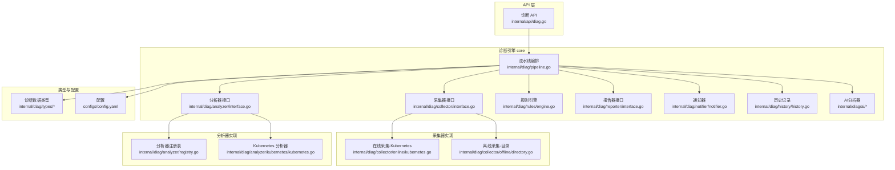
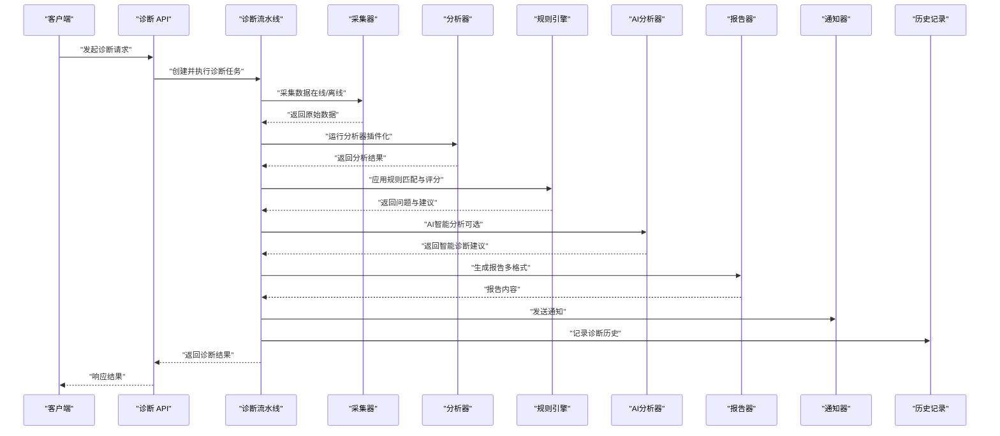
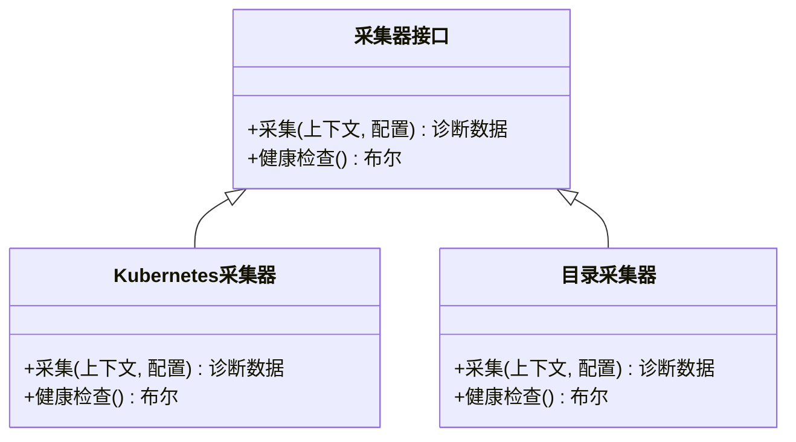
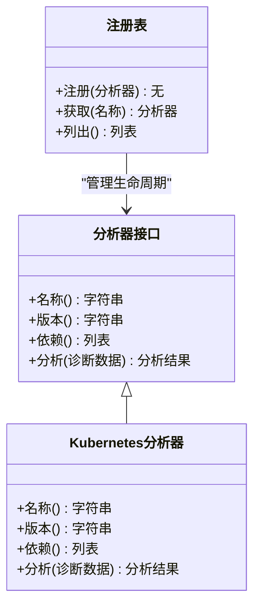
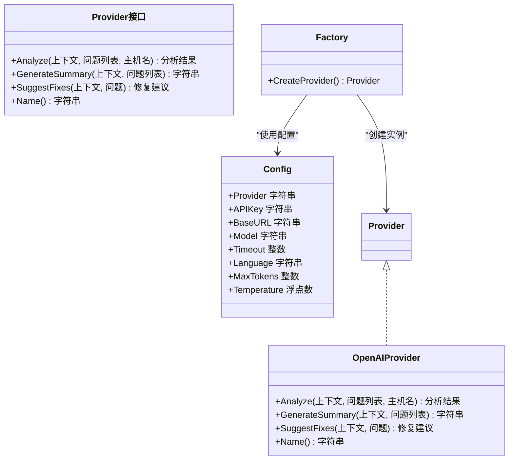
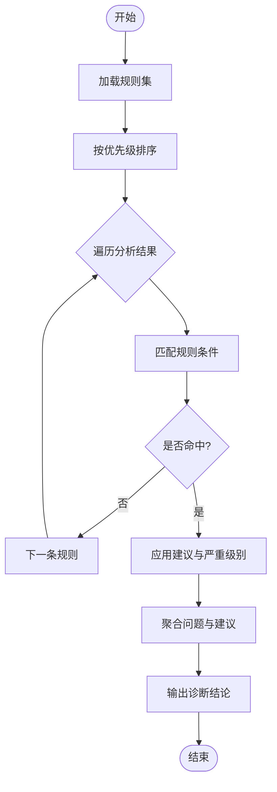
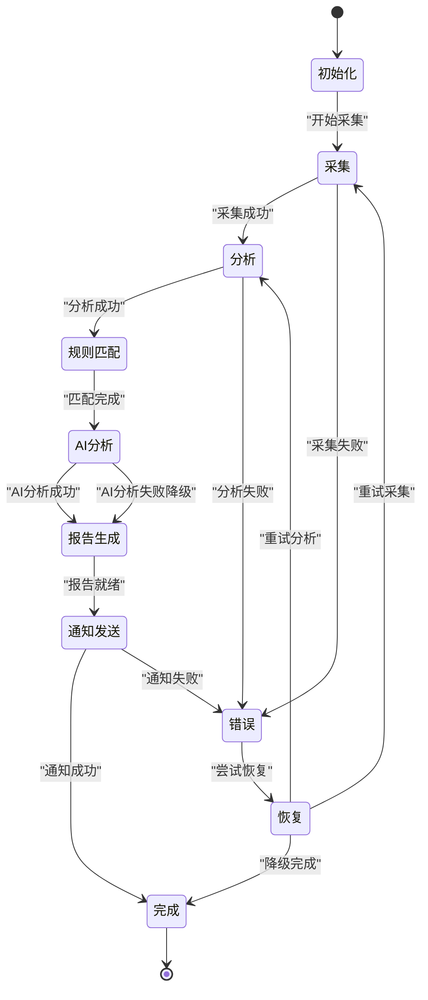
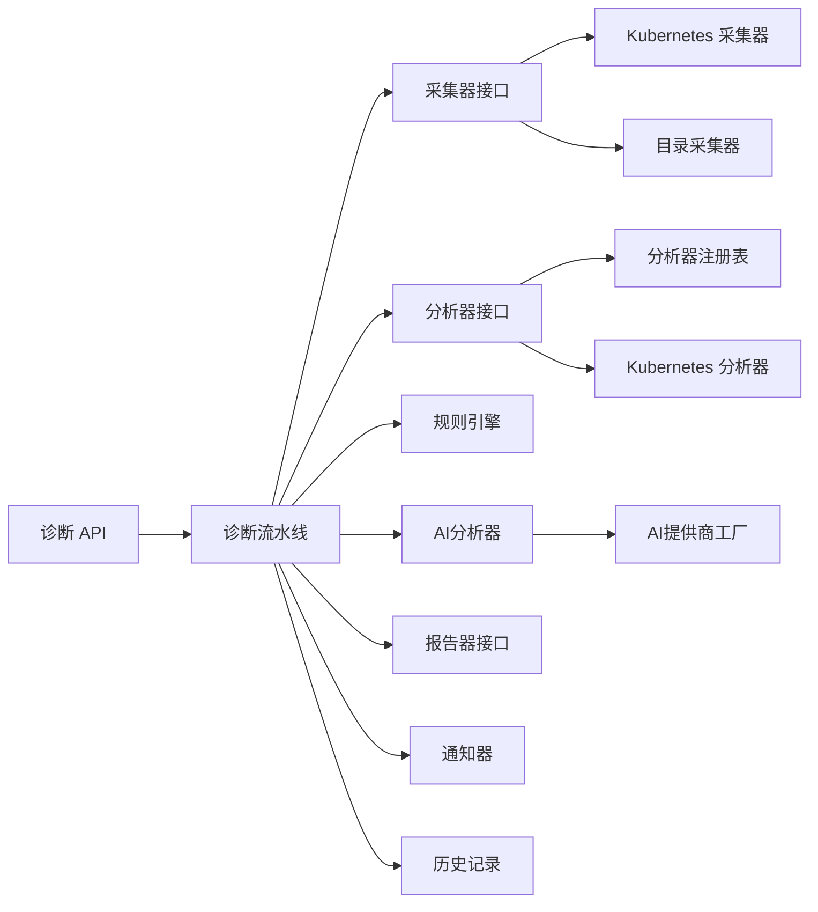

# 诊断引擎架构

<cite>
**本文引用的文件**   
- [internal/diag/pipeline.go](file://internal/diag/pipeline.go)
- [internal/diag/collector/interface.go](file://internal/diag/collector/interface.go)
- [internal/diag/collector/online/kubernetes.go](file://internal/diag/collector/online/kubernetes.go)
- [internal/diag/collector/offline/directory.go](file://internal/diag/collector/offline/directory.go)
- [internal/diag/analyzer/interface.go](file://internal/diag/analyzer/interface.go)
- [internal/diag/analyzer/registry.go](file://internal/diag/analyzer/registry.go)
- [internal/diag/analyzer/kubernetes/kubernetes.go](file://internal/diag/analyzer/kubernetes/kubernetes.go)
- [internal/diag/rules/engine.go](file://internal/diag/rules/engine.go)
- [internal/diag/rules/types.go](file://internal/diag/rules/types.go)
- [internal/diag/rules/loader.go](file://internal/diag/rules/loader.go)
- [internal/diag/types/diagnostic_data.go](file://internal/diag/types/diagnostic_data.go)
- [internal/diag/types/severity.go](file://internal/diag/types/severity.go)
- [internal/diag/reporter/interface.go](file://internal/diag/reporter/interface.go)
- [internal/diag/notifier/notifier.go](file://internal/diag/notifier/notifier.go)
- [internal/diag/history/history.go](file://internal/diag/history/history.go)
- [internal/api/diag.go](file://internal/api/diag.go)
- [configs/config.yaml](file://configs/config.yaml)
- [internal/diag/ai/provider.go](file://internal/diag/ai/provider.go)
- [internal/diag/ai/assistant.go](file://internal/diag/ai/assistant.go)
</cite>

## 更新摘要
**所做更改**
- 新增AI分析能力章节，详细说明多提供商支持（OpenAI、Qwen、Ollama、MiMo）
- 更新架构总览图，包含AI分析组件
- 扩展详细组件分析，增加AI提供商工厂模式和智能端点检测
- 更新配置部分，说明AI相关环境变量配置
- 增强故障排查指南，包含AI分析相关问题

## 目录
1. [简介](#简介)
2. [项目结构](#项目结构)
3. [核心组件](#核心组件)
4. [架构总览](#架构总览)
5. [详细组件分析](#详细组件分析)
6. [依赖关系分析](#依赖关系分析)
7. [性能考虑](#性能考虑)
8. [故障排查指南](#故障排查指南)
9. [结论](#结论)
10. [附录](#附录)

## 简介
本文件为 Klaw 平台诊断引擎的架构文档，聚焦数据采集管道、分析器插件化、规则引擎与诊断流程编排。内容涵盖：
- 数据源抽象与采集器插件化设计
- 分析器接口与动态加载机制
- 规则定义、匹配算法与优先级管理
- **新增** AI分析能力，支持多提供商智能诊断
- 诊断流程状态管理与错误恢复
- 性能监控、资源限制与并发控制策略
- 扩展开发指南（新分析器实现模式与最佳实践）

## 项目结构
诊断引擎位于 internal/diag 下，按职责划分为采集器、分析器、规则、报告、通知、历史等子模块；API 层在 internal/api 中暴露诊断能力；配置集中在 configs 目录。**新增AI分析模块**提供智能诊断辅助能力。

**图表来源**
- [internal/api/diag.go](file://internal/api/diag.go)
- [internal/diag/pipeline.go](file://internal/diag/pipeline.go)
- [internal/diag/collector/interface.go](file://internal/diag/collector/interface.go)
- [internal/diag/collector/online/kubernetes.go](file://internal/diag/collector/online/kubernetes.go)
- [internal/diag/collector/offline/directory.go](file://internal/diag/collector/offline/directory.go)
- [internal/diag/analyzer/interface.go](file://internal/diag/analyzer/interface.go)
- [internal/diag/analyzer/registry.go](file://internal/diag/analyzer/registry.go)
- [internal/diag/analyzer/kubernetes/kubernetes.go](file://internal/diag/analyzer/kubernetes/kubernetes.go)
- [internal/diag/rules/engine.go](file://internal/diag/rules/engine.go)
- [internal/diag/reporter/interface.go](file://internal/diag/reporter/interface.go)
- [internal/diag/notifier/notifier.go](file://internal/diag/notifier/notifier.go)
- [internal/diag/history/history.go](file://internal/diag/history/history.go)
- [internal/diag/types/diagnostic_data.go](file://internal/diag/types/diagnostic_data.go)
- [configs/config.yaml](file://configs/config.yaml)

**章节来源**
- [internal/api/diag.go](file://internal/api/diag.go)
- [internal/diag/pipeline.go](file://internal/diag/pipeline.go)
- [configs/config.yaml](file://configs/config.yaml)

## 核心组件
- 采集器接口：统一数据源抽象，支持在线（如 Kubernetes）与离线（如本地目录）两种模式，便于插件化扩展。
- 分析器接口与注册表：定义分析器契约，通过注册表集中管理，支持动态加载自定义分析器。
- 规则引擎：基于规则定义进行匹配与评分，支持优先级与条件组合。
- **新增** AI分析器：支持多提供商的智能诊断辅助，包括OpenAI、Qwen、Ollama和MiMo平台。
- 报告器接口：统一输出格式（文本、JSON、HTML、SARIF 等），便于集成外部系统。
- 通知器与历史记录：将诊断结果推送至消息通道并持久化历史，支撑可观测性与回溯。
- 类型体系：标准化诊断数据与严重级别，确保跨模块一致性。

**章节来源**
- [internal/diag/collector/interface.go](file://internal/diag/collector/interface.go)
- [internal/diag/analyzer/interface.go](file://internal/diag/analyzer/interface.go)
- [internal/diag/analyzer/registry.go](file://internal/diag/analyzer/registry.go)
- [internal/diag/rules/engine.go](file://internal/diag/rules/engine.go)
- [internal/diag/rules/types.go](file://internal/diag/rules/types.go)
- [internal/diag/reporter/interface.go](file://internal/diag/reporter/interface.go)
- [internal/diag/notifier/notifier.go](file://internal/diag/notifier/notifier.go)
- [internal/diag/history/history.go](file://internal/diag/history/history.go)
- [internal/diag/types/diagnostic_data.go](file://internal/diag/types/diagnostic_data.go)
- [internal/diag/types/severity.go](file://internal/diag/types/severity.go)

## 架构总览
诊断引擎采用"流水线 + 插件"的架构：API 触发诊断任务，流水线协调采集、分析、规则匹配、AI分析、报告生成与通知发送。采集器与分析器均通过接口解耦，注册表提供动态发现与加载能力。**新增AI分析环节**在规则匹配后提供智能诊断建议。

**图表来源**
- [internal/api/diag.go](file://internal/api/diag.go)
- [internal/diag/pipeline.go](file://internal/diag/pipeline.go)
- [internal/diag/collector/interface.go](file://internal/diag/collector/interface.go)
- [internal/diag/analyzer/interface.go](file://internal/diag/analyzer/interface.go)
- [internal/diag/rules/engine.go](file://internal/diag/rules/engine.go)
- [internal/diag/reporter/interface.go](file://internal/diag/reporter/interface.go)
- [internal/diag/notifier/notifier.go](file://internal/diag/notifier/notifier.go)
- [internal/diag/history/history.go](file://internal/diag/history/history.go)

## 详细组件分析

### 数据采集管道
- 数据源抽象：通过采集器接口统一封装不同数据源的访问方式，屏蔽在线/离线差异。
- 采集器插件化：新增数据源只需实现采集器接口，并在初始化时注册到采集器管理器。
- 数据流处理：采集阶段产出标准化诊断数据，供后续分析器消费。

**图表来源**
- [internal/diag/collector/interface.go](file://internal/diag/collector/interface.go)
- [internal/diag/collector/online/kubernetes.go](file://internal/diag/collector/online/kubernetes.go)
- [internal/diag/collector/offline/directory.go](file://internal/diag/collector/offline/directory.go)

**章节来源**
- [internal/diag/collector/interface.go](file://internal/diag/collector/interface.go)
- [internal/diag/collector/online/kubernetes.go](file://internal/diag/collector/online/kubernetes.go)
- [internal/diag/collector/offline/directory.go](file://internal/diag/collector/offline/directory.go)

### 分析器接口与插件化架构
- 分析器契约：定义输入（诊断数据）、输出（分析结果）与元信息（名称、版本、依赖）。
- 注册表机制：启动时扫描并注册所有分析器，支持运行时动态加载自定义分析器。
- 执行策略：支持串行或并行执行，结合超时与重试策略提升鲁棒性。

**图表来源**
- [internal/diag/analyzer/interface.go](file://internal/diag/analyzer/interface.go)
- [internal/diag/analyzer/registry.go](file://internal/diag/analyzer/registry.go)
- [internal/diag/analyzer/kubernetes/kubernetes.go](file://internal/diag/analyzer/kubernetes/kubernetes.go)

**章节来源**
- [internal/diag/analyzer/interface.go](file://internal/diag/analyzer/interface.go)
- [internal/diag/analyzer/registry.go](file://internal/diag/analyzer/registry.go)
- [internal/diag/analyzer/kubernetes/kubernetes.go](file://internal/diag/analyzer/kubernetes/kubernetes.go)

### AI分析器与多提供商支持
**新增** AI分析器提供智能诊断辅助能力，支持多种AI服务提供商：

- **提供商工厂模式**：通过工厂方法根据配置动态创建不同的AI提供商实例
- **智能端点检测**：自动识别MiMo平台的Token Plan套餐和普通套餐，选择正确的API端点
- **多语言支持**：支持中文和英文的诊断结果输出
- **容错处理**：AI分析失败不影响主诊断流程，仅记录警告日志

**图表来源**
- [internal/diag/ai/provider.go:19-32](file://internal/diag/ai/provider.go#L19-L32)
- [internal/diag/ai/provider.go:109-136](file://internal/diag/ai/provider.go#L109-L136)
- [internal/diag/ai/provider.go:528-574](file://internal/diag/ai/provider.go#L528-L574)
- [internal/diag/ai/provider.go:53-65](file://internal/diag/ai/provider.go#L53-L65)

**章节来源**
- [internal/diag/ai/provider.go](file://internal/diag/ai/provider.go)
- [internal/diag/ai/assistant.go](file://internal/diag/ai/assistant.go)

### 规则引擎工作原理
- 规则定义：以结构化形式描述条件、匹配表达式、严重级别与建议动作。
- 匹配算法：对分析结果逐项评估规则，支持复合条件与优先级排序。
- 优先级管理：高优先级规则优先命中，避免低优先级覆盖关键问题。

**图表来源**
- [internal/diag/rules/engine.go](file://internal/diag/rules/engine.go)
- [internal/diag/rules/types.go](file://internal/diag/rules/types.go)
- [internal/diag/rules/loader.go](file://internal/diag/rules/loader.go)

**章节来源**
- [internal/diag/rules/engine.go](file://internal/diag/rules/engine.go)
- [internal/diag/rules/types.go](file://internal/diag/rules/types.go)
- [internal/diag/rules/loader.go](file://internal/diag/rules/loader.go)

### 诊断流程的状态管理与错误恢复
- 状态机：任务从"初始化 → 采集 → 分析 → 规则匹配 → **AI分析** → 报告 → 通知 → 完成"，任一阶段失败进入"错误"分支。
- 错误恢复：支持重试、降级（跳过失败的分析器或采集器）、回滚（清理中间状态）与告警上报。
- 幂等性：同一诊断任务可重复执行，保证结果一致。
- **AI分析容错**：AI分析失败仅记录警告，不影响主诊断流程继续执行。

**章节来源**
- [internal/diag/pipeline.go](file://internal/diag/pipeline.go)
- [internal/diag/notifier/notifier.go](file://internal/diag/notifier/notifier.go)
- [internal/diag/history/history.go](file://internal/diag/history/history.go)

### 报告与通知
- 报告器接口：统一输出多种格式（文本、JSON、HTML、SARIF），便于对接不同下游系统。
- 通知器：支持多渠道通知（如企业微信、钉钉、飞书等），可配置模板与过滤策略。
- 历史记录：持久化每次诊断的关键指标与结论，便于趋势分析与回溯。

**章节来源**
- [internal/diag/reporter/interface.go](file://internal/diag/reporter/interface.go)
- [internal/diag/notifier/notifier.go](file://internal/diag/notifier/notifier.go)
- [internal/diag/history/history.go](file://internal/diag/history/history.go)

### 类型体系与严重级别
- 诊断数据：标准化数据结构，包含来源、时间戳、指标与摘要。
- 严重级别：定义从"信息"到"致命"的分级，用于规则匹配与报告展示。

**章节来源**
- [internal/diag/types/diagnostic_data.go](file://internal/diag/types/diagnostic_data.go)
- [internal/diag/types/severity.go](file://internal/diag/types/severity.go)

## 依赖关系分析
- 松耦合：采集器、分析器、报告器均通过接口与调用方解耦，便于替换与扩展。
- 集中管理：分析器注册表统一管理插件生命周期，降低耦合度。
- 外部依赖：Kubernetes 采集器依赖集群 API，目录采集器依赖文件系统；规则引擎依赖规则定义文件。
- **新增依赖**：AI分析器依赖OpenAI兼容协议的AI服务，支持多种提供商。

**图表来源**
- [internal/api/diag.go](file://internal/api/diag.go)
- [internal/diag/pipeline.go](file://internal/diag/pipeline.go)
- [internal/diag/collector/interface.go](file://internal/diag/collector/interface.go)
- [internal/diag/collector/online/kubernetes.go](file://internal/diag/collector/online/kubernetes.go)
- [internal/diag/collector/offline/directory.go](file://internal/diag/collector/offline/directory.go)
- [internal/diag/analyzer/interface.go](file://internal/diag/analyzer/interface.go)
- [internal/diag/analyzer/registry.go](file://internal/diag/analyzer/registry.go)
- [internal/diag/analyzer/kubernetes/kubernetes.go](file://internal/diag/analyzer/kubernetes/kubernetes.go)
- [internal/diag/rules/engine.go](file://internal/diag/rules/engine.go)
- [internal/diag/reporter/interface.go](file://internal/diag/reporter/interface.go)
- [internal/diag/notifier/notifier.go](file://internal/diag/notifier/notifier.go)
- [internal/diag/history/history.go](file://internal/diag/history/history.go)

**章节来源**
- [internal/api/diag.go](file://internal/api/diag.go)
- [internal/diag/pipeline.go](file://internal/diag/pipeline.go)

## 性能考虑
- 并发控制：采集与分析阶段支持并行执行，结合工作池与限流避免资源争用。
- 超时与重试：为每个阶段设置合理超时与最大重试次数，防止长尾阻塞。
- 内存与 I/O：大对象使用流式处理，减少峰值内存占用；批量读取与缓存热点数据。
- 监控与度量：暴露关键指标（采集耗时、分析成功率、规则命中率），便于容量规划与调优。
- **AI分析优化**：AI分析设置为可选功能，可通过参数禁用；支持超时控制和降级处理。

## 故障排查指南
- 常见问题
  - 采集失败：检查网络连通性、权限与资源配额；查看采集器健康检查日志。
  - 分析器未加载：确认注册表是否正确初始化，依赖是否满足。
  - 规则未命中：验证规则优先级与条件表达式，检查输入数据结构。
  - 通知失败：核对渠道配置与模板变量，检查网络与认证。
  - **新增** AI分析失败：检查API Key配置、网络连接、提供商端点可达性。
- 定位方法
  - 启用调试日志，关注流水线各阶段状态转换。
  - 查看历史记录与报告，对比多次执行差异。
  - 使用健康检查接口快速定位异常组件。
  - **新增** 检查AI相关环境变量配置（KUDIG_AI_*）。
- **AI分析特定问题**
  - 提供商配置错误：验证KUDIG_AI_PROVIDER、KUDIG_AI_API_KEY、KUDIG_AI_BASE_URL配置
  - 端点检测失败：检查MiMo平台的API Key前缀（sk-或tp-）是否正确
  - 模型不可用：确认配置的模型在当前提供商中可用

**章节来源**
- [internal/diag/pipeline.go](file://internal/diag/pipeline.go)
- [internal/diag/notifier/notifier.go](file://internal/diag/notifier/notifier.go)
- [internal/diag/history/history.go](file://internal/diag/history/history.go)

## 结论
Klaw 诊断引擎通过接口抽象与插件化设计，实现了高内聚、低耦合的可扩展架构。**新增的AI分析能力**进一步增强了诊断系统的智能化水平，支持多种AI提供商的智能诊断辅助。采集器与分析器的解耦、规则引擎的灵活匹配、AI分析的智能决策以及完善的错误恢复机制，共同保障了诊断流程的稳定性与可维护性。配合性能优化与监控手段，可在复杂环境中高效运行。

## 附录
- 扩展开发指南（新分析器实现模式与最佳实践）
  - 实现分析器接口：定义名称、版本、依赖与核心分析方法。
  - 注册分析器：在初始化阶段调用注册表进行注册，支持运行时动态加载。
  - 单元测试：覆盖正常路径与异常路径，验证输入输出与边界条件。
  - 性能测试：模拟大规模数据，评估内存与 CPU 占用，必要时引入批处理与缓存。
  - 文档与示例：提供使用说明与示例配置，便于团队复用与维护。
- **新增** AI分析器扩展指南
  - 实现Provider接口：定义AI提供商的分析、摘要生成和修复建议功能
  - 配置环境：设置KUDIG_AI_*环境变量配置AI提供商
  - 端点检测：利用工厂模式的智能端点检测功能
  - 容错处理：确保AI分析失败不影响主诊断流程

**章节来源**
- [internal/diag/analyzer/interface.go](file://internal/diag/analyzer/interface.go)
- [internal/diag/analyzer/registry.go](file://internal/diag/analyzer/registry.go)
- [internal/diag/ai/provider.go](file://internal/diag/ai/provider.go)
- [internal/diag/ai/assistant.go](file://internal/diag/ai/assistant.go)