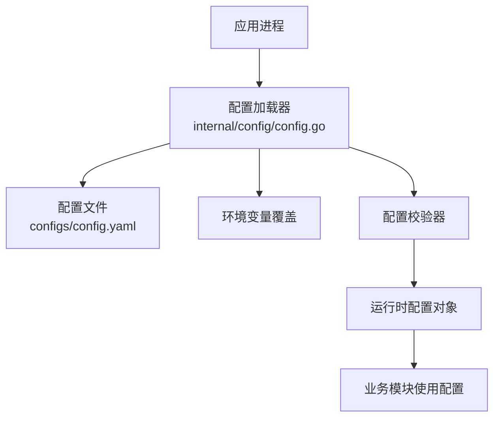
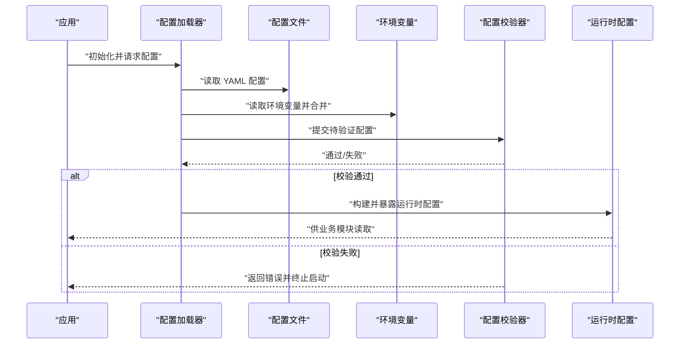
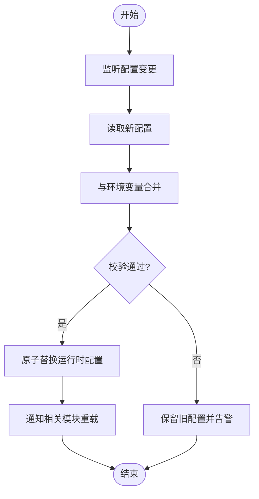
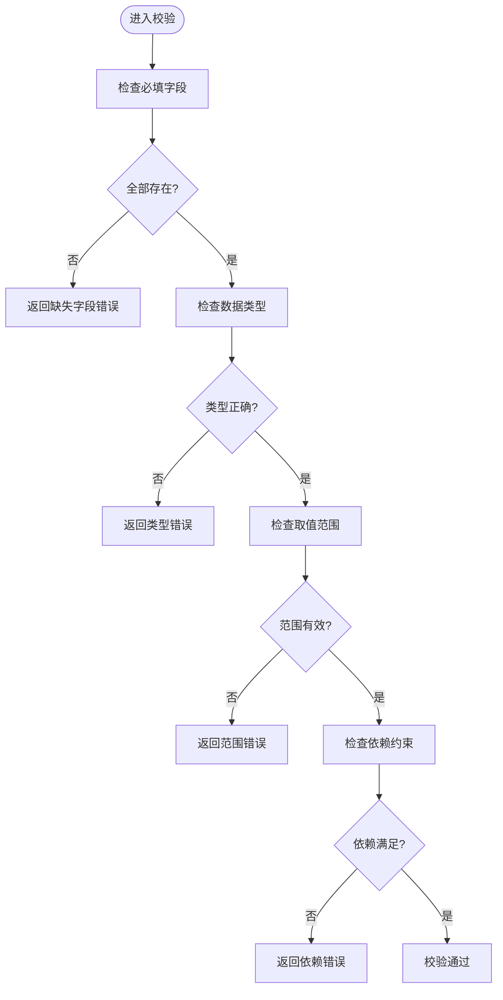
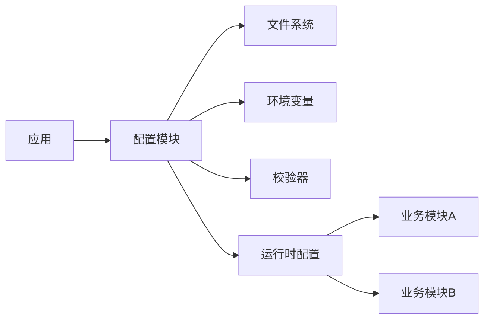

# 配置管理

<cite>
**本文引用的文件**   
- [configs/config.yaml](file://configs/config.yaml)
- [configs/config.yaml.example](file://configs/config.yaml.example)
- [internal/config/config.go](file://internal/config/config.go)
- [internal/config/test/config_test.go](file://internal/config/test/config_test.go)
</cite>

## 目录
1. [简介](#简介)
2. [项目结构](#项目结构)
3. [核心组件](#核心组件)
4. [架构总览](#架构总览)
5. [详细组件分析](#详细组件分析)
6. [依赖关系分析](#依赖关系分析)
7. [性能考虑](#性能考虑)
8. [故障排查指南](#故障排查指南)
9. [结论](#结论)
10. [附录](#附录)

## 简介
本文件面向 Klaw 平台的配置管理，系统性说明配置文件结构、环境变量覆盖机制、动态配置更新与配置校验流程。文档同时提供各配置项的详细说明、默认值、取值范围与示例，并给出不同环境的模板与最佳实践建议，帮助读者快速完成部署与运维。

## 项目结构
Klaw 的配置相关代码与文件主要分布在以下位置：
- 配置文件目录 configs/：包含默认配置文件与示例模板
- 内部配置模块 internal/config/：负责加载、解析、合并与校验配置

**图表来源** 
- [internal/config/config.go](file://internal/config/config.go)
- [configs/config.yaml](file://configs/config.yaml)
- [configs/config.yaml.example](file://configs/config.yaml.example)

**章节来源**
- [configs/config.yaml](file://configs/config.yaml)
- [configs/config.yaml.example](file://configs/config.yaml.example)
- [internal/config/config.go](file://internal/config/config.go)

## 核心组件
- 配置加载器：从配置文件与环境变量中读取并合并为统一的配置结构
- 配置校验器：对必填字段、类型与取值范围进行校验，失败时阻止启动或返回错误
- 运行时配置对象：以不可变结构暴露给业务模块，保证一致性
- 配置热更新（如启用）：监听外部变更事件，触发重新加载与校验，再安全替换运行时配置

**章节来源**
- [internal/config/config.go](file://internal/config/config.go)
- [internal/config/test/config_test.go](file://internal/config/test/config_test.go)

## 架构总览
下图展示了配置从源到运行时的完整链路，包括加载、合并、校验与注入过程。

**图表来源** 
- [internal/config/config.go](file://internal/config/config.go)
- [configs/config.yaml](file://configs/config.yaml)
- [configs/config.yaml.example](file://configs/config.yaml.example)

## 详细组件分析

### 配置结构与字段说明
- 配置文件格式：YAML
- 典型字段类别（按常见系统划分）：
  - 服务基础信息：名称、版本、监听地址与端口
  - 日志级别与输出：控制台、文件、JSON 开关
  - 存储后端：路径、连接参数、备份策略
  - 消息通道：钉钉、飞书等通知渠道的接入参数
  - 诊断与分析：规则引擎、采集器、报告器开关与阈值
  - 多租户与鉴权：租户隔离、RBAC、令牌有效期
  - 监控与指标：Prometheus 导出开关、采样间隔
- 字段优先级：环境变量 > 配置文件；同层级键按声明顺序合并
- 默认值：未显式设置的字段采用内置默认值；可通过示例模板对照补齐

注意：具体字段名、默认值与取值范围请以实际配置文件与示例为准。建议在部署前基于示例模板逐项核对。

**章节来源**
- [configs/config.yaml](file://configs/config.yaml)
- [configs/config.yaml.example](file://configs/config.yaml.example)

### 环境变量覆盖机制
- 命名约定：通常采用“大写+下划线”的全局键，映射到配置的嵌套字段
- 覆盖时机：在配置文件解析后、校验前进行覆盖
- 类型转换：字符串自动转换为目标类型（布尔、整数、浮点、数组、对象）
- 缺失处理：未设置的环境变量不覆盖对应配置项

示例（概念性）：
- LOG_LEVEL=debug
- STORAGE_PATH=/data/klaw
- NOTIFICATION_DINGTALK_TOKEN=xxx

**章节来源**
- [internal/config/config.go](file://internal/config/config.go)

### 动态配置更新
- 触发方式：文件系统监听、API 调用或配置中心推送
- 更新流程：增量读取 -> 合并 -> 校验 -> 原子替换运行时配置
- 回滚策略：若新配置校验失败，保持旧配置不变并记录告警
- 影响范围：仅影响后续请求，避免中断当前处理

**图表来源** 
- [internal/config/config.go](file://internal/config/config.go)

**章节来源**
- [internal/config/config.go](file://internal/config/config.go)

### 配置校验机制
- 必填校验：关键密钥、连接串、端口等不允许为空
- 类型校验：确保数值、布尔、枚举等类型正确
- 取值范围：端口范围、超时时间、并发度等边界检查
- 关联校验：某些字段组合必须满足约束（如开启某功能需配套参数）
- 错误处理：启动阶段失败直接报错；运行时热更新失败则拒绝生效并告警

**图表来源** 
- [internal/config/config.go](file://internal/config/config.go)

**章节来源**
- [internal/config/config.go](file://internal/config/config.go)

### 配置示例与模板
- 示例模板：configs/config.yaml.example 提供最小可用配置与常用选项注释
- 生产模板：基于示例模板扩展，补充安全、监控、审计与高可用相关项
- 开发模板：简化配置，关闭非必要功能，便于本地调试

建议：
- 首次部署先复制示例模板，逐项填写必要项
- 环境差异通过环境变量覆盖，避免维护多份完整配置
- 敏感信息（密钥、令牌）务必通过环境变量注入，不要写入配置文件

**章节来源**
- [configs/config.yaml.example](file://configs/config.yaml.example)

## 依赖关系分析
- 配置模块被应用启动阶段调用，随后由业务模块只读访问
- 外部依赖：文件系统（YAML）、环境变量、可能的配置中心或 API
- 耦合点：校验逻辑与运行时配置对象的接口契约
- 潜在风险：循环依赖应避免；配置变更应幂等且可回滚

**图表来源** 
- [internal/config/config.go](file://internal/config/config.go)

**章节来源**
- [internal/config/config.go](file://internal/config/config.go)

## 性能考虑
- 配置加载频率：启动时一次性加载；热更新仅在变更时触发
- 合并与校验开销：尽量精简配置项数量，避免过深的嵌套
- 内存占用：运行时配置对象应保持轻量，避免冗余拷贝
- I/O 优化：配置文件缓存、增量读取与异步校验可降低阻塞

[本节为通用指导，无需特定文件引用]

## 故障排查指南
常见问题与定位步骤：
- 启动失败：检查必填字段是否缺失、类型与范围是否正确
- 热更新无效：确认监听路径或 API 回调是否生效，查看校验错误日志
- 环境变量未生效：核对命名约定与覆盖顺序，确认大小写与分隔符
- 权限问题：配置文件与数据目录权限不足导致读取失败

建议操作：
- 使用最小化配置逐步添加项，定位问题字段
- 开启更详细的日志级别，观察加载与校验过程
- 对敏感配置使用独立的环境变量管理工具

**章节来源**
- [internal/config/test/config_test.go](file://internal/config/test/config_test.go)

## 结论
Klaw 的配置管理遵循“文件为主、环境变量为辅、严格校验、可选热更新”的原则。通过清晰的层次与严格的校验，保障系统在多种环境下稳定运行。建议在生产环境中结合环境变量与配置中心，实现集中化与安全的配置治理。

[本节为总结性内容，无需特定文件引用]

## 附录
- 术语表
  - 配置加载器：负责从文件与环境变量读取并合并配置
  - 运行时配置：启动后暴露给业务模块的只读配置对象
  - 热更新：在不重启进程的情况下动态刷新配置
- 参考文件
  - 配置文件：configs/config.yaml
  - 示例模板：configs/config.yaml.example
  - 配置实现：internal/config/config.go
  - 测试用例：internal/config/test/config_test.go

**章节来源**
- [configs/config.yaml](file://configs/config.yaml)
- [configs/config.yaml.example](file://configs/config.yaml.example)
- [internal/config/config.go](file://internal/config/config.go)
- [internal/config/test/config_test.go](file://internal/config/test/config_test.go)