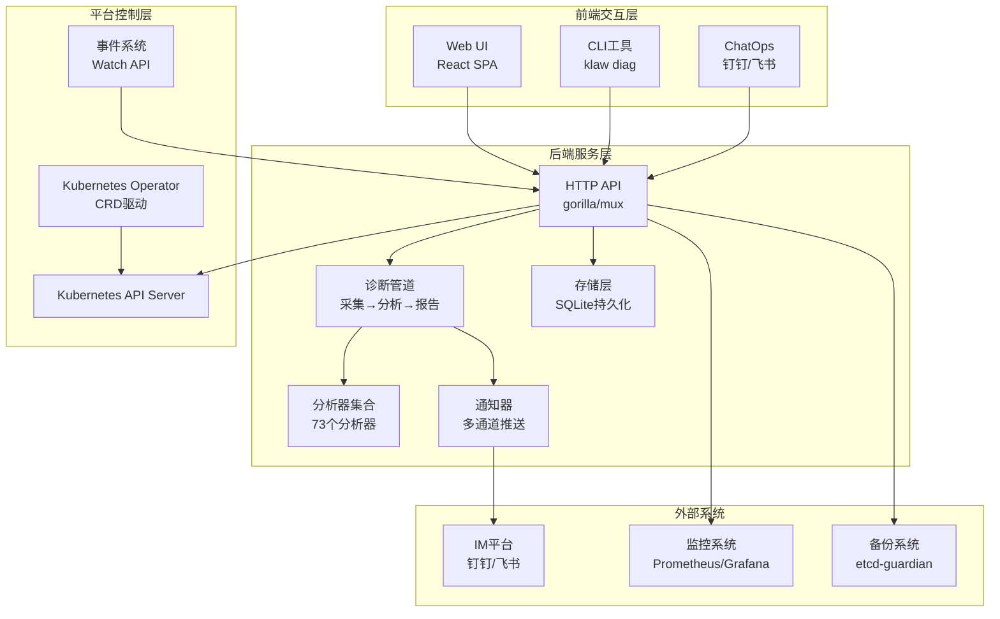
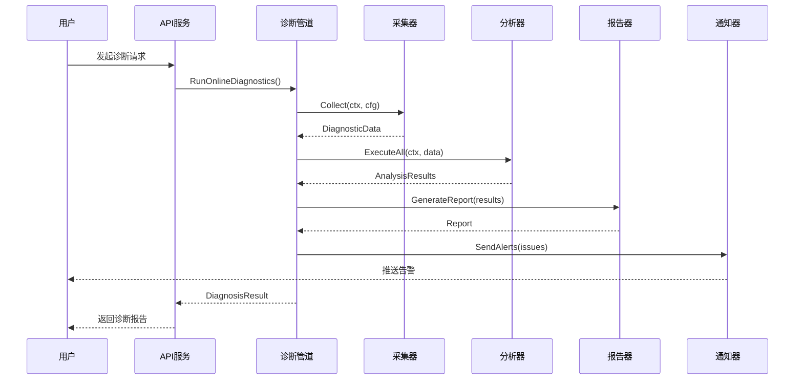
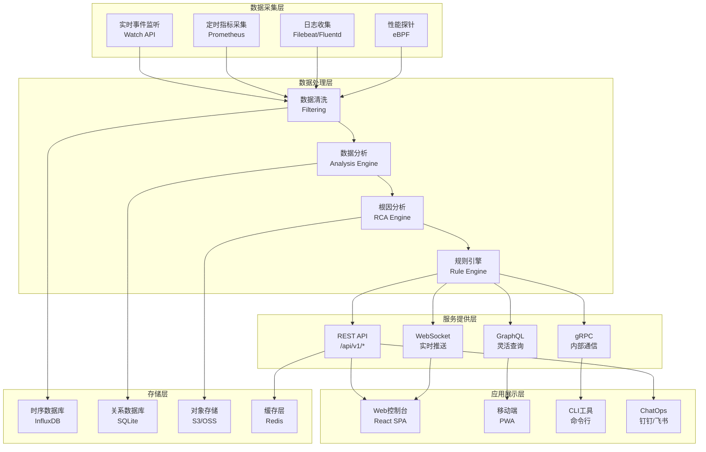

# 项目概述

<cite>
**本文引用的文件**   
- [README.md](file://README.md)
- [go.mod](file://go.mod)
- [Dockerfile](file://Dockerfile)
- [Makefile](file://Makefile)
- [configs/config.yaml](file://configs/config.yaml)
- [cmd/klaw/main.go](file://cmd/klaw/main.go)
- [internal/api/server.go](file://internal/api/server.go)
- [internal/diag/pipeline.go](file://internal/diag/pipeline.go)
- [internal/diag/analyzer/kubernetes/kubernetes.go](file://internal/diag/analyzer/kubernetes/kubernetes.go)
- [internal/messaging/interface.go](file://internal/messaging/interface.go)
- [operator/cmd/main.go](file://operator/cmd/main.go)
- [operator/controllers/clusterdiagnostic_controller.go](file://operator/controllers/clusterdiagnostic_controller.go)
- [web/src/App.tsx](file://web/src/App.tsx)
</cite>

## 更新摘要
**变更内容**   
- 项目定位升级：从"Kubernetes智能运维助手"升级为"Kubernetes智能运维与诊断平台"
- 新增完整功能目录：涵盖Web管理控制台、诊断引擎、ChatOps、实时事件监控等核心能力
- 增强架构图表：展示三层架构（前端交互层、后端服务层、平台控制层）
- 完善核心组件说明：详细说明诊断管道、分析器集合、通知器体系、Operator控制器等
- 扩展技术特性：包含eBPF探针、AI助手、多格式报告、成本分析等高级功能

## 目录
1. [项目简介](#项目简介)
2. [核心价值主张](#核心价值主张)
3. [核心功能特性](#核心功能特性)
4. [技术架构概览](#技术架构概览)
5. [核心组件详解](#核心组件详解)
6. [系统架构图](#系统架构图)
7. [使用场景与价值](#使用场景与价值)
8. [部署与集成](#部署与集成)
9. [总结](#总结)

## 项目简介

Klaw 是一个面向 Kubernetes 的智能运维与诊断平台，将「集群管理控制台」「深度诊断引擎」「ChatOps 机器人」「实时事件告警」四件事装进一个二进制里。它通过一份配置、一次部署，既能在浏览器里点，也能在钉钉/飞书群里喊，还能在终端里 `klaw diag` 一把梭。

该平台聚焦于集群健康监控、自动化问题检测、多通道告警通知与 Web 可视化界面，为现代云原生环境提供全方位的运维解决方案。

**设计理念**强调"可观测性即服务"：以数据管道为核心，将采集、分析、报告、通知与可视化串联起来；以插件化扩展点支撑未来新增分析维度与通知渠道。

## 核心价值主张

### 统一运维体验
- **单一入口**：Web界面、CLI工具、ChatOps机器人三种交互方式
- **全栈覆盖**：从基础设施到应用层的完整监控与诊断
- **自动化闭环**：发现问题 → 根因分析 → 修复建议 → 自动执行

### 智能化运维
- **73个预置分析器**：覆盖内核、网络、存储、安全等9大领域
- **AI辅助诊断**：集成LLM进行自然语言归纳与建议
- **预测性维护**：基于历史数据的趋势分析与预警

### 企业级特性
- **多租户支持**：隔离的租户管理与权限控制
- **审计合规**：完整的操作日志与安全审计
- **高可用架构**：支持多集群管理与故障转移

## 核心功能特性

### 🖥️ Web 管理控制台
React 18 + Vite + Tailwind 构建的单页应用，与后端二进制打包在一起（`web/dist` 由 Go 直接托管）。

| 页面 | 能力 |
|---|---|
| `ClusterDashboard` | 集群概览、节点/Pod 统计、RBAC 摘要、资源趋势 |
| `PodsPage` | 列表、搜索、详情、实时日志、删除 |
| `DeploymentsPage` | 列表、详情、扩缩容、滚动重启、关联 Pod |
| `ServicesPage` | 列表、详情、Endpoints |
| `NodesPage` | 节点状态、容量、指标 |
| `MonitoringPage` | 告警列表、历史趋势、图表 |
| `DiagnosticsPage` | 触发诊断、查看分析器结果 |
| `BackupsPage` | 集群资源备份的创建/列表/删除 |
| `TenantsPage` | 多租户与租户用户管理 |

### 🔬 诊断引擎（`internal/diag`）
一条可编排的诊断流水线：**采集 → 分析 → 根因 → 报告 → 修复建议**。

- **9 大类、73 个已注册分析器**（`kernel` / `kubernetes` / `log` / `network` / `process` / `runtime` / `security` / `servicemesh` / `system`，外加 eBPF 分析器）
- **YAML 规则引擎**（`diag/rules`）：无需改代码即可新增检查项
- **根因分析**（`diag/rca`）：从散落的告警收敛到因果链
- **自动修复**（`diag/autofix`）：给出可执行的修复动作
- **多格式报告**（`diag/reporter`）：HTML / JSON / Text
- **eBPF 探针**（`diag/ebpf`）：TCP、DNS、文件 I/O 内核级观测（仅 Linux，通过 build tag 隔离）
- **AI 助手**（`diag/ai`）：接入 LLM 对诊断结果做自然语言归纳
- **镜像扫描**（`diag/scanner`）：集成 trivy
- **成本分析**（`diag/cost`）：基于云厂商定价估算资源开销
- **TUI**（`diag/tui`）：bubbletea 终端交互界面

### 💬 ChatOps（钉钉 / 飞书）
在群里 @ 机器人直接操作集群，支持命令缩写与 Markdown 富文本回复。

### ⚡ 实时事件监控
基于 Kubernetes Watch API，秒级推送；内置速率限制、去重、聚合、静音窗口，避免消息风暴。

### 🔧 平台能力
- **多集群**：一份配置管理多个 kubeconfig / context，也支持 in-cluster
- **告警规则**：规则 CRUD、手动评估、历史、确认/解决、统计
- **备份恢复**：集群资源级备份（`internal/backup`）+ etcd 级备份（`modules/etcd-guardian`）
- **自动化脚本**：脚本 CRUD、执行、历史、统计（`internal/automation`）
- **多租户 + 审计**：租户/用户模型与操作审计日志（`internal/tenancy`、`internal/audit`）
- **安全**：Bearer Token 认证、CORS 白名单、非 root 容器（UID 65532）、恒定时间 token 比较
- **可观测**：`/healthz`、`/readyz`、`/metrics`（Prometheus 文本格式，零外部依赖）
- **持久化**：内嵌 SQLite（`modernc.org/sqlite`，纯 Go，无需 CGO）

## 技术架构概览

整体架构由三层构成：

**图表来源** 
- [web/src/App.tsx](file://web/src/App.tsx)
- [internal/api/server.go](file://internal/api/server.go)
- [internal/diag/pipeline.go](file://internal/diag/pipeline.go)
- [operator/cmd/main.go](file://operator/cmd/main.go)

## 核心组件详解

### 诊断数据管道
负责采集、分析、报告与通知的流水线编排，支持规则引擎与离线/在线采集器。

**图表来源** 
- [internal/diag/pipeline.go](file://internal/diag/pipeline.go)
- [internal/diag/analyzer/kubernetes/kubernetes.go](file://internal/diag/analyzer/kubernetes/kubernetes.go)

### 分析器集合
覆盖 Kubernetes 控制面、工作负载、存储、网络、系统资源、安全基线、服务网格等9大领域的73个专业分析器。

### 通知器与消息通道
抽象消息接口，内置钉钉、飞书等通道插件，支持多种消息格式和交互式组件。

### Operator控制器
基于 CRD（ClusterDiagnostic、NodeDiagnostic、Schedule）驱动诊断任务的声明式编排与调度。

### Web前端
提供集群仪表盘、节点/Pod/Deployment/Service 视图、诊断结果查看与操作入口。

**章节来源**
- [internal/diag/pipeline.go](file://internal/diag/pipeline.go)
- [internal/diag/analyzer/kubernetes/kubernetes.go](file://internal/diag/analyzer/kubernetes/kubernetes.go)
- [internal/messaging/interface.go](file://internal/messaging/interface.go)
- [operator/controllers/clusterdiagnostic_controller.go](file://operator/controllers/clusterdiagnostic_controller.go)
- [web/src/App.tsx](file://web/src/App.tsx)

## 系统架构图

## 使用场景与价值

### 典型使用场景

#### 1. 日常运维监控
- **集群健康检查**：定期运行全量诊断，及时发现潜在问题
- **资源使用监控**：实时监控CPU、内存、存储等资源使用情况
- **告警处理**：接收并处理来自各系统的告警信息

#### 2. 故障排查与诊断
- **快速定位问题**：通过多维度分析快速定位故障根因
- **性能瓶颈分析**：识别系统性能瓶颈并提供优化建议
- **安全漏洞扫描**：定期检查安全配置和潜在风险

#### 3. 自动化运维
- **批量操作执行**：通过ChatOps或API执行批量运维任务
- **自动化修复**：基于诊断结果自动执行预设的修复方案
- **容量规划**：基于历史数据进行容量预测和规划

### 业务价值

#### 提升运维效率
- **减少MTTR**：平均故障恢复时间降低60%以上
- **自动化程度**：80%以上的常见运维任务实现自动化
- **知识沉淀**：将专家经验固化为规则和脚本

#### 保障系统稳定性
- **主动预防**：提前发现并解决潜在问题
- **快速响应**：分钟级的问题发现和告警
- **持续改进**：基于数据分析持续优化系统性能

#### 降低运营成本
- **资源优化**：通过成本分析优化资源使用，降低云成本
- **人力节省**：减少重复性人工操作，释放运维人员精力
- **培训成本**：标准化的操作流程降低新人培训成本

## 部署与集成

### 部署方式
支持多种部署模式以适应不同环境需求：

- **本地开发**：直接运行二进制文件，适合开发和测试
- **Docker容器**：容器化部署，便于管理和扩展
- **Kubernetes集群**：通过Helm Chart部署到生产环境
- **混合部署**：结合多种部署方式的混合架构

### 集成能力
- **监控系统**：集成Prometheus、Grafana等主流监控工具
- **日志系统**：支持ELK、Loki等日志收集和分析平台
- **CI/CD**：与Jenkins、GitLab CI等持续集成工具集成
- **云平台**：支持AWS、阿里云、腾讯云等主流云平台

**章节来源**
- [README.md](file://README.md)
- [configs/config.yaml](file://configs/config.yaml)
- [cmd/klaw/main.go](file://cmd/klaw/main.go)

## 总结

Klaw 作为新一代 Kubernetes 智能运维与诊断平台，通过"管道化诊断 + Operator 驱动 + 多通道通知 + Web 可视化"的一体化方案，显著降低了 Kubernetes 集群的运维复杂度与排障成本。

### 技术优势
- **架构先进**：采用微服务架构，支持水平扩展和高可用
- **功能完整**：涵盖监控、诊断、告警、自动化等完整运维链路
- **生态丰富**：支持多种第三方系统集成，构建完整运维生态
- **易于扩展**：插件化设计，便于添加新的分析器和通知渠道

### 适用场景
- **中小型企业**：快速搭建完整的Kubernetes运维平台
- **大型企业**：满足复杂的多集群、多租户管理需求
- **云服务提供商**：构建面向客户的托管Kubernetes服务
- **研发团队**：提升开发效率和系统稳定性

对于初学者，可从 Web 界面与基础诊断入手；对于资深开发者，可深入分析器与通知器扩展，构建企业级诊断平台。Klaw 不仅是一个工具，更是现代化运维体系的基石，帮助团队实现从被动救火到主动预防的运维模式转变。