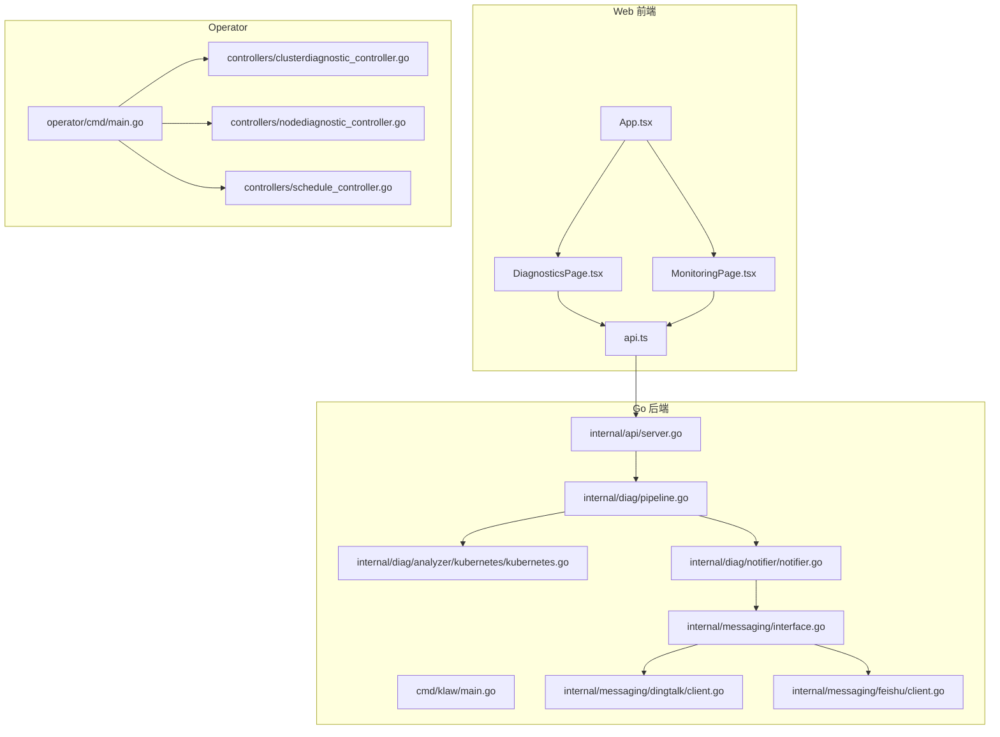
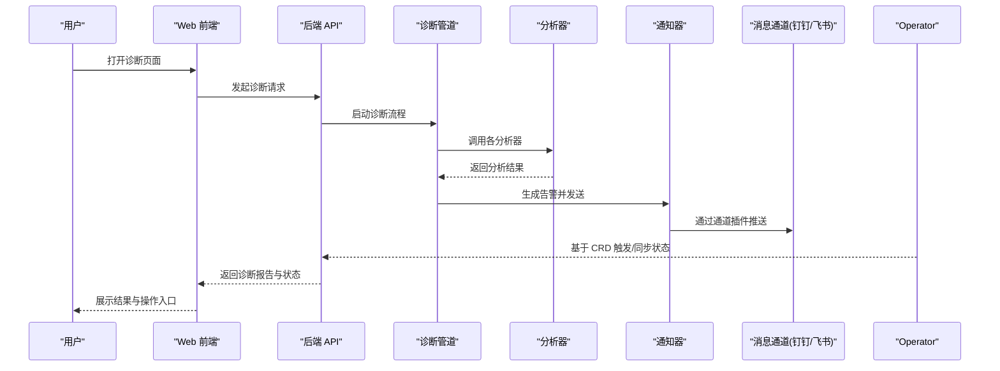
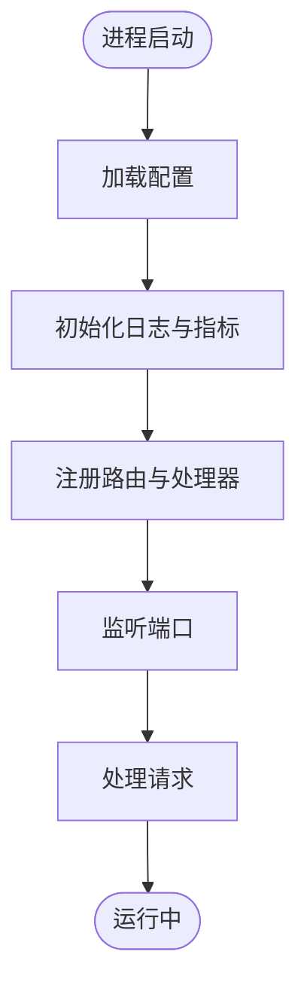
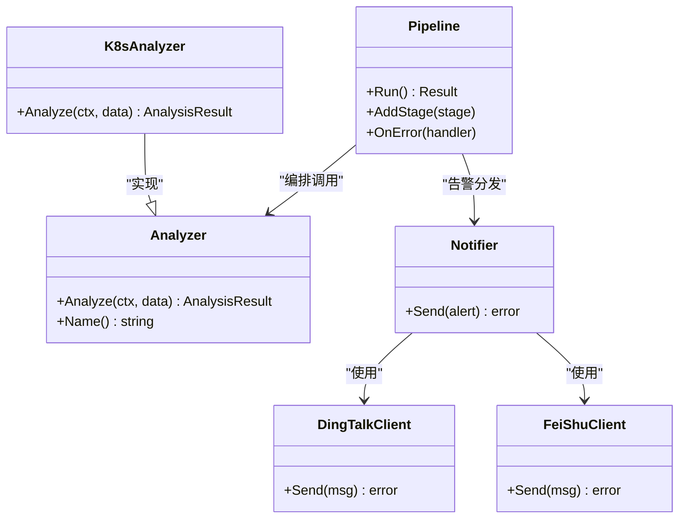
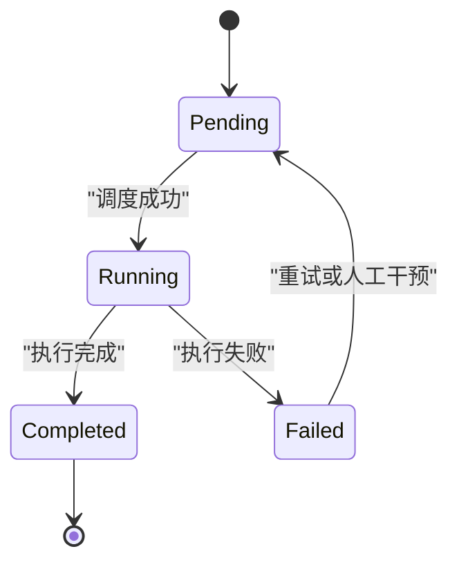
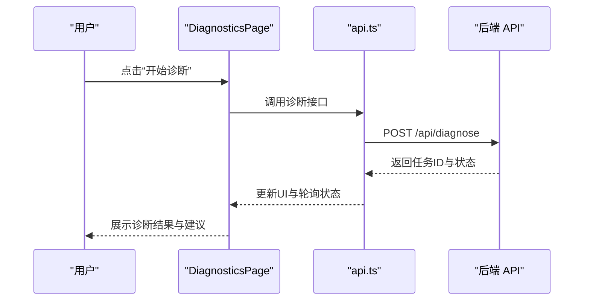
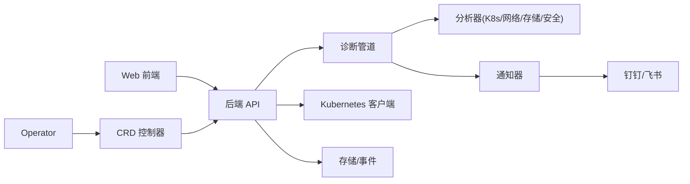

# 项目概述

<cite>
**本文引用的文件**   
- [go.mod](file://go.mod)
- [Dockerfile](file://Dockerfile)
- [Makefile](file://Makefile)
- [configs/config.yaml](file://configs/config.yaml)
- [cmd/klaw/main.go](file://cmd/klaw/main.go)
- [internal/api/server.go](file://internal/api/server.go)
- [internal/diag/pipeline.go](file://internal/diag/pipeline.go)
- [internal/diag/analyzer/kubernetes/kubernetes.go](file://internal/diag/analyzer/kubernetes/kubernetes.go)
- [internal/diag/notifier/notifier.go](file://internal/diag/notifier/notifier.go)
- [internal/messaging/interface.go](file://internal/messaging/interface.go)
- [internal/messaging/dingtalk/client.go](file://internal/messaging/dingtalk/client.go)
- [internal/messaging/feishu/client.go](file://internal/messaging/feishu/client.go)
- [operator/cmd/main.go](file://operator/cmd/main.go)
- [operator/controllers/clusterdiagnostic_controller.go](file://operator/controllers/clusterdiagnostic_controller.go)
- [operator/controllers/nodediagnostic_controller.go](file://operator/controllers/nodediagnostic_controller.go)
- [operator/controllers/schedule_controller.go](file://operator/controllers/schedule_controller.go)
- [web/src/App.tsx](file://web/src/App.tsx)
- [web/src/pages/DiagnosticsPage.tsx](file://web/src/pages/DiagnosticsPage.tsx)
- [web/src/pages/MonitoringPage.tsx](file://web/src/pages/MonitoringPage.tsx)
- [web/src/lib/api.ts](file://web/src/lib/api.ts)
</cite>

## 目录
1. [简介](#简介)
2. [项目结构](#项目结构)
3. [核心组件](#核心组件)
4. [架构总览](#架构总览)
5. [详细组件分析](#详细组件分析)
6. [依赖关系分析](#依赖关系分析)
7. [性能考量](#性能考量)
8. [故障排查指南](#故障排查指南)
9. [结论](#结论)
10. [附录](#附录)

## 简介
Klaw 是一个面向 Kubernetes 的诊断与运维管理平台，聚焦于集群健康监控、自动化问题检测、多通道告警通知与 Web 可视化界面。其核心价值在于：
- 将分散的集群诊断能力统一编排，提供端到端的问题发现、根因分析与修复建议闭环
- 通过 Operator 驱动 CRD 生命周期管理，实现声明式调度与执行
- 以可扩展的分析器与通知器体系，适配多种运行时、网络栈与安全基线
- 提供直观的 Web 界面，降低排障门槛，提升团队协同效率

设计理念强调“可观测性即服务”：以数据管道为核心，将采集、分析、报告、通知与可视化串联起来；以插件化扩展点支撑未来新增分析维度与通知渠道。

## 项目结构
仓库采用 Go 后端 + React 前端 + Kubernetes Operator 的分层组织方式：
- cmd/klaw：应用入口与 HTTP API 服务
- internal/*：业务逻辑（API、诊断、消息、存储、事件等）
- operator/*：Kubernetes Operator，基于 CRD 驱动诊断任务
- web/*：React 前端，提供集群仪表盘、诊断页面、监控页面等
- configs/*：配置样例与默认配置
- deployment/*、helm/*：部署与打包相关资源

**图表来源** 
- [web/src/App.tsx](file://web/src/App.tsx)
- [web/src/pages/DiagnosticsPage.tsx](file://web/src/pages/DiagnosticsPage.tsx)
- [web/src/pages/MonitoringPage.tsx](file://web/src/pages/MonitoringPage.tsx)
- [web/src/lib/api.ts](file://web/src/lib/api.ts)
- [cmd/klaw/main.go](file://cmd/klaw/main.go)
- [internal/api/server.go](file://internal/api/server.go)
- [internal/diag/pipeline.go](file://internal/diag/pipeline.go)
- [internal/diag/analyzer/kubernetes/kubernetes.go](file://internal/diag/analyzer/kubernetes/kubernetes.go)
- [internal/diag/notifier/notifier.go](file://internal/diag/notifier/notifier.go)
- [internal/messaging/interface.go](file://internal/messaging/interface.go)
- [internal/messaging/dingtalk/client.go](file://internal/messaging/dingtalk/client.go)
- [internal/messaging/feishu/client.go](file://internal/messaging/feishu/client.go)
- [operator/cmd/main.go](file://operator/cmd/main.go)
- [operator/controllers/clusterdiagnostic_controller.go](file://operator/controllers/clusterdiagnostic_controller.go)
- [operator/controllers/nodediagnostic_controller.go](file://operator/controllers/nodediagnostic_controller.go)
- [operator/controllers/schedule_controller.go](file://operator/controllers/schedule_controller.go)

**章节来源**
- [go.mod](file://go.mod)
- [Dockerfile](file://Dockerfile)
- [Makefile](file://Makefile)
- [configs/config.yaml](file://configs/config.yaml)

## 核心组件
- 诊断数据管道：负责采集、分析、报告与通知的流水线编排，支持规则引擎与离线/在线采集器
- 分析器集合：覆盖 Kubernetes 控制面、工作负载、存储、网络、系统资源、安全基线、服务网格等
- 通知器与消息通道：抽象消息接口，内置钉钉、飞书等通道插件
- Operator：基于 CRD（ClusterDiagnostic、NodeDiagnostic、Schedule）驱动诊断任务的声明式编排与调度
- Web 前端：提供集群仪表盘、节点/Pod/Deployment/Service 视图、诊断结果查看与操作入口

**章节来源**
- [internal/diag/pipeline.go](file://internal/diag/pipeline.go)
- [internal/diag/analyzer/kubernetes/kubernetes.go](file://internal/diag/analyzer/kubernetes/kubernetes.go)
- [internal/diag/notifier/notifier.go](file://internal/diag/notifier/notifier.go)
- [internal/messaging/interface.go](file://internal/messaging/interface.go)
- [operator/controllers/clusterdiagnostic_controller.go](file://operator/controllers/clusterdiagnostic_controller.go)
- [operator/controllers/nodediagnostic_controller.go](file://operator/controllers/nodediagnostic_controller.go)
- [operator/controllers/schedule_controller.go](file://operator/controllers/schedule_controller.go)
- [web/src/pages/DiagnosticsPage.tsx](file://web/src/pages/DiagnosticsPage.tsx)
- [web/src/pages/MonitoringPage.tsx](file://web/src/pages/MonitoringPage.tsx)

## 架构总览
整体架构由三层构成：
- 前端交互层：React SPA，通过 REST API 与后端通信，展示诊断与监控结果
- 后端服务层：HTTP API 路由、诊断管道编排、分析器调用、通知分发
- 平台控制层：Kubernetes Operator 监听 CRD，触发并管理诊断任务的生命周期

**图表来源** 
- [web/src/lib/api.ts](file://web/src/lib/api.ts)
- [internal/api/server.go](file://internal/api/server.go)
- [internal/diag/pipeline.go](file://internal/diag/pipeline.go)
- [internal/diag/analyzer/kubernetes/kubernetes.go](file://internal/diag/analyzer/kubernetes/kubernetes.go)
- [internal/diag/notifier/notifier.go](file://internal/diag/notifier/notifier.go)
- [internal/messaging/interface.go](file://internal/messaging/interface.go)
- [internal/messaging/dingtalk/client.go](file://internal/messaging/dingtalk/client.go)
- [internal/messaging/feishu/client.go](file://internal/messaging/feishu/client.go)
- [operator/controllers/clusterdiagnostic_controller.go](file://operator/controllers/clusterdiagnostic_controller.go)

## 详细组件分析

### 后端 API 与服务启动
- 入口程序加载配置、初始化日志与指标收集，注册路由与中间件
- API Server 暴露诊断、备份、审计、自动化、租户管理等接口
- 通过统一的上下文与错误处理机制保证稳定性与可观测性

**图表来源** 
- [cmd/klaw/main.go](file://cmd/klaw/main.go)
- [internal/api/server.go](file://internal/api/server.go)

**章节来源**
- [cmd/klaw/main.go](file://cmd/klaw/main.go)
- [internal/api/server.go](file://internal/api/server.go)

### 诊断数据管道与分析器
- 管道按阶段组织：采集、分析、报告、通知，支持并行与重试策略
- 分析器按领域划分（Kubernetes、网络、存储、安全、系统等），通过注册表统一管理
- 结果结构化输出，便于前端渲染与下游消费

**图表来源** 
- [internal/diag/pipeline.go](file://internal/diag/pipeline.go)
- [internal/diag/analyzer/kubernetes/kubernetes.go](file://internal/diag/analyzer/kubernetes/kubernetes.go)
- [internal/diag/notifier/notifier.go](file://internal/diag/notifier/notifier.go)
- [internal/messaging/interface.go](file://internal/messaging/interface.go)
- [internal/messaging/dingtalk/client.go](file://internal/messaging/dingtalk/client.go)
- [internal/messaging/feishu/client.go](file://internal/messaging/feishu/client.go)

**章节来源**
- [internal/diag/pipeline.go](file://internal/diag/pipeline.go)
- [internal/diag/analyzer/kubernetes/kubernetes.go](file://internal/diag/analyzer/kubernetes/kubernetes.go)
- [internal/diag/notifier/notifier.go](file://internal/diag/notifier/notifier.go)
- [internal/messaging/interface.go](file://internal/messaging/interface.go)

### Operator 控制器与 CRD 驱动
- ClusterDiagnostic、NodeDiagnostic、Schedule 三种 CRD 分别对应集群级、节点级与定时任务
- 控制器监听 CRD 变更，协调诊断任务创建、执行与状态同步
- 通过 RBAC 限制权限，确保最小权限原则

**图表来源** 
- [operator/controllers/clusterdiagnostic_controller.go](file://operator/controllers/clusterdiagnostic_controller.go)
- [operator/controllers/nodediagnostic_controller.go](file://operator/controllers/nodediagnostic_controller.go)
- [operator/controllers/schedule_controller.go](file://operator/controllers/schedule_controller.go)

**章节来源**
- [operator/cmd/main.go](file://operator/cmd/main.go)
- [operator/controllers/clusterdiagnostic_controller.go](file://operator/controllers/clusterdiagnostic_controller.go)
- [operator/controllers/nodediagnostic_controller.go](file://operator/controllers/nodediagnostic_controller.go)
- [operator/controllers/schedule_controller.go](file://operator/controllers/schedule_controller.go)

### Web 前端与交互流程
- 路由与页面模块：诊断页、监控页、节点/Pod/Deployment/Service 列表与详情
- 通过 api.ts 封装后端接口，统一错误处理与加载态
- 提供刷新、筛选、导出等操作，提升排障效率

**图表来源** 
- [web/src/pages/DiagnosticsPage.tsx](file://web/src/pages/DiagnosticsPage.tsx)
- [web/src/lib/api.ts](file://web/src/lib/api.ts)
- [internal/api/server.go](file://internal/api/server.go)

**章节来源**
- [web/src/App.tsx](file://web/src/App.tsx)
- [web/src/pages/DiagnosticsPage.tsx](file://web/src/pages/DiagnosticsPage.tsx)
- [web/src/pages/MonitoringPage.tsx](file://web/src/pages/MonitoringPage.tsx)
- [web/src/lib/api.ts](file://web/src/lib/api.ts)

## 依赖关系分析
- 后端依赖 Kubernetes 客户端、存储与事件总线，用于采集与状态同步
- 分析器依赖具体运行时与工具链（如内核、网络栈、存储子系统）
- 通知器依赖消息通道插件，支持扩展新的 IM 平台
- 前端依赖后端 REST API，保持无状态与跨域安全

**图表来源** 
- [internal/api/server.go](file://internal/api/server.go)
- [internal/diag/pipeline.go](file://internal/diag/pipeline.go)
- [internal/diag/analyzer/kubernetes/kubernetes.go](file://internal/diag/analyzer/kubernetes/kubernetes.go)
- [internal/diag/notifier/notifier.go](file://internal/diag/notifier/notifier.go)
- [internal/messaging/interface.go](file://internal/messaging/interface.go)
- [internal/messaging/dingtalk/client.go](file://internal/messaging/dingtalk/client.go)
- [internal/messaging/feishu/client.go](file://internal/messaging/feishu/client.go)
- [operator/controllers/clusterdiagnostic_controller.go](file://operator/controllers/clusterdiagnostic_controller.go)

**章节来源**
- [go.mod](file://go.mod)

## 性能考量
- 诊断管道支持并发执行与限流，避免对集群造成压力
- 分析器按需启用，减少不必要的数据采集与计算开销
- 通知器批量合并与去重，降低通道负载
- 前端分页与懒加载，优化大列表渲染性能
- 建议在生产环境开启缓存与异步任务队列，结合 Prometheus/Grafana 进行容量规划

[本节为通用指导，不直接分析具体文件]

## 故障排查指南
- 检查配置项是否正确加载（配置文件路径、环境变量）
- 查看后端日志与指标，定位 API 错误与分析器异常
- 确认 Operator 控制器状态与 CRD 事件是否生效
- 验证消息通道凭据与网络连通性（钉钉/飞书 webhook）
- 前端网络请求与跨域设置，确认 API 可达性与鉴权

**章节来源**
- [configs/config.yaml](file://configs/config.yaml)
- [internal/api/server.go](file://internal/api/server.go)
- [internal/diag/pipeline.go](file://internal/diag/pipeline.go)
- [internal/diag/notifier/notifier.go](file://internal/diag/notifier/notifier.go)
- [internal/messaging/dingtalk/client.go](file://internal/messaging/dingtalk/client.go)
- [internal/messaging/feishu/client.go](file://internal/messaging/feishu/client.go)
- [operator/controllers/clusterdiagnostic_controller.go](file://operator/controllers/clusterdiagnostic_controller.go)

## 结论
Klaw 通过“管道化诊断 + Operator 驱动 + 多通道通知 + Web 可视化”的一体化方案，显著降低了 Kubernetes 集群的运维复杂度与排障成本。其插件化设计与清晰的职责边界，使得在复杂生产环境中快速扩展新能力成为可能。对于初学者，可从 Web 界面与基础诊断入手；对于资深开发者，可深入分析器与通知器扩展，构建企业级诊断平台。

[本节为总结性内容，不直接分析具体文件]

## 附录
- 部署参考：使用 Makefile 与 Dockerfile 构建镜像，Helm Chart 安装 Operator 与后端服务
- 配置示例：configs/config.yaml 提供默认参数说明
- 技能文档：skills 目录下提供集群与 Kubernetes 排障技能指引

[本节为补充信息，不直接分析具体文件]