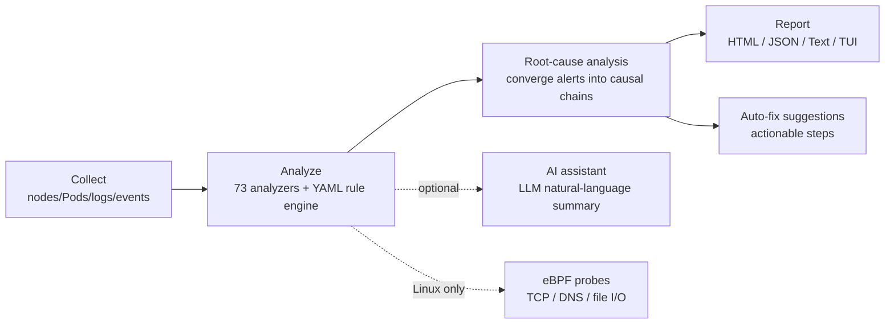
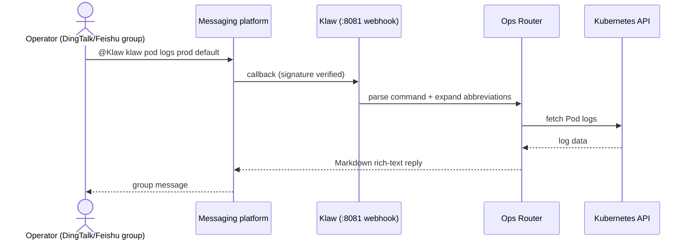
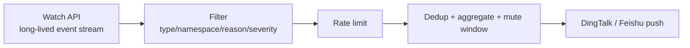

# 🦞 Klaw — Kubernetes Intelligent Ops & Diagnostics Platform

[简体中文](./README.md) | **[English](./README.en.md)**

[](https://github.com/kudig-io/klaw/actions/workflows/ci.yml)
[](https://golang.org)
[](https://reactjs.org)
[](./helm/klaw)
[](./Dockerfile)
[](./LICENSE)

Klaw packs four things into a single binary: a **cluster management console**, a **deep diagnostics engine**, a **ChatOps bot**, and **real-time event alerting**.
One config, one deploy — click in the browser, shout in a DingTalk/Feishu group, or run `klaw diag` in your terminal.

**30-second start:**

```bash
git clone https://github.com/kudig-io/klaw.git && cd klaw
make build && ./klaw        # open http://localhost:8080
```

<p align="center">
  
</p>
<p align="center"><sub>Dashboard: multi-cluster overview · node / Pod stats · RBAC summary (real UI rendered with MSW mock data)</sub></p>

---

## Table of Contents

- [Why Klaw](#why-klaw)
- [Core Capabilities](#core-capabilities)
  - [SOS Mode (voice emergency dialog)](#-sos-mode-voice-emergency-dialog)
  - [Web Management Console](#-web-management-console)
  - [Diagnostics Engine](#-diagnostics-engine-internaldiag)
  - [ChatOps (DingTalk / Feishu)](#-chatops-dingtalk--feishu)
  - [Real-time Event Monitoring](#-real-time-event-monitoring)
  - [Platform Capabilities](#-platform-capabilities)
- [UI Preview](#ui-preview)
- [Repository Layout](#repository-layout)
- [Architecture](#architecture)
  - [Diagnostics Pipeline](#diagnostics-pipeline)
  - [ChatOps Sequence](#chatops-sequence)
  - [Event Pipeline](#event-pipeline)
- [Quick Start](#quick-start)
  - [Prerequisites](#prerequisites)
  - [Local Binary](#option-1-local-binary)
  - [Docker](#option-2-docker)
  - [kind + Helm (in-cluster)](#option-3-kind--helm-in-cluster-recommended-for-verification)
- [Configuration](#configuration)
  - [Alibaba Cloud Ops Environment (Skills & ACS)](#alibaba-cloud-ops-environment-skills--acs)
  - [Onboarding External Clusters (multi-cluster)](#onboarding-external-clusters-multi-cluster)
  - [Environment Variable Overrides](#environment-variable-overrides)
  - [AI Diagnostics Assistant (optional)](#ai-diagnostics-assistant-optional)
- [CLI](#cli)
- [HTTP API](#http-api)
- [ChatOps](#chatops)
- [Real-time Event Monitoring](#real-time-event-monitoring)
- [Frontend Development](#frontend-development)
- [Testing](#testing)
- [Makefile Targets](#makefile-targets)
- [Roadmap](#roadmap)
- [Sub-projects](#sub-projects)
- [Known Limitations](#known-limitations)
- [FAQ](#faq)
- [Documentation Index](#documentation-index)
- [Contributing](#contributing)
- [Security](#security)
- [Code of Conduct](#code-of-conduct)
- [License](#license)
- [Links](#links)

---

## Why Klaw

It's 3 a.m. and an alert fires: you want to check status from your phone in a group chat, triage with `kubectl` on your laptop, and ideally have someone (or an AI) tell you the root cause. Klaw's answer is to put that entire workflow into a single binary —

- **One binary, five capabilities**: Web console + deep diagnostics engine (73 analyzers in 9 categories) + ChatOps (DingTalk/Feishu) + sub-second real-time event alerts + SOS voice emergency dialog — one deploy gets you all of it.
- **Three entry points, one capability set**: click in the browser, @ the bot in a group, or run `klaw diag` in the terminal — all backed by the same diagnostics pipeline and cluster clients.
- **Deploy and go**: embedded SQLite (pure Go, no CGO), no external database; ~127MB image running as non-root; delivered as local binary / Docker / Helm.
- **Verifiable differentiators**: 73 registered analyzers, Watch-mode event latency < 1s (vs 30–60s polling), ~90% fewer API calls.

### Comparison with Similar Tools

Capability comparison with common Kubernetes management tools (based on each project's public documentation, as of 2026-08; these projects evolve quickly — [corrections welcome](https://github.com/kudig-io/klaw/issues)):

| Capability | Klaw | [Kubernetes Dashboard](https://github.com/kubernetes/dashboard) | [k9s](https://github.com/derailed/k9s) | [Headlamp](https://github.com/headlamp-k8s/headlamp) |
|---|---|---|---|---|
| Form factor | Single binary (Web + CLI + ChatOps) | Web UI (in-cluster) | Terminal TUI | Web UI (desktop / in-cluster) |
| Deep diagnostics engine (73 analyzers / RCA / fix suggestions) | ✅ | ❌ | ❌ (resource browsing) | ❌ (plugin-based) |
| ChatOps (DingTalk / Feishu) | ✅ | ❌ | ❌ | ❌ |
| Sub-second event push (Watch + dedup / aggregation / muting) | ✅ | ❌ (events page) | manual refresh | ❌ |
| Multi-cluster | ✅ (one config, many kubecontexts) | one cluster per instance | context switching | ✅ |
| Multi-tenancy + audit log | ✅ | relies on K8s RBAC | ❌ | ❌ |
| Cluster / etcd backup & restore | ✅ | ❌ | ❌ | ❌ |
| AI assistance (diagnostics summary / voice SOS) | ✅ | ❌ | ❌ | ❌ |
| License | MIT | Apache-2.0 | Apache-2.0 | Apache-2.0 |

> Comparison doesn't mean replacement: k9s' terminal UX, Dashboard's official lineage, and Headlamp's plugin ecosystem each have their strengths. Klaw's differentiation is packaging "manage + diagnose + alert + ChatOps" into a single-binary delivery.

---

## Core Capabilities

### 🚨 SOS Mode (voice emergency dialog)

A full-screen voice call page (floating button / SOS nav entry) that proxies through the Klaw backend to real-time full-duplex voice models, with smart interruption and two-way subtitles. Switch the upstream via `sos.provider`:

| provider | Upstream model | Notes |
|---|---|---|
| `dashscope` (default) | Alibaba Cloud Bailian Qwen-Omni-Realtime | semantic_vad interruption, two-way subtitles |
| `glm` | Zhipu GLM-Realtime | server_vad interruption, OpenAI Realtime-compatible event protocol |

Answers use a three-layer fallback: **preset corpus** (`configs/sos-faq.yaml`, answered verbatim on hit) → **cluster tools** (function calling for live status/logs/events/trigger diagnostics) → **model general knowledge**.

Enable it:

```yaml
sos:
  enabled: true
  provider: dashscope        # or glm
  dashscope:
    workspace_id: "<Bailian Workspace ID>"   # inject api_key via KLAW_SOS_DASHSCOPE_API_KEY
  # when provider: glm:
  # glm:
  #   model: glm-realtime    # inject api_key via KLAW_SOS_GLM_API_KEY (format: {id}.{secret})
```

### 🖥️ Web Management Console

A single-page app built with React 18 + Vite + Tailwind, bundled into the backend binary (`web/dist` is served directly by Go).

| Page | Capabilities |
|---|---|
| `ClusterDashboard` | cluster overview, node/Pod stats, RBAC summary, resource trends |
| `PodsPage` | list, search, details, live logs, delete |
| `DeploymentsPage` | list, details, scale, rolling restart, related Pods |
| `ServicesPage` | list, details, Endpoints |
| `NodesPage` | node status, capacity, metrics |
| `MonitoringPage` | alert list, history trends, charts |
| `DiagnosticsPage` | trigger diagnostics, view analyzer results |
| `BackupsPage` | create / list / delete cluster resource backups |
| `TenantsPage` | multi-tenancy and tenant user management |

Dark mode is provided by `ThemeContext` and can follow the system.

### 🔬 Diagnostics Engine (`internal/diag`)

An orchestrable diagnostics pipeline: **collect → analyze → root cause → report → fix suggestions**.

- **73 registered analyzers in 9 categories** (`kernel` / `kubernetes` / `log` / `network` / `process` / `runtime` / `security` / `servicemesh` / `system`, plus eBPF analyzers)
- **YAML rule engine** (`diag/rules`): add checks without changing code
- **Root-cause analysis** (`diag/rca`): converge scattered alerts into causal chains
- **Auto-fix** (`diag/autofix`): actionable remediation steps
- **Multi-format reports** (`diag/reporter`): HTML / JSON / Text
- **eBPF probes** (`diag/ebpf`): kernel-level TCP, DNS, file-I/O observation (Linux only, isolated via build tags)
- **AI assistant** (`diag/ai`): LLM-generated natural-language summaries of diagnostic results
- **Image scanning** (`diag/scanner`): trivy integration
- **Cost analysis** (`diag/cost`): estimate resource spend from cloud pricing
- **TUI** (`diag/tui`): bubbletea terminal interface

### 💬 ChatOps (DingTalk / Feishu)

@ the bot in a group to operate the cluster directly, with command abbreviations and Markdown rich-text replies.

### ⚡ Real-time Event Monitoring

Built on the Kubernetes Watch API with sub-second push; built-in rate limiting, dedup, aggregation, and mute windows to avoid message storms.

### 🔧 Platform Capabilities

- **Multi-cluster**: one config manages multiple kubeconfigs / contexts; in-cluster supported
- **Alert rules**: rule CRUD, manual evaluation, history, acknowledge/resolve, statistics
- **Backup & restore**: cluster-resource backups (`internal/backup`) + etcd-level backups (`modules/etcd-guardian`)
- **Automation scripts**: script CRUD, execution, history, statistics (`internal/automation`)
- **Multi-tenancy + audit**: tenant/user model with operation audit logs (`internal/tenancy`, `internal/audit`)
- **Security**: Bearer token auth, CORS allowlist, non-root container (UID 65532), constant-time token comparison
- **Observability**: `/healthz`, `/readyz`, `/metrics` (Prometheus text format, zero external deps)
- **Persistence**: embedded SQLite (`modernc.org/sqlite`, pure Go, no CGO)

---

## UI Preview

All screenshots are of the real Web UI (rendered via `npm run dev:mock` + MSW mock data — no real cluster information):

| Dashboard (dark) | Dashboard (light) |
|:---:|:---:|
|  |  |

| Pods (dark) | Deployments (dark) |
|:---:|:---:|
|  |  |

| Diagnostics (dark) | Nodes (light) |
|:---:|:---:|
|  |  |

---

## Repository Layout

This is a monorepo with 5 independent Go modules:

| Path | Module | Go | Description |
|---|---|---|---|
| `./` | `github.com/kudig-io/klaw` | 1.24.2 | Main app: API + Web + diagnostics + ChatOps |
| `operator/` | `.../klaw/operator` | 1.21 | Kudig Operator, CRD-driven diagnostics orchestration |
| `modules/etcd-backup/` | `.../modules/etcd-backup` | 1.25 | etcd backup/restore client library |
| `modules/etcd-guardian/` | `.../modules/etcd-guardian` | 1.26.0 | etcd backup/restore Operator (CRDs, controller, Helm chart) |
| `modules/etcd-guardian/backend/` | `.../etcd-guardian/backend` | 1.22 | Gin backend API for etcd-guardian |

```
klaw/
├── cmd/klaw/               # CLI entry: main / server / diag
├── internal/
│   ├── api/                # HTTP server, routes, middleware, all handlers
│   ├── kubernetes/         # cluster client management (kubeconfig / in-cluster)
│   ├── diag/               # diagnostics pipeline (analyzer/rules/rca/autofix/reporter/ebpf/ai/...)
│   ├── events/             # Watch event collection and notification pipeline
│   ├── messaging/          # DingTalk / Feishu messaging abstraction
│   ├── ops/                # ChatOps command routing and handling
│   ├── monitoring/         # polling-based metric collection and alerting
│   ├── alerting/           # alert rule engine
│   ├── backup/             # cluster resource backups
│   ├── automation/         # automation script execution engine
│   ├── tenancy/            # multi-tenancy
│   ├── audit/              # audit logs and security compliance
│   ├── storage/            # SQLite persistence and schema migrations
│   ├── metrics/            # in-process metric collection
│   ├── chart/              # ASCII chart generation
│   ├── config/             # config loading + env overrides
│   ├── openclaw/           # OpenClaw skill management
│   └── {log,network,rbac,storage}analysis/   # four specialized analyzers
├── web/                    # React frontend
├── operator/               # Kudig Operator (CRDs: ClusterDiagnostic / NodeDiagnostic / Schedule)
├── modules/                # etcd-backup, etcd-guardian
├── helm/klaw/              # Helm chart (includes values-kind.yaml)
├── deployment/kind/        # kind local cluster config and management scripts
├── configs/                # config.yaml / config.yaml.example
├── skills/                 # OpenClaw skill definitions
└── docs/                   # design and implementation docs
```

---

## Architecture

```
                       ┌──────────────────────────────────────────────┐
   Browser ──────────▶ │  Web UI (React SPA, statically served by Go) │
                       └───────────────────┬──────────────────────────┘
                                           │ /api/v1/*
   DingTalk/Feishu ──▶  ┌─────────────────▼──────────────────────────┐
                       │  HTTP Server (gorilla/mux)                  │
                       │  metrics ▸ CORS ▸ auth ▸ deprecation        │
                       └───┬───────────┬──────────┬──────────┬───────┘
                           │           │          │          │
                  ┌────────▼──┐ ┌──────▼─────┐ ┌──▼──────┐ ┌─▼─────────┐
                  │ K8s       │ │ Diag       │ │ Ops     │ │ Event     │
                  │ Manager   │ │ Pipeline   │ │ Router  │ │ Watcher   │
                  │(client-go)│ │ 73 analyzers│ │ChatOps │ │ rate/dedup│
                  └────┬──────┘ └──────┬─────┘ └────┬────┘ └─────┬─────┘
                       │               │            │            │
                       ▼               ▼            ▼            ▼
                  Kubernetes API   SQLite store   messaging   alert push
```

The terminal side is independent of the HTTP server: `klaw diag` drives the same diagnostics pipeline directly and outputs Text/JSON/TUI.

### Diagnostics Pipeline



### ChatOps Sequence



### Event Pipeline



---

## Quick Start

### Prerequisites

| Component | Version | Notes |
|---|---|---|
| Go | 1.24+ | `modules/etcd-guardian` needs 1.26+ |
| Node.js | 18+ | build the frontend |
| Kubernetes | 1.24+ | or use kind for a local cluster |
| Docker | optional | containerized deploy / kind |
| Helm | 3.x | in-cluster deploy |

### Option 1: Local Binary

```bash
git clone https://github.com/kudig-io/klaw.git
cd klaw

# build frontend + backend in one step
make build

# configure
cp configs/config.yaml.example configs/config.yaml
$EDITOR configs/config.yaml

# run (defaults to the server subcommand)
./klaw
```

Open <http://localhost:8080>.

> Auth is on by default (`server.auth.enabled: true`); requests to `/api/*` need `Authorization: Bearer <token>`.
> See [Known Limitations](#known-limitations) — the Web UI does not currently inject this header automatically.

### Option 2: Docker

```bash
docker build -t kudig-io/klaw:latest .

docker run -d \
  -p 8080:8080 \
  -e KLAW_API_TOKEN='your-token' \
  -v ~/.kube/config:/home/klaw/.kube/config:ro \
  -v $(pwd)/configs/config.yaml:/app/configs/config.yaml:ro \
  kudig-io/klaw:latest
```

Three-stage build: `node:20-alpine` (frontend) → `golang:1.24-alpine` (backend, `CGO_ENABLED=0`) → `alpine:3.20` (runtime, non-root UID 65532); final image ~127MB.

For restricted networks, set a module proxy:

```bash
docker build --build-arg GOPROXY=https://goproxy.cn,direct -t kudig-io/klaw:dev .
```

### Option 3: kind + Helm (in-cluster, recommended for verification)

This path is verified end-to-end: Klaw accesses the API server as a ServiceAccount via `rest.InClusterConfig()` — no kubeconfig mount needed.

```bash
# 1. create a local cluster (1 control-plane + 2 workers)
kind create cluster --config deployment/kind/cluster-config.yaml

# 2. build the image
docker build --build-arg GOPROXY=https://goproxy.cn,direct -t kudig-io/klaw:dev .

# 3. load the image into cluster nodes (avoids remote registry)
kind load docker-image kudig-io/klaw:dev --name klaw-test

# 4. deploy
helm upgrade --install klaw helm/klaw \
  -f helm/klaw/values-kind.yaml \
  -n klaw --create-namespace --wait

# 5. access
kubectl port-forward -n klaw svc/klaw 18080:8080
```

Open <http://127.0.0.1:18080>.

Differences of `values-kind.yaml` vs production values:

- `image.pullPolicy: Never` — image is injected via `kind load`; never pull from a remote
- `config.server.auth.enabled: false` — the frontend can't inject a token yet; disabled locally by default
- `persistence.storageClass: standard` — kind's bundled rancher local-path
- resource requests lowered to 100m / 128Mi

For production, use the default `values.yaml`; the chart renders Deployment, Service, ConfigMap, Secret (`stringData`), PVC, ServiceAccount, ClusterRole/ClusterRoleBinding.

Full kind instructions, image pre-pull scripts, and troubleshooting: [deployment/README.md](./deployment/README.md).

---

## Configuration

The config file defaults to `configs/config.yaml`. Full structure:

```yaml
kubernetes:
  clusters:
    - name: default
      kubeconfig: ~/.kube/config   # use "in-cluster" to use the ServiceAccount
      context: minikube            # leave empty to use the kubeconfig current-context
    - name: production
      kubeconfig: ~/.kube/prod-config
      context: production

server:
  port: 8080
  auth:
    enabled: true
    token: change-me               # prefer injecting via KLAW_API_TOKEN to avoid on-disk secrets
  cors:
    allowed_origins: []            # empty = same-origin only; e.g. https://klaw.example.com

messaging:
  dingtalk:
    enabled: false
    app_key: your_app_key
    app_secret: your_app_secret
    webhook: https://oapi.dingtalk.com/robot/send?access_token=xxx
    secret: SECxxx                 # signing secret
    webhook_port: 8081             # port receiving DingTalk callbacks
  feishu:
    enabled: false
    app_id: your_app_id
    app_secret: your_app_secret

events:
  enabled: true
  watch_types: [Pod, Deployment, Service, Node]
  namespaces: []                   # empty = all namespaces
  event_types: [Warning, Error]
  reasons: [BackOff, Unhealthy, Failed, OOMKilled]
  exclude_reasons: [Scheduled, Pulling, Pulled, Created, Started]
  min_severity: warning            # info | warning | critical
  rate_limit: 10                   # max events per second
  dedup_window: 300                # dedup window (seconds)
  mute_duration: 10                # mute duration for similar events (minutes)
  channels: [ops-alert]

monitoring:
  enabled: true
  interval: 60                     # polling period (seconds), used for charts and trends

openclaw:
  enabled: true
  skills: ./skills
```

### Alibaba Cloud Ops Environment (Skills & ACS)

When using an AI assistant (e.g. Qoder) to maintain klaw and manage Alibaba Cloud clusters, there are two interdependent preparation steps — complete them in order:

1. **Install Alibaba Cloud Skills** — answers "how to operate the cloud". Install the
   `alibabacloud-core` skill pack via your AI assistant's plugin marketplace; the entry point is
   `alibabacloud-find-skills`: when you need a cloud capability (ECS / RDS / OSS management, CLI
   guidance, Terraform, etc.) it finds and installs the matching skill on demand. You can also
   download a single skill directly from the official distribution URL:
   `https://skills.aliyun.com/api/public/skills/alibabacloud-find-skills/download`
2. **Onboard the ACS cluster (kubeconfig)** — answers "which cluster to operate on". See the next
   section [Onboarding External Clusters (multi-cluster)](#onboarding-external-clusters-multi-cluster)
   and add the ACS/ACK kubeconfig to `kubernetes.clusters`.

The dependency: **Skills provide the methodology for cloud operations; kubeconfig provides the
target**. Skills without cluster credentials have nothing to act on; kubeconfig without Skills
leaves the AI assistant without tools for Alibaba Cloud-specific operations (security groups, SLB,
NodePool, and other non-standard-K8s resources). After both steps, the AI assistant can invoke
Alibaba Cloud skills within klaw's diagnostics / ChatOps flows.

### Onboarding External Clusters (multi-cluster)

Each entry in the `kubernetes.clusters` array is an independently managed cluster; klaw builds a
client-go client per cluster, and the Web UI / API / event monitoring / diagnostics can all switch
by cluster name.

**Steps** (Alibaba Cloud ACS / ACK as an example; other clouds or self-managed clusters are analogous):

```bash
# 1. download the kubeconfig from the cloud console into configs/ and tighten permissions
#    .gitignore already covers *.kubeconfig, so private keys won't be committed
cp ~/Downloads/acs-kubeconfig configs/acs.kubeconfig
chmod 600 configs/acs.kubeconfig

# 2. verify connectivity with kubectl first (get nodes output before proceeding)
kubectl --kubeconfig configs/acs.kubeconfig get nodes

# 3. append an entry under kubernetes.clusters in configs/config.yaml
#    name is the display name inside klaw (customizable); context must match the kubeconfig
```

```yaml
kubernetes:
  clusters:
    - name: acs-hangzhou
      kubeconfig: /absolute/path/to/klaw/configs/acs.kubeconfig   # absolute path recommended (relative resolves against the process CWD)
      context: kubernetes-admin-xxxxxxxx                          # must match the context name inside acs.kubeconfig
```

```bash
# 4. start and verify multi-cluster registration
go run ./cmd/klaw server
curl -s http://127.0.0.1:8080/api/v1/clusters     # should list all registered clusters
curl -s http://127.0.0.1:8080/api/v1/clusters/acs-hangzhou/nodes
```

Security note: cloud-issued kubeconfigs are usually cluster-admin and long-lived — use them only on
your own machine; if leaked, reset them in the cloud console ("reset cluster credentials" for ACS/ACK).

Known boundary: **ACK Serverless (ECI) clusters** have only `virtual-kubelet` nodes. Basic management
(Pods/Deployments/Services/event monitoring) works fully, but diagnostic analyzers that depend on real
node system data (kernel, network, log categories) get no raw data — a platform characteristic, not a bug.

### Environment Variable Overrides

Sensitive fields prefer environment variables, convenient with Kubernetes Secrets:

| Variable | Overrides |
|---|---|
| `KLAW_API_TOKEN` | `server.auth.token` |
| `KLAW_DINGTALK_APP_KEY` | `messaging.dingtalk.app_key` |
| `KLAW_DINGTALK_APP_SECRET` | `messaging.dingtalk.app_secret` |
| `KLAW_DINGTALK_WEBHOOK` | `messaging.dingtalk.webhook` |
| `KLAW_DINGTALK_SECRET` | `messaging.dingtalk.secret` |
| `KLAW_FEISHU_APP_ID` | `messaging.feishu.app_id` |
| `KLAW_FEISHU_APP_SECRET` | `messaging.feishu.app_secret` |
| `KLAW_SOS_DASHSCOPE_API_KEY` | `sos.dashscope.api_key` |
| `KLAW_SOS_GLM_API_KEY` | `sos.glm.api_key` |

### AI Diagnostics Assistant (optional)

The diagnostics engine can optionally call an LLM to generate natural-language summaries and fix
suggestions (`klaw diag` appends an `=== AI Analysis ===` section; HTTP `/api/v1/diag/run` returns an
`ai_analysis` field). Everything is configured via environment variables; when `KUDIG_AI_API_KEY` is
unset, AI is disabled automatically without affecting the main diagnostics flow:

| Variable | Description | Default |
|---|---|---|
| `KUDIG_AI_PROVIDER` | `openai` / `qwen` / `ollama` / `mimo` | `openai` |
| `KUDIG_AI_API_KEY` | API key (Bearer auth) | empty (AI disabled) |
| `KUDIG_AI_BASE_URL` | custom OpenAI-compatible endpoint | auto-filled per provider |
| `KUDIG_AI_MODEL` | model name | auto-filled per provider |
| `KUDIG_AI_TIMEOUT` | timeout (seconds) | `30` (`60` recommended for MiMo) |
| `KUDIG_AI_LANGUAGE` | output language `zh` / `en` | `zh` |
| `KUDIG_AI_MAX_TOKENS` | max generated tokens | `2000` |
| `KUDIG_AI_TEMPERATURE` | sampling temperature | `0.3` |

#### Using Xiaomi MiMo

```bash
export KUDIG_AI_PROVIDER=mimo
export KUDIG_AI_API_KEY=tp-xxxx        # apply at MiMo Open Platform (https://mimo.mi.com)
export KUDIG_AI_TIMEOUT=60             # a full diagnostics analysis takes ~20s in practice; the 30s default is tight
# default model is mimo-v2.5; switch with: export KUDIG_AI_MODEL=mimo-v2.5-pro
klaw diag                              # diagnostics report ends with an AI analysis section
klaw diag --no-ai                      # explicitly disable AI analysis for this run
```

Endpoint routing is automatic: `tp-`-prefixed keys (Token Plan) use
`https://token-plan-cn.xiaomimimo.com/v1`; `sk-` keys (pay-as-you-go) use
`https://api.xiaomimimo.com/v1`; set `KUDIG_AI_BASE_URL` to override explicitly.
Calls automatically disable MiMo's deep-thinking mode (`thinking: disabled`) so reasoning tokens
don't consume the generation budget and leave the body empty.

For in-cluster deployment, inject via Helm (written into a K8s Secret, applied via `envFrom`):

```bash
helm upgrade --install klaw helm/klaw \
  --set secrets.ai.provider=mimo \
  --set secrets.ai.apiKey=tp-xxxx \
  -f helm/klaw/values-kind.yaml -n klaw
```

---

## CLI

```
klaw v1.0.0-fusion

Usage:
  klaw [command]

Available Commands:
  server      start the Web API + ChatOps service (default when no args)
  diag        run diagnostics against the cluster (70+ analyzers)
  version     print version info
```

### `klaw server`

| Flag | Description |
|---|---|
| `--port int` | override `server.port` (default 8080) |

Startup order: config load → K8s manager → monitoring service → ChatOps router → messaging plugins → event watcher → OpenClaw skills → HTTP server.

### `klaw diag`

| Flag | Description |
|---|---|
| `--kubeconfig string` | kubeconfig path (default `~/.kube/config`) |
| `--context string` | kubeconfig context |
| `--node string` | diagnose only this node |
| `--namespace string` | diagnose only this namespace |
| `--analyzer string` | run only these analyzers (comma-separated) |
| `--exclude-analyzer string` | exclude these analyzers (comma-separated) |
| `--json` | output as JSON |

```bash
klaw diag                                  # full-cluster diagnostics
klaw diag --node worker-1                  # focus on one node
klaw diag --namespace production --json    # specific namespace, JSON output
klaw diag --context prod --exclude-analyzer ebpf-tcp,cis
```

---

## HTTP API

### Versioning

- **`/api/v1/*`** — current version; use it for all new integrations
- **`/api/*`** — legacy paths, deprecated. Responses carry `Deprecation: true` and `Sunset: 2026-12-31` headers

### Endpoints without auth

| Endpoint | Description |
|---|---|
| `GET /healthz` | liveness probe; 200 while the process is alive |
| `GET /readyz` | readiness probe; verifies the Kubernetes client is usable |
| `GET /metrics` | Prometheus text format (goroutines, memory, HTTP request counts, `klaw_uptime_seconds`) |

### Middleware chain

```
metrics ▸ CORS ▸ auth ▸ deprecation ▸ router
```

`auth` only intercepts the `/api` prefix; `corsMiddleware` emits no cross-origin headers when no allowlist is configured.

### Route list (`/api/v1` prefix)

**Clusters**

```
GET    /clusters
GET    /clusters/{name}
GET    /clusters/{name}/status
GET    /clusters/{name}/metrics
GET    /clusters/{name}/namespaces
```

**Pods**

```
GET    /clusters/{c}/pods
GET    /clusters/{c}/namespaces/{ns}/pods
GET    /clusters/{c}/namespaces/{ns}/pods/{name}
GET    /clusters/{c}/namespaces/{ns}/pods/{name}/logs
GET    /clusters/{c}/namespaces/{ns}/pods/{name}/logs/analysis
DELETE /clusters/{c}/namespaces/{ns}/pods/{name}
```

**Deployments**

```
GET    /clusters/{c}/deployments
GET    /clusters/{c}/namespaces/{ns}/deployments
GET    /clusters/{c}/namespaces/{ns}/deployments/{name}
GET    /clusters/{c}/namespaces/{ns}/deployments/{name}/pods
GET    /clusters/{c}/namespaces/{ns}/deployments/{name}/status
POST   /clusters/{c}/namespaces/{ns}/deployments/{name}/scale
POST   /clusters/{c}/namespaces/{ns}/deployments/{name}/restart
```

**Service / Node / Event**

```
GET    /clusters/{c}/services
GET    /clusters/{c}/namespaces/{ns}/services
GET    /clusters/{c}/namespaces/{ns}/services/{name}
GET    /clusters/{c}/namespaces/{ns}/services/{name}/endpoints
DELETE /clusters/{c}/namespaces/{ns}/services/{name}

GET    /clusters/{c}/nodes
GET    /clusters/{c}/nodes/{name}
GET    /clusters/{c}/nodes/metrics

GET    /clusters/{c}/events
GET    /clusters/{c}/namespaces/{ns}/events
```

**Generic resource access** (`kind` ∈ pods, deployments, services, nodes, namespaces, events, configmaps, statefulsets, ingresses)

```
GET    /clusters/{c}/resources/{kind}
GET    /clusters/{c}/resources/{kind}/{name}
GET    /clusters/{c}/namespaces/{ns}/resources/{kind}
GET    /clusters/{c}/namespaces/{ns}/resources/{kind}/{name}
```

**Monitoring & alerting**

```
GET    /clusters/{c}/monitor/status
GET    /clusters/{c}/monitor/alerts
GET    /clusters/{c}/monitor/history

GET    /clusters/{c}/alerts/rules
POST   /clusters/{c}/alerts/rules
PUT    /clusters/{c}/alerts/rules/{id}
DELETE /clusters/{c}/alerts/rules/{id}
POST   /clusters/{c}/alerts/evaluate
GET    /clusters/{c}/alerts/history
GET    /clusters/{c}/alerts/stats
POST   /clusters/{c}/alerts/{id}/acknowledge
POST   /clusters/{c}/alerts/{id}/resolve
```

**Backups**

```
GET    /clusters/{c}/backups
POST   /clusters/{c}/backups
GET    /clusters/{c}/backups/summary
GET    /clusters/{c}/backups/{name}
DELETE /clusters/{c}/backups/{name}
```

**Analysis**

```
GET    /clusters/{c}/rbac/analysis
POST   /analysis/logs
GET    /analysis/network
GET    /analysis/storage
```

**Automation**

```
GET    /automation/scripts
POST   /automation/scripts
GET    /automation/scripts/{id}
PUT    /automation/scripts/{id}
DELETE /automation/scripts/{id}
POST   /automation/scripts/{id}/execute
GET    /automation/history
GET    /automation/statistics
```

**Multi-tenancy & audit**

```
GET    /tenants          POST   /tenants          GET /tenants/stats
GET    /tenants/{id}     PUT    /tenants/{id}     DELETE /tenants/{id}
GET    /tenant-users     POST   /tenant-users     DELETE /tenant-users/{id}
GET    /audit/logs       GET    /audit/stats
```

**Diagnostics**

```
GET    /diag/run
GET    /diag/analyzers
```

### Call examples

```bash
TOKEN=your-token
BASE=http://localhost:8080/api/v1

curl -H "Authorization: Bearer $TOKEN" $BASE/clusters
curl -H "Authorization: Bearer $TOKEN" $BASE/clusters/default/nodes
curl -H "Authorization: Bearer $TOKEN" \
     -X POST -d '{"replicas":3}' \
     $BASE/clusters/default/namespaces/default/deployments/nginx/scale
```

---

## ChatOps

### Configure the DingTalk bot

1. Group settings → smart group assistant → add bot → custom
2. Choose "signing" in security settings; copy the signing secret into `messaging.dingtalk.secret`
3. Copy the webhook into `messaging.dingtalk.webhook`
4. On the open platform, set the "message receiving URL" to `http://<server-ip>:8081/webhook/dingtalk`

Feishu is analogous: fill `messaging.feishu.app_id` / `app_secret`.

### Commands

```
klaw cluster status <cluster>              # cluster status
klaw cluster metrics <cluster>             # resource metrics
klaw cluster chart <cluster>               # push trend chart

klaw pod list <cluster> <ns>               # list Pods
klaw pod describe <cluster> <ns> <pod>     # Pod details
klaw pod logs <cluster> <ns> <pod>         # view logs
klaw pod analyze <cluster> <ns> <pod>      # smart log analysis
klaw pod delete <cluster> <ns> <pod>       # delete Pod

klaw deployment list <cluster> <ns>
klaw deployment status <cluster> <ns> <name>
klaw deployment scale <cluster> <ns> <name> <replicas>
klaw deployment restart <cluster> <ns> <name>
klaw deployment pods <cluster> <ns> <name>

klaw service list <cluster> <ns>
klaw service describe <cluster> <ns> <name>
klaw service endpoints <cluster> <ns> <name>

klaw node list <cluster>
klaw node describe <cluster> <node>
klaw node metrics <cluster>

klaw monitor status <cluster>
klaw monitor alerts <cluster>
klaw monitor chart <cluster>

klaw rbac analyze <cluster>

klaw help
```

**Abbreviations**: `c`=cluster, `p`=pod, `n`=node, `d`=deployment, `s`/`svc`=service, `r`=rbac, `m`=monitor, `h`=help,
`ls`=list, `desc`=describe, `log`=logs, `del`/`rm`=delete. So `klaw p ls prod default` equals `klaw pod list prod default`.

### Example

```
@Klaw klaw cluster status production
```

```markdown
📊 **Cluster status: production**

**Nodes:** 3 (3 Ready)
**Pods:** 12 Running / 2 Pending
**CPU:** 45% / 85%
**Memory:** 60% / 75%
```

---

## Real-time Event Monitoring

```
Klaw ──Watch──▶ Kubernetes API Server
       ◀──event stream──
            ↓ filter (type/namespace/reason/severity)
            ↓ rate limit
            ↓ dedup + aggregate + mute window
            ↓
       DingTalk / Feishu push
```

When a Pod is OOM-killed, the group receives:

```markdown
🔴 **Error** - Pod

**Resource:** Pod/nginx-7d9f-x2k
**Namespace:** production
**Cluster:** production
**Reason:** OOMKilled
**Time:** 2026-08-21 13:30:00
**Message:**
> Container nginx was OOM killed
```

### Watch vs polling

| Dimension | Polling | Watch |
|---|---|---|
| Event latency | 30–60 s | < 1 s |
| API calls | high-frequency polling | event-driven, ~90% fewer |
| Connection | short-lived | long-lived |

Both can run together: `events` handles sub-second alerts; `monitoring` handles minute-level sampling for charts.

---

## Frontend Development

```bash
cd web
npm install

npm run dev          # Vite dev server on port 3000, /api proxied to http://localhost:8080
npm run dev:mock     # MSW mock data, no backend needed
npm run build        # production build to web/dist
npm run lint         # ESLint
```

Since Vite reverse-proxies `/api` to the backend, same-origin requests don't trigger CORS — usually no extra config needed.
If you instead connect directly to the backend, add `http://localhost:3000` to `server.cors.allowed_origins`.

Stack: React 18 · TypeScript 5.2 · Vite 5 · Tailwind 3.3 · react-router-dom 6 · axios 1.6 · recharts 2.10 · lucide-react.

---

## Testing

### Go

```bash
go build ./...
go vet ./...
go test ./internal/... -count=1
make test                       # go test -v ./...
```

The main repo has 59 `_test.go` files covering API handlers, diagnostic analyzers, the rule engine, report generation, the storage layer, specialized analyzers, and ChatOps.

### Frontend

```bash
cd web
npm run test:run        # unit tests
npm run test:coverage   # coverage (v8)
npm run test:ui         # Vitest UI
./test.sh all           # wrapper script: all | unit | integration | coverage | ui | watch
```

Vitest + jsdom + MSW; tests live in `web/src/__tests__/{unit,integration}`.

### CI

`.github/workflows/ci.yml` has 7 jobs: `go`, `operator`, `etcd-backup-module`, `etcd-guardian-module`, `frontend`, `helm`, `docker`.

---

## Makefile Targets

```bash
make build            # build frontend + backend
make build-frontend   # frontend only
make build-backend    # backend only
make dev              # run frontend and backend dev servers in parallel
make run              # build and run
make test             # Go tests
make test-frontend    # frontend tests
make fmt              # go fmt + eslint --fix
make lint             # golangci-lint + eslint
make docker-build     # build image
make docker-run       # run container
make helm-install     # helm install klaw ./helm/klaw
make helm-upgrade     # helm upgrade
make helm-package     # package the chart
make deps             # install all dependencies
make help             # list all targets
```

---

## Roadmap

### ✅ Delivered

- Web console: Dashboard / Pods / Nodes / Deployments / Services / Monitoring / Backups / Tenants / Diagnostics / SOS pages, dark mode
- Diagnostics engine fusion: 73 analyzers in 9 categories, YAML rule engine, RCA, auto-fix suggestions, multi-format reports, eBPF probes, AI summaries, trivy image scanning, cost analysis, TUI
- DingTalk two-way messaging + ChatOps command routing and abbreviations
- Real-time event push (Watch mode: filter / rate limit / dedup / aggregate / mute)
- Multi-cluster, multi-tenancy + audit logs, cluster backups, automation scripts, alert rule engine
- etcd backup/restore stack (`etcd-backup` library + `etcd-guardian` Operator)
- SOS voice emergency dialog (dual upstreams: Bailian Qwen-Omni-Realtime / Zhipu GLM-Realtime)

### 🚧 Planned

Full list and progress in [DEVELOPMENT_PLAN.md](./DEVELOPMENT_PLAN.md):

- [ ] Chart generation upgrade: real chart library producing PNG/SVG image messages (replacing ASCII charts)
- [ ] ConfigMap / Secret management (Web UI / API / ChatOps commands)
- [ ] Resource quota viewing (`klaw cluster resources quota`)
- [ ] Dedicated Events page (filter by type / namespace / time range)
- [ ] Cluster security audit and security policy commands
- [ ] RBAC management (ServiceAccount / Role / RoleBinding UI and API)
- [ ] Prometheus metrics integration and richer monitoring charts
- [ ] Cluster lifecycle management (create / delete / upgrade)
- [ ] Full OpenClaw skill execution (`ExecuteSkill` implementation)
- [ ] Log enhancements (multi-container Pod log selection, log download, stronger filter/search)
- [ ] Web UI Bearer token injection (fixes [Known Limitations](#known-limitations) #1)

---

## Sub-projects

### Kudig Operator (`operator/`)

CRD-driven declarative diagnostics orchestration, built on controller-runtime 0.16.3.

| CRD | Purpose |
|---|---|
| `ClusterDiagnostic` | declare a cluster-level diagnostics task |
| `NodeDiagnostic` | declare a node-level diagnostics task |
| `Schedule` | trigger the above on a schedule |

Deploy: `operator/helm/kudig-operator`. Example CRs: `operator/config/examples/`. See [operator/README.md](./operator/README.md).

### etcd Guardian (`modules/etcd-guardian/`)

A complete etcd backup/restore Operator with its own controller, CRDs, Gin backend API, standalone Web UI, and Helm chart. Deployable independently or as Klaw's etcd backup backend. See `modules/etcd-guardian/README.md`.

### etcd Backup (`modules/etcd-backup/`)

A lightweight etcd backup/restore client library for reuse by upper layers.

---

## Known Limitations

1. **The Web UI does not automatically carry the Bearer token.**
   The axios instance in `web/src/lib/api.ts` currently has no request interceptor, so when `server.auth.enabled: true`, browser access gets
   `401 Unauthorized: missing bearer token`. The current workaround is to disable auth for local development (`values-kind.yaml` disables it by default);
   in production, put Klaw behind a reverse proxy / Ingress with authentication. A proper fix needs token input + persistence + a request interceptor in the frontend.

2. **eBPF diagnostics are Linux-only.** The related analyzers are isolated via build tags; compilation succeeds on macOS / Windows but the probes don't register.

3. **OpenClaw skill execution is a reserved interface.** `internal/openclaw` currently does directory scanning and skill loading; execution logic is pending.

4. **Legacy `/api/*` routes will be removed on 2026-12-31.** Please migrate to `/api/v1/*`.

---

## FAQ

**Q: The Web UI shows `401 Unauthorized: missing bearer token` everywhere?**
A: See [Known Limitations #1](#known-limitations) — the frontend doesn't inject the token yet. For local dev, set `server.auth.enabled: false` (`values-kind.yaml` disables it by default); in production, put Klaw behind a reverse proxy / Ingress with auth.

**Q: Why do eBPF analyzers produce no results?**
A: eBPF probes are Linux-only, isolated via build tags; compilation succeeds on macOS / Windows but the probes don't register ([Known Limitations #2](#known-limitations)).

**Q: After onboarding ACK Serverless (ECI), node-level diagnostics return no data?**
A: Serverless clusters have only `virtual-kubelet` nodes. Basic management works fully, but analyzers that depend on real node system data (kernel / network / log categories) get no raw data — a platform characteristic, not a bug. See [Onboarding External Clusters](#onboarding-external-clusters-multi-cluster).

**Q: How do I onboard a second cluster?**
A: Append an entry to the `kubernetes.clusters` array (name + absolute kubeconfig path + context), verify connectivity with `kubectl --kubeconfig` first, then start and check `/api/v1/clusters` to confirm registration. See [Onboarding External Clusters (multi-cluster)](#onboarding-external-clusters-multi-cluster).

**Q: How long will legacy `/api/*` routes keep working?**
A: Responses already carry `Deprecation: true` and `Sunset: 2026-12-31` headers — migrate to `/api/v1/*`.

**Q: How do I temporarily disable AI analysis for one diagnostics run?**
A: `klaw diag --no-ai`; when `KUDIG_AI_API_KEY` is unset, AI analysis is disabled globally without affecting the main flow. See [AI Diagnostics Assistant](#ai-diagnostics-assistant-optional).

**Q: How do I build the image on an intranet / restricted network?**
A: `docker build --build-arg GOPROXY=https://goproxy.cn,direct -t kudig-io/klaw:dev .` (similarly, pre-seed the npm cache on the build machine for frontend dependencies).

**Q: How do I switch the SOS voice upstream model?**
A: `sos.provider` supports `dashscope` (Bailian Qwen-Omni-Realtime, default) and `glm` (Zhipu GLM-Realtime); inject API keys via `KLAW_SOS_DASHSCOPE_API_KEY` / `KLAW_SOS_GLM_API_KEY`. See [SOS Mode](#-sos-mode-voice-emergency-dialog).

**Q: How do I inject sensitive config (token / app secret) more securely?**
A: Environment variables take precedence over the config file (see [Environment Variable Overrides](#environment-variable-overrides)); for in-cluster deployment, use Helm `secrets.*` to write a K8s Secret applied via `envFrom`.

---

## Documentation Index

| Document | Content |
|---|---|
| [README.md](./README.md) | 中文版说明（Chinese version） |
| [CONTRIBUTING.md](./CONTRIBUTING.md) | contributing guide: dev environment, commit conventions, PR flow |
| [SECURITY.md](./SECURITY.md) | security policy and vulnerability reporting |
| [CODE_OF_CONDUCT.md](./CODE_OF_CONDUCT.md) | community code of conduct |
| [deployment/README.md](./deployment/README.md) | kind local cluster, in-cluster deploy, image pre-pull, troubleshooting |
| [operator/README.md](./operator/README.md) | Kudig Operator and CRDs |
| [docs/technical-assessment-report.md](./docs/technical-assessment-report.md) | 8-dimension production-readiness assessment and fixes |
| [docs/dingtalk-integration.md](./docs/dingtalk-integration.md) | complete DingTalk integration guide |
| [docs/phase1-implementation-summary.md](./docs/phase1-implementation-summary.md) | DingTalk two-way messaging implementation |
| [docs/phase2-implementation-summary.md](./docs/phase2-implementation-summary.md) | real-time event push implementation |
| [docs/service-management-impl.md](./docs/service-management-impl.md) | Service management design |
| [docs/fusion-phase1-execution-status.md](./docs/fusion-phase1-execution-status.md) | diagnostics core fusion execution status |
| [CHANGELOG.md](./CHANGELOG.md) | version changelog |
| [DEVELOPMENT_PLAN.md](./DEVELOPMENT_PLAN.md) | development plan and iteration roadmap |

---

## Contributing

Issues, PRs, and feedback are welcome! Full process in [CONTRIBUTING.md](./CONTRIBUTING.md); quick version:

1. Fork this repo
2. Create a feature branch: `git checkout -b feature/AmazingFeature`
3. Make sure `make lint && make test` passes
4. Commit: `git commit -m 'feat: add AmazingFeature'`
5. Push and open a Pull Request

---

## Security

- Bearer token auth (constant-time comparison), CORS allowlist, non-root container (UID 65532)
- Sensitive config prefers environment variables, convenient with Kubernetes Secret injection
- Cloud-issued kubeconfigs should be `chmod 600` and used only on your own machine; reset them in the cloud console if leaked

Vulnerability reporting and supported versions: [SECURITY.md](./SECURITY.md).

---

## Code of Conduct

Participation in this community is governed by [CODE_OF_CONDUCT.md](./CODE_OF_CONDUCT.md) (Contributor Covenant v2.1).

---

## License

[MIT License](./LICENSE) © 2026 kudig-io

## Links

- Project home: <https://github.com/kudig-io/klaw>
- Issue tracker: <https://github.com/kudig-io/klaw/issues>
