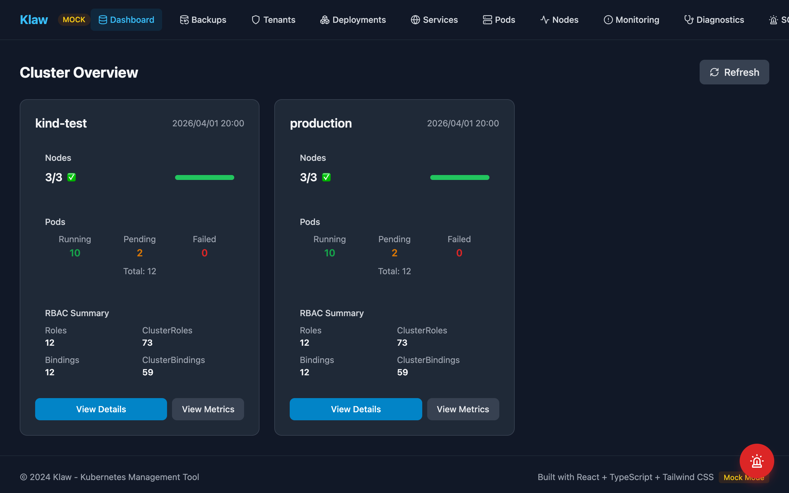
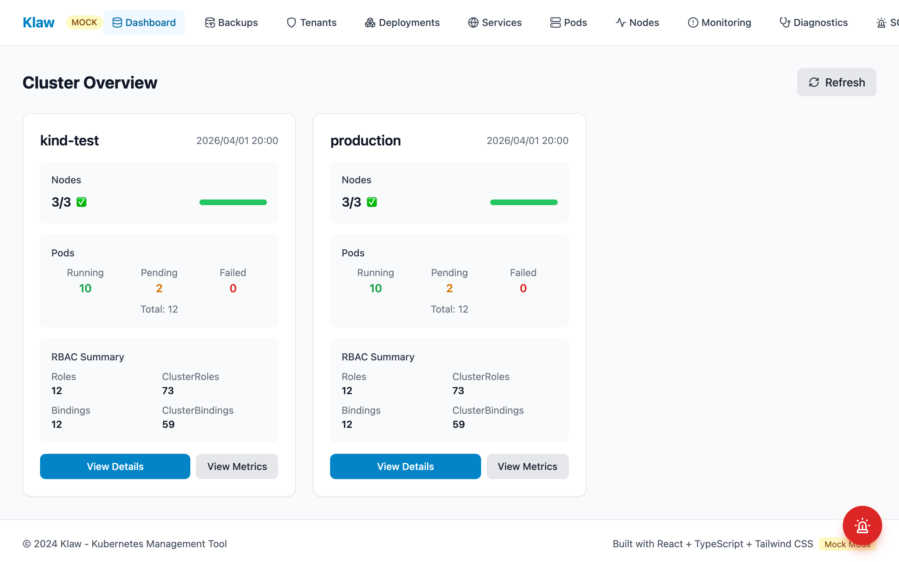
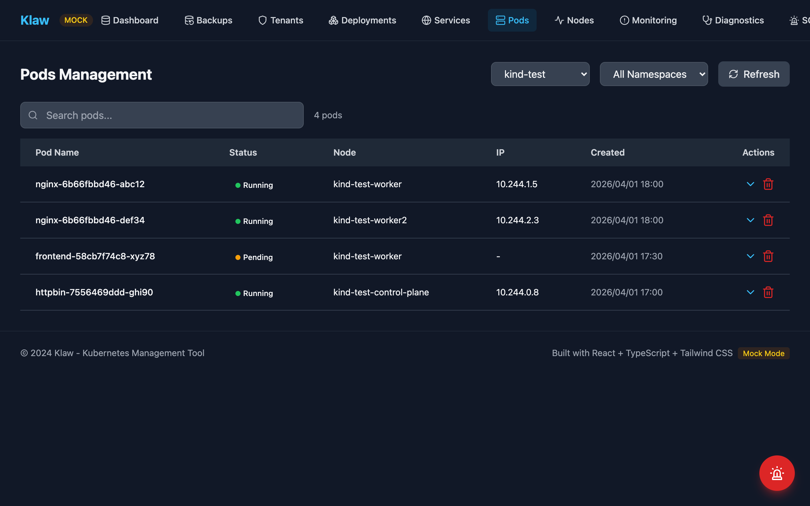
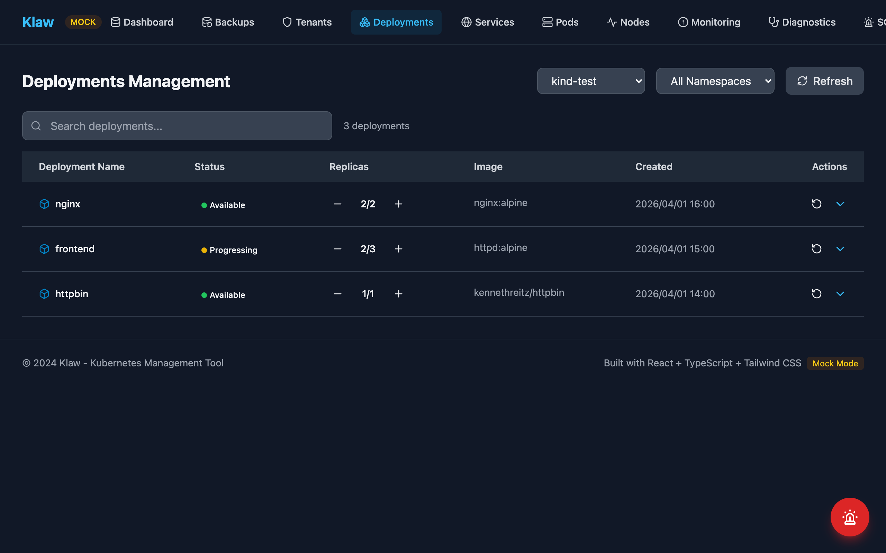
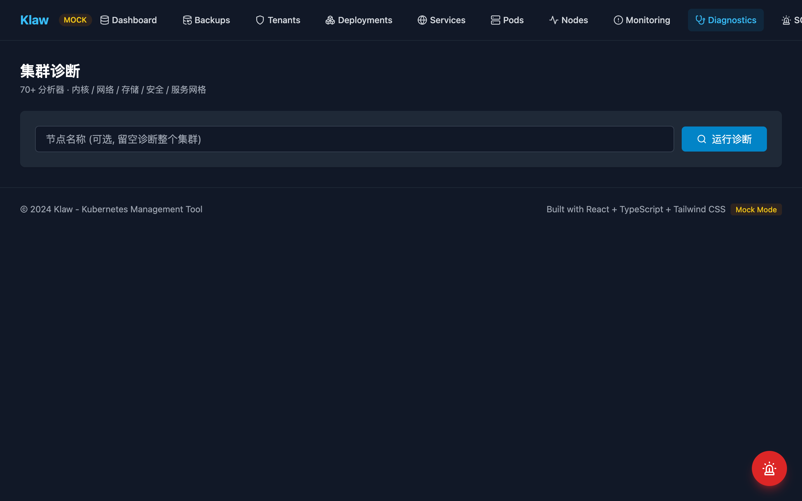
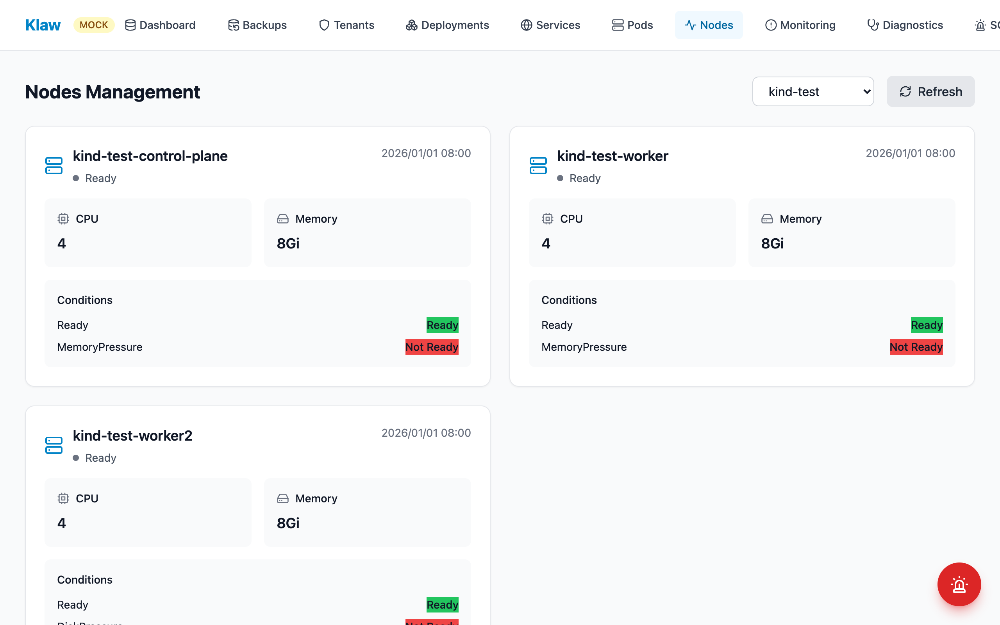
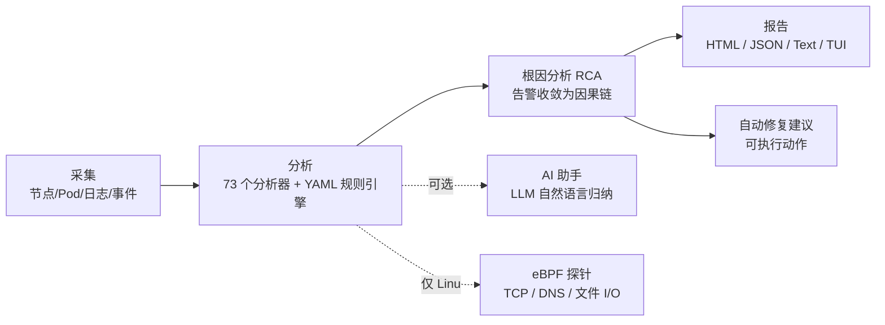
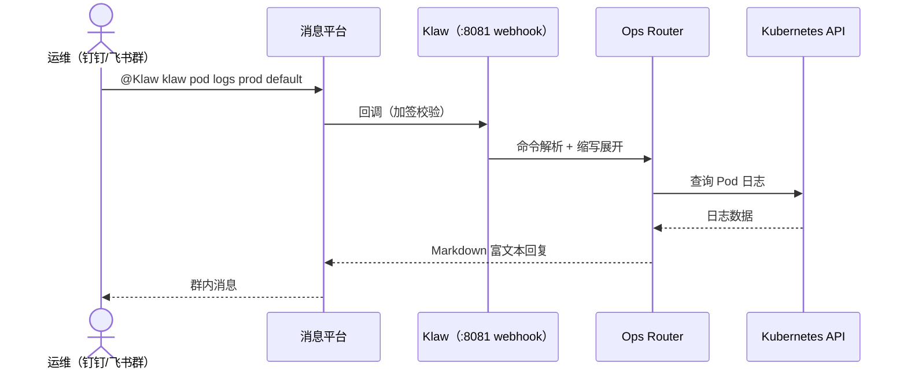
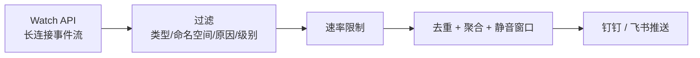

# 🦞 Klaw — Kubernetes 智能运维与诊断平台

**[简体中文](./README.md)** | [English](./README.en.md)

[](https://github.com/kudig-io/klaw/actions/workflows/ci.yml)
[](https://golang.org)
[](https://reactjs.org)
[](./helm/klaw)
[](./Dockerfile)
[](./LICENSE)
[](https://bs7klknl29np.meoo.fun)

Klaw 把「集群管理控制台」「深度诊断引擎」「ChatOps 机器人」「实时事件告警」四件事装进一个二进制里。
一份配置、一次部署，既能在浏览器里点，也能在钉钉/飞书群里喊，还能在终端里 `klaw diag` 一把梭。

**30 秒上手：**

```bash
git clone https://github.com/kudig-io/klaw.git && cd klaw
make build && ./klaw        # 打开 http://localhost:8080
```

<p align="center">
  
</p>
<p align="center"><sub>Dashboard：多集群概览 · 节点 / Pod 统计 · RBAC 摘要（截图来自 MSW mock 数据渲染的真实 UI）</sub></p>

---

## 目录

- [为什么是 Klaw](#为什么是-klaw)
- [核心能力](#核心能力)
  - [SOS 模式（语音应急快速对话）](#-sos-模式语音应急快速对话)
  - [Web 管理控制台](#-web-管理控制台)
  - [诊断引擎](#-诊断引擎internaldiag)
  - [ChatOps（钉钉 / 飞书）](#-chatops钉钉--飞书)
  - [实时事件监控](#-实时事件监控)
  - [平台能力](#-平台能力)
- [界面预览](#界面预览)
- [仓库结构](#仓库结构)
- [架构](#架构)
  - [诊断流水线](#诊断流水线)
  - [ChatOps 时序](#chatops-时序)
  - [事件管道](#事件管道)
- [快速开始](#快速开始)
  - [环境要求](#环境要求)
  - [本地二进制](#方式一本地二进制)
  - [Docker](#方式二docker)
  - [kind + Helm（in-cluster）](#方式三kind--helmin-cluster推荐用于验证)
- [配置](#配置)
  - [阿里云运维环境（Skills 与 ACS 接入）](#阿里云运维环境skills-与-acs-接入)
  - [接入外部集群（多集群）](#接入外部集群多集群)
  - [环境变量覆盖](#环境变量覆盖)
  - [AI 诊断助手（可选）](#ai-诊断助手可选)
- [CLI](#cli)
- [HTTP API](#http-api)
- [ChatOps](#chatops)
- [实时事件监控](#实时事件监控)
- [前端开发](#前端开发)
- [测试](#测试)
- [Makefile 目标](#makefile-目标)
- [Roadmap](#roadmap)
- [子项目](#子项目)
- [已知限制](#已知限制)
- [FAQ](#faq)
- [文档索引](#文档索引)
- [贡献](#贡献)
- [安全](#安全)
- [行为准则](#行为准则)
- [许可证](#许可证)
- [链接](#链接)

---

## 为什么是 Klaw

凌晨三点告警响了：你想在手机群里直接看状态、在笔记本上 `kubectl` 排查、最好还能有人（或 AI）告诉你根因是什么。Klaw 的答案是把这整条工作流装进一个二进制——

- **一个二进制，五种能力**：Web 控制台 + 深度诊断引擎（9 大类 73 个分析器）+ ChatOps（钉钉/飞书）+ 秒级实时事件告警 + SOS 语音应急对话，一次部署全部拿到。
- **三种入口，同一套能力**：浏览器里点、群里 @ 机器人喊、终端里 `klaw diag`，背后是同一套诊断流水线与集群客户端。
- **部署即用**：内嵌 SQLite（纯 Go、无 CGO），无外部数据库依赖；镜像约 127MB、非 root 运行；本地二进制 / Docker / Helm 三种交付形态。
- **可核验的差异事实**：73 个注册分析器、Watch 模式事件延迟 < 1 秒（轮询 30–60 秒）、API 调用下降约 90%。

### 同类工具对比

与常见 Kubernetes 管理工具的能力对比（基于各项目公开文档，截至 2026-08；各项目都在快速演进，欢迎[纠错](https://github.com/kudig-io/klaw/issues)）：

| 能力 | Klaw | [Kubernetes Dashboard](https://github.com/kubernetes/dashboard) | [k9s](https://github.com/derailed/k9s) | [Headlamp](https://github.com/headlamp-k8s/headlamp) |
|---|---|---|---|---|
| 形态 | 单二进制（Web + CLI + ChatOps） | Web UI（集群内部署） | 终端 TUI | Web UI（桌面 / 集群内） |
| 深度诊断引擎（73 分析器 / RCA / 修复建议） | ✅ | ❌ | ❌（资源浏览为主） | ❌（插件扩展） |
| ChatOps（钉钉 / 飞书） | ✅ | ❌ | ❌ | ❌ |
| 秒级事件推送（Watch + 去重 / 聚合 / 静音） | ✅ | ❌（事件页面查看） | 手动刷新 | ❌ |
| 多集群 | ✅（一份配置多 kubecontext） | 单实例单集群 | context 切换 | ✅ |
| 多租户 + 审计日志 | ✅ | 依赖 K8s RBAC | ❌ | ❌ |
| 集群 / etcd 备份恢复 | ✅ | ❌ | ❌ | ❌ |
| AI 辅助（诊断摘要 / 语音 SOS） | ✅ | ❌ | ❌ | ❌ |
| 许可证 | MIT | Apache-2.0 | Apache-2.0 | Apache-2.0 |

> 对比不意味着替代：k9s 的终端交互、Dashboard 的官方血统、Headlamp 的插件生态各有擅长。Klaw 的差异化在于把「管理 + 诊断 + 告警 + ChatOps」整合为单二进制交付。

---

## 核心能力

### 🚨 SOS 模式（语音应急快速对话）

全屏语音通话页（悬浮按钮 / 导航 SOS 进入），经 Klaw 后端代理对接实时全双工语音模型，
支持智能打断、双向字幕。上游服务通过 `sos.provider` 切换：

| provider | 上游模型 | 说明 |
|---|---|---|
| `dashscope`（默认） | 阿里云百炼 Qwen-Omni-Realtime | semantic_vad 语义打断，双向字幕 |
| `glm` | 智谱 GLM-Realtime | server_vad 打断，OpenAI Realtime 兼容事件协议 |

回答采用三层兜底：**预置语料**（`configs/sos-faq.yaml`，命中按标准口径回答）→
**集群工具**（function calling 查询实时状态/日志/事件/触发诊断）→ **模型通用知识**。

启用方式：

```yaml
sos:
  enabled: true
  provider: dashscope        # 或 glm
  dashscope:
    workspace_id: "<百炼 Workspace ID>"   # api_key 用环境变量 KLAW_SOS_DASHSCOPE_API_KEY 注入
  # provider: glm 时：
  # glm:
  #   model: glm-realtime    # api_key 用环境变量 KLAW_SOS_GLM_API_KEY 注入（形如 {id}.{secret}）
```

### 🖥️ Web 管理控制台

React 18 + Vite + Tailwind 构建的单页应用，与后端二进制打包在一起（`web/dist` 由 Go 直接托管）。

| 页面 | 能力 |
|---|---|
| `ClusterDashboard` | 集群概览、节点/Pod 统计、RBAC 摘要、资源趋势 |
| `PodsPage` | 列表、搜索、详情、实时日志、删除 |
| `DeploymentsPage` | 列表、详情、扩缩容、滚动重启、关联 Pod |
| `ServicesPage` | 列表、详情、Endpoints |
| `NodesPage` | 节点状态、容量、指标 |
| `MonitoringPage` | 告警列表、历史趋势、图表 |
| `DiagnosticsPage` | 触发诊断、查看分析器结果 |
| `BackupsPage` | 集群资源备份的创建/列表/删除 |
| `TenantsPage` | 多租户与租户用户管理 |

深色模式由 `ThemeContext` 提供，支持跟随系统。

### 🔬 诊断引擎（`internal/diag`）

一条可编排的诊断流水线：**采集 → 分析 → 根因 → 报告 → 修复建议**。

- **9 大类、73 个已注册分析器**（`kernel` / `kubernetes` / `log` / `network` / `process` / `runtime` / `security` / `servicemesh` / `system`，外加 eBPF 分析器）
- **YAML 规则引擎**（`diag/rules`）：无需改代码即可新增检查项
- **根因分析**（`diag/rca`）：从散落的告警收敛到因果链
- **自动修复**（`diag/autofix`）：给出可执行的修复动作
- **多格式报告**（`diag/reporter`）：HTML / JSON / Text
- **eBPF 探针**（`diag/ebpf`）：TCP、DNS、文件 I/O 内核级观测（仅 Linux，通过 build tag 隔离）
- **AI 助手**（`diag/ai`）：接入 LLM 对诊断结果做自然语言归纳
- **镜像扫描**（`diag/scanner`）：集成 trivy
- **成本分析**（`diag/cost`）：基于云厂商定价估算资源开销
- **TUI**（`diag/tui`）：bubbletea 终端交互界面

### 💬 ChatOps（钉钉 / 飞书）

在群里 @ 机器人直接操作集群，支持命令缩写与 Markdown 富文本回复。

### ⚡ 实时事件监控

基于 Kubernetes Watch API，秒级推送；内置速率限制、去重、聚合、静音窗口，避免消息风暴。

### 🔧 平台能力

- **多集群**：一份配置管理多个 kubeconfig / context，也支持 in-cluster
- **告警规则**：规则 CRUD、手动评估、历史、确认/解决、统计
- **备份恢复**：集群资源级备份（`internal/backup`）+ etcd 级备份（`modules/etcd-guardian`）
- **自动化脚本**：脚本 CRUD、执行、历史、统计（`internal/automation`）
- **多租户 + 审计**：租户/用户模型与操作审计日志（`internal/tenancy`、`internal/audit`）
- **安全**：Bearer Token 认证、CORS 白名单、非 root 容器（UID 65532）、恒定时间 token 比较
- **可观测**：`/healthz`、`/readyz`、`/metrics`（Prometheus 文本格式，零外部依赖）
- **持久化**：内嵌 SQLite（`modernc.org/sqlite`，纯 Go，无需 CGO）

---

## 界面预览

以下截图均来自真实 Web UI（`npm run dev:mock` + MSW mock 数据渲染，不含任何真实集群信息）：

| Dashboard（暗色） | Dashboard（浅色） |
|:---:|:---:|
|  |  |

| Pods（暗色） | Deployments（暗色） |
|:---:|:---:|
|  |  |

| Diagnostics（暗色） | Nodes（浅色） |
|:---:|:---:|
|  |  |

---

## 仓库结构

这是一个 monorepo，包含 5 个独立的 Go module：

| 路径 | Module | Go | 说明 |
|---|---|---|---|
| `./` | `github.com/kudig-io/klaw` | 1.24.2 | 主应用：API + Web + 诊断 + ChatOps |
| `operator/` | `.../klaw/operator` | 1.21 | Kudig Operator，CRD 驱动的诊断编排 |
| `modules/etcd-backup/` | `.../modules/etcd-backup` | 1.25 | etcd 备份/恢复客户端库 |
| `modules/etcd-guardian/` | `.../modules/etcd-guardian` | 1.26.0 | etcd 备份恢复 Operator（含 CRD、控制器、Helm Chart） |
| `modules/etcd-guardian/backend/` | `.../etcd-guardian/backend` | 1.22 | etcd-guardian 的 Gin 后端 API |

```
klaw/
├── cmd/klaw/               # CLI 入口：main / server / diag
├── internal/
│   ├── api/                # HTTP 服务器、路由、中间件、全部 handler
│   ├── kubernetes/         # 集群客户端管理（kubeconfig / in-cluster）
│   ├── diag/               # 诊断流水线（analyzer/rules/rca/autofix/reporter/ebpf/ai/...）
│   ├── events/             # Watch 事件采集与通知管道
│   ├── messaging/          # 钉钉 / 飞书通信抽象
│   ├── ops/                # ChatOps 命令路由与处理
│   ├── monitoring/         # 轮询式指标采集与告警
│   ├── alerting/           # 告警规则引擎
│   ├── backup/             # 集群资源备份
│   ├── automation/         # 自动化脚本执行引擎
│   ├── tenancy/            # 多租户
│   ├── audit/              # 审计日志与安全合规
│   ├── storage/            # SQLite 持久化与 schema 迁移
│   ├── metrics/            # 进程内指标采集
│   ├── chart/              # ASCII 图表生成
│   ├── config/             # 配置加载 + 环境变量覆盖
│   ├── openclaw/           # OpenClaw 技能管理
│   └── {log,network,rbac,storage}analysis/   # 四类专项分析器
├── web/                    # React 前端
├── operator/               # Kudig Operator（CRD: ClusterDiagnostic / NodeDiagnostic / Schedule）
├── modules/                # etcd-backup、etcd-guardian
├── helm/klaw/              # Helm Chart（含 values-kind.yaml）
├── deployment/kind/        # kind 本地集群配置与管理脚本
├── configs/                # config.yaml / config.yaml.example
├── skills/                 # OpenClaw 技能定义
└── docs/                   # 设计与实施文档
```

---

## 架构

```
                       ┌──────────────────────────────────────────────┐
   浏览器 ──────────▶  │  Web UI (React SPA, 由 Go 静态托管)          │
                       └───────────────────┬──────────────────────────┘
                                           │ /api/v1/*
   钉钉/飞书 ────────▶  ┌─────────────────▼──────────────────────────┐
                       │  HTTP Server (gorilla/mux)                  │
                       │  metrics ▸ CORS ▸ auth ▸ deprecation        │
                       └───┬───────────┬──────────┬──────────┬───────┘
                           │           │          │          │
                  ┌────────▼──┐ ┌──────▼─────┐ ┌──▼──────┐ ┌─▼─────────┐
                  │ K8s       │ │ Diag       │ │ Ops     │ │ Event     │
                  │ Manager   │ │ Pipeline   │ │ Router  │ │ Watcher   │
                  │(client-go)│ │ 73 分析器  │ │ChatOps  │ │ 限流/去重 │
                  └────┬──────┘ └──────┬─────┘ └────┬────┘ └─────┬─────┘
                       │               │            │            │
                       ▼               ▼            ▼            ▼
                  Kubernetes API   SQLite 存储   消息平台     告警推送
```

终端侧独立于 HTTP 服务：`klaw diag` 直接驱动同一套诊断流水线，输出 Text/JSON/TUI。

### 诊断流水线



### ChatOps 时序



### 事件管道



---

## 快速开始

### 环境要求

| 组件 | 版本 | 备注 |
|---|---|---|
| Go | 1.24+ | `modules/etcd-guardian` 需 1.26+ |
| Node.js | 18+ | 构建前端 |
| Kubernetes | 1.24+ | 或用 kind 起本地集群 |
| Docker | 可选 | 容器化部署 / kind |
| Helm | 3.x | 集群内部署 |

### 方式一：本地二进制

```bash
git clone https://github.com/kudig-io/klaw.git
cd klaw

# 一键构建前端 + 后端
make build

# 配置
cp configs/config.yaml.example configs/config.yaml
$EDITOR configs/config.yaml

# 运行（默认执行 server 子命令）
./klaw
```

访问 <http://localhost:8080>。

> 认证默认开启（`server.auth.enabled: true`），请求 `/api/*` 需带 `Authorization: Bearer <token>`。
> 详见[已知限制](#已知限制)——Web UI 当前不会自动注入该 header。

### 方式二：Docker

```bash
docker build -t kudig-io/klaw:latest .

docker run -d \
  -p 8080:8080 \
  -e KLAW_API_TOKEN='your-token' \
  -v ~/.kube/config:/home/klaw/.kube/config:ro \
  -v $(pwd)/configs/config.yaml:/app/configs/config.yaml:ro \
  kudig-io/klaw:latest
```

三阶段构建：`node:20-alpine`（前端）→ `golang:1.24-alpine`（后端，`CGO_ENABLED=0`）→ `alpine:3.20`（运行时，非 root UID 65532），最终镜像约 127MB。

网络受限时可指定模块代理：

```bash
docker build --build-arg GOPROXY=https://goproxy.cn,direct -t kudig-io/klaw:dev .
```

### 方式三：kind + Helm（in-cluster，推荐用于验证）

这条路径已端到端验证过，Klaw 以 ServiceAccount 身份通过 `rest.InClusterConfig()` 访问 API Server，无需挂载 kubeconfig。

```bash
# 1. 创建本地集群（1 control-plane + 2 worker）
kind create cluster --config deployment/kind/cluster-config.yaml

# 2. 构建镜像
docker build --build-arg GOPROXY=https://goproxy.cn,direct -t kudig-io/klaw:dev .

# 3. 加载镜像到集群节点（避免走远端仓库）
kind load docker-image kudig-io/klaw:dev --name klaw-test

# 4. 部署
helm upgrade --install klaw helm/klaw \
  -f helm/klaw/values-kind.yaml \
  -n klaw --create-namespace --wait

# 5. 访问
kubectl port-forward -n klaw svc/klaw 18080:8080
```

打开 <http://127.0.0.1:18080>。

`values-kind.yaml` 相对生产 values 的差异：

- `image.pullPolicy: Never` —— 镜像由 `kind load` 注入，禁止拉远端
- `config.server.auth.enabled: false` —— 前端暂无 token 注入能力，本地默认关闭
- `persistence.storageClass: standard` —— kind 自带的 rancher local-path
- 资源请求下调至 100m / 128Mi

生产部署使用默认 `values.yaml` 即可，Chart 会渲染出 Deployment、Service、ConfigMap、Secret（`stringData`）、PVC、ServiceAccount、ClusterRole/ClusterRoleBinding。

完整的 kind 操作说明、镜像预拉取脚本与故障排查见 [deployment/README.md](./deployment/README.md)。

---

## 配置

配置文件默认读取 `configs/config.yaml`。以下为全量结构：

```yaml
kubernetes:
  clusters:
    - name: default
      kubeconfig: ~/.kube/config   # 填 in-cluster 则使用 ServiceAccount
      context: minikube            # 留空使用 kubeconfig 的 current-context
    - name: production
      kubeconfig: ~/.kube/prod-config
      context: production

server:
  port: 8080
  auth:
    enabled: true
    token: change-me               # 建议用 KLAW_API_TOKEN 注入，避免密钥落盘
  cors:
    allowed_origins: []            # 留空 = 仅同源；可填 https://klaw.example.com

messaging:
  dingtalk:
    enabled: false
    app_key: your_app_key
    app_secret: your_app_secret
    webhook: https://oapi.dingtalk.com/robot/send?access_token=xxx
    secret: SECxxx                 # 加签密钥
    webhook_port: 8081             # 接收钉钉回调的端口
  feishu:
    enabled: false
    app_id: your_app_id
    app_secret: your_app_secret

events:
  enabled: true
  watch_types: [Pod, Deployment, Service, Node]
  namespaces: []                   # 空 = 所有命名空间
  event_types: [Warning, Error]
  reasons: [BackOff, Unhealthy, Failed, OOMKilled]
  exclude_reasons: [Scheduled, Pulling, Pulled, Created, Started]
  min_severity: warning            # info | warning | critical
  rate_limit: 10                   # 每秒最大事件数
  dedup_window: 300                # 去重窗口（秒）
  mute_duration: 10                # 同类事件静音时长（分钟）
  channels: [ops-alert]

monitoring:
  enabled: true
  interval: 60                     # 轮询周期（秒），用于图表与趋势

openclaw:
  enabled: true
  skills: ./skills
```

### 阿里云运维环境（Skills 与 ACS 接入）

用 AI 助手（Qoder 等）维护 klaw 并纳管阿里云集群时，有两个相互依赖的准备动作，
建议按顺序完成：

1. **安装阿里云 Skills** —— 解决"怎么做云上操作"。通过 AI 助手的插件市场安装
   `alibabacloud-core` 技能包，入口是 `alibabacloud-find-skills`：需要某种云上能力时
   （ECS / RDS / OSS 管理、CLI 指南、Terraform 等）由它检索并按需安装对应技能；
   也可从官网分发地址直接下载单个技能：
   `https://skills.aliyun.com/api/public/skills/alibabacloud-find-skills/download`
2. **接入 ACS 集群（kubeconfig）** —— 解决"对哪个集群操作"。见下一节
   [接入外部集群（多集群）](#接入外部集群多集群)，把 ACS/ACK 的 kubeconfig 配置进
   `kubernetes.clusters`。

两者的依赖关系：**Skills 提供云上操作的方法论，kubeconfig 提供操作目标**。只装 Skills
没有集群凭据则无处施展；只配 kubeconfig 不装 Skills，AI 助手对阿里云特有操作
（安全组、SLB、NodePool 等非 K8s 标准资源）缺少工具支撑。完成两步后，AI 助手即可
在 klaw 的诊断 / ChatOps 流程中调用阿里云技能处理集群相关任务。

### 接入外部集群（多集群）

`kubernetes.clusters` 数组中的每个条目都是一个独立纳管的集群，klaw 会对每个集群各建一个
client-go 客户端，Web UI / API / 事件监控 / 诊断均可按集群名切换。

**接入步骤**（以阿里云 ACS / ACK 为例，其他云或自建集群同理）：

```bash
# 1. 从云控制台下载 kubeconfig，存入 configs/ 并收紧权限
#    .gitignore 已包含 *.kubeconfig 规则，证书私钥不会被提交
cp ~/Downloads/acs-kubeconfig configs/acs.kubeconfig
chmod 600 configs/acs.kubeconfig

# 2. kubectl 先验证连通性（拿到 nodes 输出再进下一步）
kubectl --kubeconfig configs/acs.kubeconfig get nodes

# 3. 在 configs/config.yaml 的 kubernetes.clusters 下追加条目
#    name 是 klaw 内的展示名，可自定义；context 必须与 kubeconfig 内的名称一致
```

```yaml
kubernetes:
  clusters:
    - name: acs-hangzhou
      kubeconfig: /absolute/path/to/klaw/configs/acs.kubeconfig   # 建议绝对路径（相对路径基于进程工作目录）
      context: kubernetes-admin-xxxxxxxx                          # 与 acs.kubeconfig 内的 context 名一致
```

```bash
# 4. 启动并验证多集群注册
go run ./cmd/klaw server
curl -s http://127.0.0.1:8080/api/v1/clusters     # 应列出全部已注册集群
curl -s http://127.0.0.1:8080/api/v1/clusters/acs-hangzhou/nodes
```

安全提示：云厂商签发的 kubeconfig 通常是 cluster-admin 权限且长期有效，只在本机使用；
泄露后需在云控制台重置（ACS/ACK 为「重置集群凭据」）。

已知边界：**ACK Serverless（ECI）集群**的节点全部是 `virtual-kubelet`，基础管理
（Pods/Deployments/Services/事件监控）完全可用，但依赖节点真实系统数据的诊断分析器
（内核、网络、日志类）会拿不到原始数据，属于平台特性而非故障。

### 环境变量覆盖

敏感项一律优先读环境变量，便于配合 Kubernetes Secret：

| 变量 | 覆盖字段 |
|---|---|
| `KLAW_API_TOKEN` | `server.auth.token` |
| `KLAW_DINGTALK_APP_KEY` | `messaging.dingtalk.app_key` |
| `KLAW_DINGTALK_APP_SECRET` | `messaging.dingtalk.app_secret` |
| `KLAW_DINGTALK_WEBHOOK` | `messaging.dingtalk.webhook` |
| `KLAW_DINGTALK_SECRET` | `messaging.dingtalk.secret` |
| `KLAW_FEISHU_APP_ID` | `messaging.feishu.app_id` |
| `KLAW_FEISHU_APP_SECRET` | `messaging.feishu.app_secret` |
| `KLAW_SOS_DASHSCOPE_API_KEY` | `sos.dashscope.api_key` |
| `KLAW_SOS_GLM_API_KEY` | `sos.glm.api_key` |

### AI 诊断助手（可选）

诊断引擎可选接入 LLM，对诊断结果生成自然语言摘要与修复建议（`klaw diag` 尾部自动输出
`=== AI 分析 ===` 段落，HTTP `/api/v1/diag/run` 返回 `ai_analysis` 字段）。全部通过环境变量
配置，未设置 `KUDIG_AI_API_KEY` 时自动禁用，不影响诊断主流程：

| 变量 | 说明 | 默认 |
|---|---|---|
| `KUDIG_AI_PROVIDER` | `openai` / `qwen` / `ollama` / `mimo` | `openai` |
| `KUDIG_AI_API_KEY` | API Key（Bearer 鉴权） | 空（禁用 AI） |
| `KUDIG_AI_BASE_URL` | 自定义 OpenAI 兼容端点 | 按 provider 自动补齐 |
| `KUDIG_AI_MODEL` | 模型名 | 按 provider 自动补齐 |
| `KUDIG_AI_TIMEOUT` | 超时（秒） | `30`（MiMo 建议 `60`） |
| `KUDIG_AI_LANGUAGE` | 输出语言 `zh` / `en` | `zh` |
| `KUDIG_AI_MAX_TOKENS` | 最大生成 token 数 | `2000` |
| `KUDIG_AI_TEMPERATURE` | 采样温度 | `0.3` |

#### 使用小米 MiMo

```bash
export KUDIG_AI_PROVIDER=mimo
export KUDIG_AI_API_KEY=tp-xxxx        # MiMo 开放平台 (https://mimo.mi.com) 申请
export KUDIG_AI_TIMEOUT=60             # 完整诊断分析实测约 20s，默认 30s 余量偏紧
# 模型默认 mimo-v2.5，可切换：export KUDIG_AI_MODEL=mimo-v2.5-pro
klaw diag                              # 诊断报告末尾自动附带 AI 分析
klaw diag --no-ai                      # 显式关闭本次 AI 分析
```

端点自动路由：`tp-` 前缀 key（Token Plan 套餐）自动使用
`https://token-plan-cn.xiaomimimo.com/v1`，`sk-` key（按量付费）使用
`https://api.xiaomimimo.com/v1`；如需显式指定可设 `KUDIG_AI_BASE_URL`。
调用时会自动关闭 MiMo 的深度思考模式（`thinking: disabled`），
避免推理 token 挤占生成预算导致正文为空。

集群内部署时通过 Helm 注入（写入 K8s Secret，经 `envFrom` 生效）：

```bash
helm upgrade --install klaw helm/klaw \
  --set secrets.ai.provider=mimo \
  --set secrets.ai.apiKey=tp-xxxx \
  -f helm/klaw/values-kind.yaml -n klaw
```

---

## CLI

```
klaw v1.0.0-fusion

Usage:
  klaw [command]

Available Commands:
  server      启动 Web API + ChatOps 服务（无参数时的默认命令）
  diag        对集群运行诊断分析（70+ 分析器）
  version     打印版本信息
```

### `klaw server`

| Flag | 说明 |
|---|---|
| `--port int` | 覆盖 `server.port`（默认 8080） |

启动时依次初始化：配置加载 → K8s 管理器 → 监控服务 → ChatOps 路由 → 消息插件 → 事件监听 → OpenClaw 技能 → HTTP 服务器。

### `klaw diag`

| Flag | 说明 |
|---|---|
| `--kubeconfig string` | kubeconfig 路径（默认 `~/.kube/config`） |
| `--context string` | kubeconfig context |
| `--node string` | 只诊断指定节点 |
| `--namespace string` | 只诊断指定命名空间 |
| `--analyzer string` | 只运行指定分析器（逗号分隔） |
| `--exclude-analyzer string` | 排除指定分析器（逗号分隔） |
| `--json` | 以 JSON 输出 |

```bash
klaw diag                                  # 全集群诊断
klaw diag --node worker-1                  # 聚焦单节点
klaw diag --namespace production --json    # 指定命名空间，JSON 输出
klaw diag --context prod --exclude-analyzer ebpf-tcp,cis
```

---

## HTTP API

### 版本策略

- **`/api/v1/*`** —— 当前版本，新集成一律使用
- **`/api/*`** —— 旧版路径，已标记弃用。响应会带 `Deprecation: true` 与 `Sunset: 2026-12-31` 头

### 无需认证的端点

| 端点 | 说明 |
|---|---|
| `GET /healthz` | 存活探针，进程存活即 200 |
| `GET /readyz` | 就绪探针，校验 Kubernetes 客户端可用 |
| `GET /metrics` | Prometheus 文本格式（goroutine 数、内存、HTTP 请求计数、`klaw_uptime_seconds`） |

### 中间件链

```
metrics ▸ CORS ▸ auth ▸ deprecation ▸ router
```

`auth` 仅拦截 `/api` 前缀；`corsMiddleware` 在未配置白名单时不下发任何跨域头。

### 路由清单（`/api/v1` 前缀）

**集群**

```
GET    /clusters
GET    /clusters/{name}
GET    /clusters/{name}/status
GET    /clusters/{name}/metrics
GET    /clusters/{name}/namespaces
```

**Pod**

```
GET    /clusters/{c}/pods
GET    /clusters/{c}/namespaces/{ns}/pods
GET    /clusters/{c}/namespaces/{ns}/pods/{name}
GET    /clusters/{c}/namespaces/{ns}/pods/{name}/logs
GET    /clusters/{c}/namespaces/{ns}/pods/{name}/logs/analysis
DELETE /clusters/{c}/namespaces/{ns}/pods/{name}
```

**Deployment**

```
GET    /clusters/{c}/deployments
GET    /clusters/{c}/namespaces/{ns}/deployments
GET    /clusters/{c}/namespaces/{ns}/deployments/{name}
GET    /clusters/{c}/namespaces/{ns}/deployments/{name}/pods
GET    /clusters/{c}/namespaces/{ns}/deployments/{name}/status
POST   /clusters/{c}/namespaces/{ns}/deployments/{name}/scale
POST   /clusters/{c}/namespaces/{ns}/deployments/{name}/restart
```

**Service / Node / Event**

```
GET    /clusters/{c}/services
GET    /clusters/{c}/namespaces/{ns}/services
GET    /clusters/{c}/namespaces/{ns}/services/{name}
GET    /clusters/{c}/namespaces/{ns}/services/{name}/endpoints
DELETE /clusters/{c}/namespaces/{ns}/services/{name}

GET    /clusters/{c}/nodes
GET    /clusters/{c}/nodes/{name}
GET    /clusters/{c}/nodes/metrics

GET    /clusters/{c}/events
GET    /clusters/{c}/namespaces/{ns}/events
```

**通用资源访问**（`kind` ∈ pods、deployments、services、nodes、namespaces、events、configmaps、statefulsets、ingresses）

```
GET    /clusters/{c}/resources/{kind}
GET    /clusters/{c}/resources/{kind}/{name}
GET    /clusters/{c}/namespaces/{ns}/resources/{kind}
GET    /clusters/{c}/namespaces/{ns}/resources/{kind}/{name}
```

**监控与告警**

```
GET    /clusters/{c}/monitor/status
GET    /clusters/{c}/monitor/alerts
GET    /clusters/{c}/monitor/history

GET    /clusters/{c}/alerts/rules
POST   /clusters/{c}/alerts/rules
PUT    /clusters/{c}/alerts/rules/{id}
DELETE /clusters/{c}/alerts/rules/{id}
POST   /clusters/{c}/alerts/evaluate
GET    /clusters/{c}/alerts/history
GET    /clusters/{c}/alerts/stats
POST   /clusters/{c}/alerts/{id}/acknowledge
POST   /clusters/{c}/alerts/{id}/resolve
```

**备份**

```
GET    /clusters/{c}/backups
POST   /clusters/{c}/backups
GET    /clusters/{c}/backups/summary
GET    /clusters/{c}/backups/{name}
DELETE /clusters/{c}/backups/{name}
```

**分析**

```
GET    /clusters/{c}/rbac/analysis
POST   /analysis/logs
GET    /analysis/network
GET    /analysis/storage
```

**自动化**

```
GET    /automation/scripts
POST   /automation/scripts
GET    /automation/scripts/{id}
PUT    /automation/scripts/{id}
DELETE /automation/scripts/{id}
POST   /automation/scripts/{id}/execute
GET    /automation/history
GET    /automation/statistics
```

**多租户与审计**

```
GET    /tenants          POST   /tenants          GET /tenants/stats
GET    /tenants/{id}     PUT    /tenants/{id}     DELETE /tenants/{id}
GET    /tenant-users     POST   /tenant-users     DELETE /tenant-users/{id}
GET    /audit/logs       GET    /audit/stats
```

**诊断**

```
GET    /diag/run
GET    /diag/analyzers
```

### 调用示例

```bash
TOKEN=your-token
BASE=http://localhost:8080/api/v1

curl -H "Authorization: Bearer $TOKEN" $BASE/clusters
curl -H "Authorization: Bearer $TOKEN" $BASE/clusters/default/nodes
curl -H "Authorization: Bearer $TOKEN" \
     -X POST -d '{"replicas":3}' \
     $BASE/clusters/default/namespaces/default/deployments/nginx/scale
```

---

## ChatOps

### 配置钉钉机器人

1. 群设置 → 智能群助手 → 添加机器人 → 自定义
2. 安全设置选「加签」，复制签名密钥填入 `messaging.dingtalk.secret`
3. 复制 Webhook 填入 `messaging.dingtalk.webhook`
4. 在开放平台把「消息接收地址」设为 `http://<服务器IP>:8081/webhook/dingtalk`

飞书同理，填 `messaging.feishu.app_id` / `app_secret`。

### 命令

```
klaw cluster status <cluster>              # 集群状态
klaw cluster metrics <cluster>             # 资源指标
klaw cluster chart <cluster>               # 推送趋势图

klaw pod list <cluster> <ns>               # 列出 Pod
klaw pod describe <cluster> <ns> <pod>     # Pod 详情
klaw pod logs <cluster> <ns> <pod>         # 查看日志
klaw pod analyze <cluster> <ns> <pod>      # 日志智能分析
klaw pod delete <cluster> <ns> <pod>       # 删除 Pod

klaw deployment list <cluster> <ns>
klaw deployment status <cluster> <ns> <name>
klaw deployment scale <cluster> <ns> <name> <replicas>
klaw deployment restart <cluster> <ns> <name>
klaw deployment pods <cluster> <ns> <name>

klaw service list <cluster> <ns>
klaw service describe <cluster> <ns> <name>
klaw service endpoints <cluster> <ns> <name>

klaw node list <cluster>
klaw node describe <cluster> <node>
klaw node metrics <cluster>

klaw monitor status <cluster>
klaw monitor alerts <cluster>
klaw monitor chart <cluster>

klaw rbac analyze <cluster>

klaw help
```

**缩写**：`c`=cluster、`p`=pod、`n`=node、`d`=deployment、`s`/`svc`=service、`r`=rbac、`m`=monitor、`h`=help、
`ls`=list、`desc`=describe、`log`=logs、`del`/`rm`=delete。所以 `klaw p ls prod default` 等价于 `klaw pod list prod default`。

### 效果

```
@Klaw klaw cluster status production
```

```markdown
📊 **集群状态：production**

**节点：** 3 (3 Ready)
**Pod：** 12 Running / 2 Pending
**CPU：** 45% / 85%
**内存：** 60% / 75%
```

---

## 实时事件监控

```
Klaw ──Watch──▶ Kubernetes API Server
       ◀──事件流──
            ↓ 过滤（类型/命名空间/原因/严重级别）
            ↓ 速率限制
            ↓ 去重 + 聚合 + 静音窗口
            ↓
       钉钉 / 飞书推送
```

Pod 被 OOM 杀掉时，群里会收到：

```markdown
🔴 **Error** - Pod

**资源：** Pod/nginx-7d9f-x2k
**命名空间：** production
**集群：** production
**原因：** OOMKilled
**时间：** 2026-08-21 13:30:00
**消息：**
> Container nginx was OOM killed
```

### Watch vs 轮询

| 维度 | 轮询模式 | Watch 模式 |
|---|---|---|
| 事件延迟 | 30–60 秒 | < 1 秒 |
| API 调用 | 高频轮询 | 事件驱动，下降约 90% |
| 连接方式 | 短连接 | 长连接 |

两者可同时开启：`events` 负责秒级告警，`monitoring` 负责分钟级采样供图表使用。

---

## 前端开发

```bash
cd web
npm install

npm run dev          # Vite 开发服务器，端口 3000，/api 代理到 http://localhost:8080
npm run dev:mock     # 用 MSW mock 数据，无需后端
npm run build        # 生产构建到 web/dist
npm run lint         # ESLint
```

由于 Vite 已把 `/api` 反向代理到后端，同源请求不触发 CORS，通常无需额外配置。
若改用直连后端的方式联调，把 `http://localhost:3000` 加进 `server.cors.allowed_origins`。

技术栈：React 18 · TypeScript 5.2 · Vite 5 · Tailwind 3.3 · react-router-dom 6 · axios 1.6 · recharts 2.10 · lucide-react。

---

## 测试

### Go

```bash
go build ./...
go vet ./...
go test ./internal/... -count=1
make test                       # go test -v ./...
```

主仓库共 59 个 `_test.go`，覆盖 API handler、诊断分析器、规则引擎、报告生成、存储层、各专项分析器与 ChatOps。

### 前端

```bash
cd web
npm run test:run        # 单元测试
npm run test:coverage   # 覆盖率（v8）
npm run test:ui         # Vitest UI
./test.sh all           # 封装脚本：all | unit | integration | coverage | ui | watch
```

Vitest + jsdom + MSW，测试位于 `web/src/__tests__/{unit,integration}`。

### CI

`.github/workflows/ci.yml` 共 7 个 job：`go`、`operator`、`etcd-backup-module`、`etcd-guardian-module`、`frontend`、`helm`、`docker`。

---

## Makefile 目标

```bash
make build            # 构建前端 + 后端
make build-frontend   # 仅前端
make build-backend    # 仅后端
make dev              # 并行启动前后端开发服务
make run              # 构建并运行
make test             # Go 测试
make test-frontend    # 前端测试
make fmt              # go fmt + eslint --fix
make lint             # golangci-lint + eslint
make docker-build     # 构建镜像
make docker-run       # 运行容器
make helm-install     # helm install klaw ./helm/klaw
make helm-upgrade     # helm upgrade
make helm-package     # 打包 Chart
make deps             # 安装全部依赖
make help             # 查看全部目标
```

---

## Roadmap

### ✅ 已交付

- Web 控制台：Dashboard / Pods / Nodes / Deployments / Services / Monitoring / Backups / Tenants / 诊断页 / SOS 页，深色模式
- 诊断引擎融合：9 大类 73 个分析器、YAML 规则引擎、RCA、自动修复建议、多格式报告、eBPF 探针、AI 摘要、trivy 镜像扫描、成本分析、TUI
- 钉钉双向通信 + ChatOps 命令路由与缩写
- 实时事件推送（Watch 模式：过滤 / 限速 / 去重 / 聚合 / 静音）
- 多集群、多租户 + 审计日志、集群备份、自动化脚本、告警规则引擎
- etcd 备份恢复体系（`etcd-backup` 库 + `etcd-guardian` Operator）
- SOS 语音应急对话（百炼 Qwen-Omni-Realtime / 智谱 GLM-Realtime 双上游）

### 🚧 规划中

完整清单与进度见 [DEVELOPMENT_PLAN.md](./DEVELOPMENT_PLAN.md)：

- [ ] 图表生成增强：真实图表库输出 PNG/SVG 图片消息（替代 ASCII 图表）
- [ ] ConfigMap / Secret 管理（Web UI / API / ChatOps 命令）
- [ ] 资源配额查看（`klaw cluster resources quota`）
- [ ] 独立 Events 页面（按类型 / 命名空间 / 时间范围筛选）
- [ ] 集群安全审计与安全策略命令
- [ ] RBAC 管理（ServiceAccount / Role / RoleBinding 的 UI 与 API）
- [ ] Prometheus 指标集成与更丰富的监控图表
- [ ] 集群生命周期管理（create / delete / upgrade）
- [ ] OpenClaw 技能完整执行（`ExecuteSkill` 落地）
- [ ] 日志增强（多容器 Pod 日志选择、日志下载、更强的过滤搜索）
- [ ] Web UI Bearer Token 注入（修复[已知限制](#已知限制) #1）

---

## 子项目

### Kudig Operator（`operator/`）

CRD 驱动的声明式诊断编排，基于 controller-runtime 0.16.3。

| CRD | 用途 |
|---|---|
| `ClusterDiagnostic` | 声明一次集群级诊断任务 |
| `NodeDiagnostic` | 声明节点级诊断任务 |
| `Schedule` | 定时触发上述诊断 |

部署：`operator/helm/kudig-operator`。示例 CR：`operator/config/examples/`。详见 [operator/README.md](./operator/README.md)。

### etcd Guardian（`modules/etcd-guardian/`）

完整的 etcd 备份恢复 Operator，自带控制器、CRD、Gin 后端 API、独立 Web UI 与 Helm Chart。可独立部署，也可作为 Klaw 的 etcd 备份能力后端。详见 `modules/etcd-guardian/README.md`。

### etcd Backup（`modules/etcd-backup/`）

轻量的 etcd 备份/恢复客户端库，供上层复用。

---

## 已知限制

1. **Web UI 不会自动携带 Bearer Token。**
   `web/src/lib/api.ts` 的 axios 实例目前没有请求拦截器，因此当 `server.auth.enabled: true` 时，浏览器访问会收到
   `401 Unauthorized: missing bearer token`。当前的规避方式是本地开发关闭认证（`values-kind.yaml` 已默认关闭），
   生产环境请置于反向代理 / Ingress 认证之后。彻底修复需要给前端补 token 输入与持久化 + 请求拦截器。

2. **eBPF 诊断仅在 Linux 可用。** 相关分析器通过 build tag 隔离，macOS / Windows 上编译不会失败，但探针不会注册。

3. **OpenClaw 技能执行为预留接口。** `internal/openclaw` 当前完成目录扫描与技能加载，执行逻辑待补全。

4. **`/api/*` 旧版路由将于 2026-12-31 下线。** 请迁移到 `/api/v1/*`。

---

## FAQ

**Q：打开 Web UI 全是 `401 Unauthorized: missing bearer token`？**
A：见[已知限制 #1](#已知限制)——前端尚未自动注入 token。本地开发可设 `server.auth.enabled: false`（`values-kind.yaml` 已默认关闭）；生产环境请置于反向代理 / Ingress 认证之后。

**Q：eBPF 相关分析器为什么没有运行结果？**
A：eBPF 探针仅在 Linux 可用，通过 build tag 隔离；macOS / Windows 上编译不会失败，但探针不会注册（[已知限制 #2](#已知限制)）。

**Q：接入 ACK Serverless（ECI）后，节点类诊断拿不到数据？**
A：Serverless 集群的节点全部是 `virtual-kubelet`，基础管理完全可用，但依赖节点真实系统数据的分析器（内核 / 网络 / 日志类）拿不到原始数据，属于平台特性而非故障。详见[接入外部集群](#接入外部集群多集群)。

**Q：如何接入第二个集群？**
A：在 `kubernetes.clusters` 数组追加条目（name + kubeconfig 绝对路径 + context），先用 `kubectl --kubeconfig` 验证连通性，再启动并访问 `/api/v1/clusters` 验证注册。详见[接入外部集群（多集群）](#接入外部集群多集群)。

**Q：`/api/*` 旧版路由还能用多久？**
A：响应已带 `Deprecation: true` 与 `Sunset: 2026-12-31` 头，请迁移到 `/api/v1/*`。

**Q：如何临时关闭某次诊断的 AI 分析？**
A：`klaw diag --no-ai`；未设置 `KUDIG_AI_API_KEY` 时 AI 分析整体自动禁用，不影响诊断主流程。详见 [AI 诊断助手](#ai-诊断助手可选)。

**Q：内网 / 网络受限环境怎么构建镜像？**
A：`docker build --build-arg GOPROXY=https://goproxy.cn,direct -t kudig-io/klaw:dev .`（前端依赖同理可在构建机上预置 npm 缓存）。

**Q：SOS 语音的上游模型怎么切换？**
A：`sos.provider` 支持 `dashscope`（百炼 Qwen-Omni-Realtime，默认）与 `glm`（智谱 GLM-Realtime），API Key 分别用 `KLAW_SOS_DASHSCOPE_API_KEY` / `KLAW_SOS_GLM_API_KEY` 注入。见 [SOS 模式](#-sos-模式语音应急快速对话)。

**Q：敏感配置（token / app secret）怎么注入更安全？**
A：环境变量优先级高于配置文件（见[环境变量覆盖](#环境变量覆盖)）；集群内部署用 Helm `secrets.*` 写入 K8s Secret 经 `envFrom` 生效。

---

## 文档索引

| 文档 | 内容 |
|---|---|
| [README.en.md](./README.en.md) | 英文版说明（与中文版对齐） |
| [CONTRIBUTING.md](./CONTRIBUTING.md) | 贡献指南：开发环境、提交规范、PR 流程 |
| [SECURITY.md](./SECURITY.md) | 安全策略与漏洞报告方式 |
| [CODE_OF_CONDUCT.md](./CODE_OF_CONDUCT.md) | 社区行为准则 |
| [deployment/README.md](./deployment/README.md) | kind 本地集群、in-cluster 部署、镜像预拉取、故障排查 |
| [operator/README.md](./operator/README.md) | Kudig Operator 与 CRD 说明 |
| [docs/technical-assessment-report.md](./docs/technical-assessment-report.md) | 8 维度生产就绪度评估与修复记录 |
| [docs/dingtalk-integration.md](./docs/dingtalk-integration.md) | 钉钉集成完整指南 |
| [docs/phase1-implementation-summary.md](./docs/phase1-implementation-summary.md) | 钉钉双向通信实现 |
| [docs/phase2-implementation-summary.md](./docs/phase2-implementation-summary.md) | 实时事件推送实现 |
| [docs/service-management-impl.md](./docs/service-management-impl.md) | Service 管理功能设计 |
| [docs/fusion-phase1-execution-status.md](./docs/fusion-phase1-execution-status.md) | 诊断核心融合执行状态 |
| [CHANGELOG.md](./CHANGELOG.md) | 版本变更记录 |
| [DEVELOPMENT_PLAN.md](./DEVELOPMENT_PLAN.md) | 开发计划与迭代路线 |

---

## 贡献

欢迎 issue、PR 与反馈！详细流程见 [CONTRIBUTING.md](./CONTRIBUTING.md)，速览：

1. Fork 本仓库
2. 创建特性分支：`git checkout -b feature/AmazingFeature`
3. 确保 `make lint && make test` 通过
4. 提交：`git commit -m 'feat: add AmazingFeature'`
5. 推送并开启 Pull Request

---

## 安全

- Bearer Token 认证（恒定时间比较）、CORS 白名单、非 root 容器（UID 65532）
- 敏感配置优先读环境变量，配合 Kubernetes Secret 注入
- 云厂商 kubeconfig 建议 `chmod 600` 且仅本机使用，泄露后在云控制台重置

漏洞报告与支持版本见 [SECURITY.md](./SECURITY.md)。

---

## 行为准则

参与本社区请遵守 [CODE_OF_CONDUCT.md](./CODE_OF_CONDUCT.md)（Contributor Covenant v2.1）。

---

## 许可证

[MIT License](./LICENSE) © 2026 kudig-io

## 链接

- 项目主页：<https://github.com/kudig-io/klaw>
- 在线体验：<https://bs7klknl29np.meoo.fun>
- 问题反馈：<https://github.com/kudig-io/klaw/issues>
